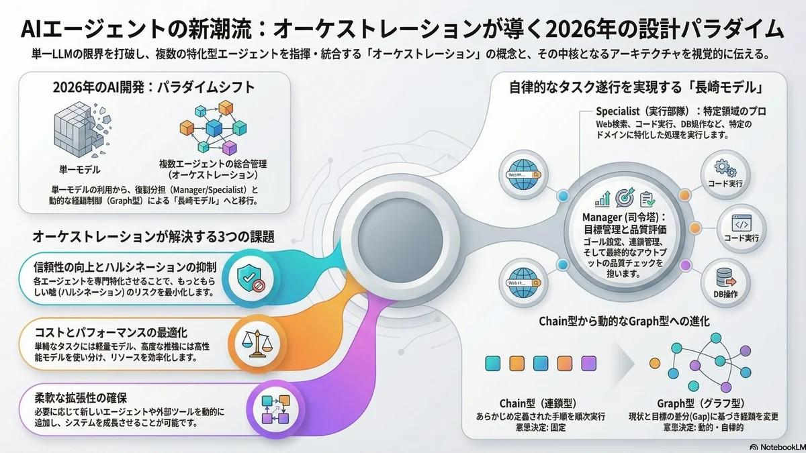

# AIエージェント | オーケストレーションの最新動向 2026

<figure class="mb-10 max-w-4xl mx-auto cyber-glow">
  
</figure>

本記事では、AI開発の最前線である「[オーケストレーター](https://fununi222.github.io/website/article.html?md=glossary/system-glossary.md#:~:text="オーケストレーター")」による複数エージェントの統合管理について解説します。単一モデルの限界を、役割分担（Manager, Specialist等）によって克服し、信頼性と拡張性を両立させる「Graph型」への進化が、次世代のAI運用において不可欠な視点となることを示します。

Last Updated: 2026-04-09

---

2026年の[AIエージェント](https://fununi222.github.io/website/article.html?md=glossary/system-glossary.md#:~:text="AIエージェント")開発における最大のパラダイムシフトは、単独のLLM（Large Language Model）による対話から、**「複数の特化型エージェントを束ねるオーケストレーションシステム」**への転換にあります。

## 1. オーケストレーションの必要性

単一のAIモデルがすべてのタスク（推論、検索、コーディング、外部ツール操作など）を完璧にこなすには限界があります。システム全体を階層化・役割分担させることで、以下のメリットが得られます。

- **信頼性の向上**: 個々のエージェントに専門特化させることで、[ハルシネーション](https://fununi222.github.io/website/article.html?md=glossary/system-glossary.md#:~:text="ハルシネーション")（もっともらしい嘘）のリスクを低減。
- **拡張性**: 必要な機能に応じて、新しいエージェントやツールを動的に追加可能。
- **コスト最適化**: 単純なタスクには軽量モデルを、高度な推論には高性能モデルを使い分ける。

## 2. 技術的変遷：Chain から Graph へ

これまでの「あらかじめ決められた手順を順次実行する」Chain（連鎖）型から、**「現状と目標の差分（Gap）を認識し、動的に経路を変更する」** Graph（グラフ）型へと進化しています。

### 長崎モデルの提唱
長崎モデル（仮称）では、以下の3層構造による自律的なタスク遂行を定義しています。
1. **Manager**: ゴールの設定、進捗管理、最終品質チェック。
2. **Specialist**: 特定ドメイン（Web検索、コード実行、DB操作）のプロフェッショナル。
3. **Environment**: 実際にコードが走り、データが蓄積されるセキュアな環境。

## 3. 分業こそが AI 運用の極致となる

今後の展望として、人間が直接すべてのAI操作を指示するのではなく、**「目標を管理する人間と、それを実行するオーケストレーター」**の関係が一般化してくるでしょう。

> "AIを使いこなすとは、AIを指揮することである。" 

## 変更履歴 (Changelog)
- **2026-04-09**: `SKILL.md` 準拠のグローバルデザイン統一およびメタデータ標準化アップデートを実施。
- **2026-04-06**: 用語の自動抽出とクロスリンク（Glossary）の適用、ならびに日付メタデータの統一アップデート、超要約の追加を実施。

