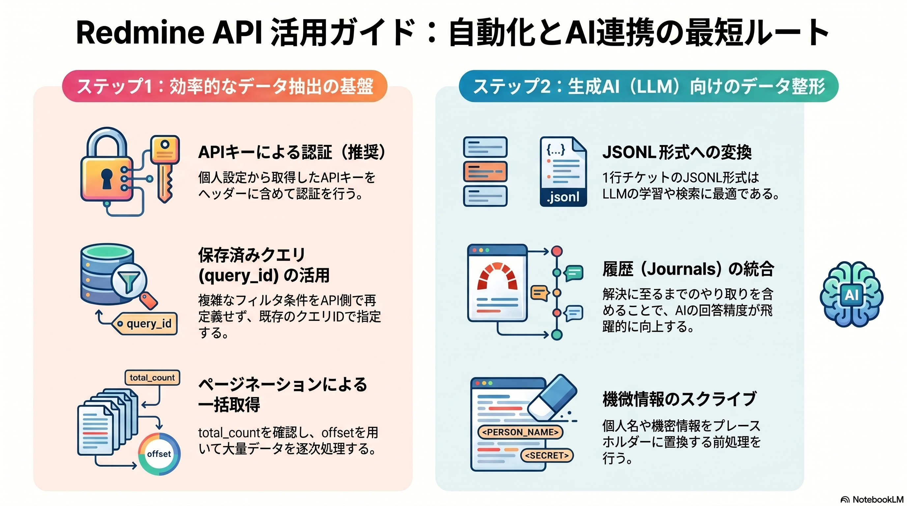

<div class="text-[10px] text-emerald-500 opacity-60 text-right mb-6 tracking-widest font-mono">Research Log: v2026.04.15</div>

<figure class="mb-10 max-w-4xl mx-auto cyber-glow">
  
</figure>

# Redmine APIの使用方法 | REST APIによる自動化とデータ連携の詳解

[Redmine](https://fununi222.github.io/website/article.html?md=glossary/system-glossary.md#:~:text="Redmine")の[REST API](https://fununi222.github.io/website/article.html?md=glossary/system-glossary.md#:~:text="REST%20API")を有効活用することで、チケットの自動起票や外部ダッシュボードへのデータ集約など、プロジェクト管理の自動化を強力に推進できます。本稿では、高度な抽出シナリオ（Basic認証、クエリ活用、[生成AI](https://fununi222.github.io/website/article.html?md=glossary/system-glossary.md#:~:text="生成AI")投入用データ整備）について解説します。

<div class="text-[10px] text-on-surface-variant opacity-60 text-right mb-6 tracking-widest font-mono">Last Updated: 2026-04-15</div>

---

## 1. 認証方式の選択

Redmine環境によっては、APIキーだけでなく[Basic認証](https://fununi222.github.io/website/article.html?md=glossary/system-glossary.md#:~:text="Basic認証")が必要な場合があります。

### APIアクセスキー方式 (推奨)
自身の「個人設定」画面から取得したAPIキーをヘッダーに含めます。
```http
X-Redmine-API-Key: [YOUR_API_KEY]
```

### Basic認証の併用
プロキシやWebサーバー層で制限がある場合、標準のAuthorizationヘッダーを併用します。
```bash
curl -u "username:password" \
     -H "X-Redmine-API-Key: YOUR_API_KEY" \
     "https://redmine.example.com/issues.json"
```

## 2. 効率的なデータのバルク抽出

数千件規模のチケットを[生成AI](https://fununi222.github.io/website/article.html?md=glossary/system-glossary.md#:~:text="生成AI")（[RAG](https://fununi222.github.io/website/article.html?md=glossary/system-glossary.md#:~:text="RAG")）に投入する場合、ブラウザでの検索結果と同じ条件でAPIから取得するのが最も効率的です。

### 保存済みクエリ (`query_id`) の活用
Redmine上で作成した「保存済みクエリ」のIDを指定することで、複雑なフィルタ条件をAPI側で再定義する必要がなくなります。

```bash
# クエリID = 123 の結果をページ単位で取得
GET /issues.json?query_id=123&limit=100&offset=0
```

### ページネーションの実装
大量データを取得する際は、`total_count` を確認しながら `offset` をずらしてループ処理を行います。メモリ負荷を抑えるため、逐次ファイルへ書き出す「ストリーム処理」的な構成が望ましいです。

## 3. 生成AI (LLM) 向けデータ整形

抽出したJSONを[生成AI](https://fununi222.github.io/website/article.html?md=glossary/system-glossary.md#:~:text="生成AI")に効率よく学習・検索させるためのポイントです。

- **JSONL形式への変換**: ExcelやCSVよりも、1行1チケットのJSONL（JSON Lines）形式が[LLM](https://fununi222.github.io/website/article.html?md=glossary/system-glossary.md#:~:text="LLM")のトレーニングやベクトル検索用のチャンク分割に適しています。
- **履歴 (Journals) の統合**: `?include=journals` を付与し、チケットの「現状」だけでなく「解決に至るまでの経緯（やり取り）」を一つのテキストブロックに結合することで、回答精度が飛躍的に向上します。
- **機微情報のスクライブ**: 抽出スクリプト内で、個人名や機微情報をプレースホルダーに置換する前処理を推奨します。

---

## 自動化の可能性
[REST API](https://fununi222.github.io/website/article.html?md=glossary/system-glossary.md#:~:text="REST%20API")を解禁することで、[生成AI](https://fununi222.github.io/website/article.html?md=glossary/system-glossary.md#:~:text="生成AI")エージェントが自律的にプロジェクトの進捗を確認したり、過去の類似トラブルから解決策を提示する「Artemis」のようなナレッジエージェントの構築が可能になります。

## 変更履歴 (Changelog)
- 2026-04-15: 第2版。Basic認証、query_id活用、LLM向けデータ整形術を追記。
- 2026-04-15: 新規作成。 Redmine API連携の技術リサーチ結果を統合。
