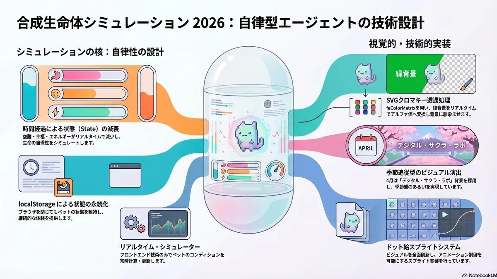
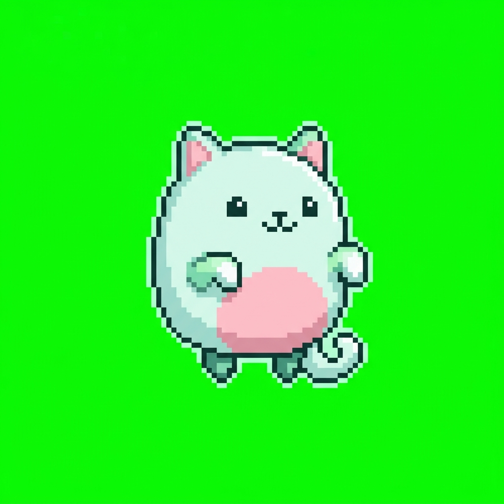

# Development | Synthetic Pet Simulation：合成生命体の自律エージェント試論 2026

<figure class="mb-10 max-w-4xl mx-auto cyber-glow">

</figure>

本プロジェクトは、[フロントエンド](https://fununi222.github.io/website/article.html?md=glossary/system-glossary.md#:~:text="フロントエンド")技術のみで完結する「たまごっち風」の自律型エージェント・シミュレーターです。単なるゲーム制作にとどまらず、**「時間経過による状態（State）の減衰」**と**「localStorage による永続化」**の実装を通じて、デジタル環境における自律生命体の[UI](https://fununi222.github.io/website/article.html?md=glossary/system-glossary.md#:~:text="UI")/[UX](https://fununi222.github.io/website/article.html?md=glossary/system-glossary.md#:~:text="UX")設計を検証します。

Last Updated: 2026-04-13

---

## 💻 Simulation Core

以下のシミュレーターは、リアルタイムでペットの状態を計算します。
現在は**ミント・ゴースト・キャット**（デジタル生命体）が稼働しています。

<!-- Game Container -->

SYNTH_OS v4.13-MINT
100%

Age: 0 CYCLES

LOW ENERGY

Hunger100%

Happiness100%

Energy100%

<button onclick="petAction('feed')" class="action-btn py-3 rounded-2xl bg-surface-container-high border border-white/5 hover:border-primary/50 text-on-surface text-[10px] font-headline uppercase tracking-widest transition-all active:scale-95 flex flex-col items-center gap-1">
restaurant
Feed
</button>
<button onclick="petAction('play')" class="action-btn py-3 rounded-2xl bg-surface-container-high border border-white/5 hover:border-primary/50 text-on-surface text-[10px] font-headline uppercase tracking-widest transition-all active:scale-95 flex flex-col items-center gap-1">
smart_toy
Play
</button>
<button onclick="petAction('charge')" class="action-btn py-3 rounded-2xl bg-surface-container-high border border-white/5 hover:border-secondary/50 text-on-surface text-[10px] font-headline uppercase tracking-widest transition-all active:scale-95 flex flex-col items-center gap-1">
bolt
Charge
</button>
<button onclick="resetPet()" class="action-btn py-3 rounded-2xl bg-surface-container-high border border-white/5 hover:border-red-400/50 text-on-surface text-[10px] font-headline uppercase tracking-widest transition-all active:scale-95 flex flex-col items-center gap-1">
refresh
Reset
</button>

FUNUNI_SYNTH_CORE_MINT

<!-- SVG Chromakey Filter -->
<svg width="0" height="0" style="position:absolute">
  <filter id="chromakey">
    <feColorMatrix type="matrix" values="1 0 0 0 0
                                         0 1 0 0 0
                                         0 0 1 0 0
                                         1 -1 1 1 0" />
  </filter>
</svg>

---

## 🛠️ Implementation Details

### Mascot Redesign
最新の設計に基づき、マスコットを[ミント・ゴースト・キャット]へと刷新しました。このデジタル生命体は、透過性のあるボディとサイバーな配色が特徴で、FunUni-lab の Technical Archive の美学を体現しています。

### Mint-Cyber Aesthetic
キャラクターの変更に伴い、ハードウェア（UIフレーム）の配色もミントグリーン（#b2f2bb）ベースへと変更しました。これにより、春の背景とマスコットが視覚的にシームレスに統合されています。従来のクロマキー技術によるリアルタイム透過処理も継続して適用されています。

## 今後の展望
今後は[LLM](https://fununi222.github.io/website/article.html?md=glossary/system-glossary.md#:~:text="LLM")と連携し、特定条件下でマスコットのボディカラーが変化する動的な色彩変化システムや、ユーザーの入力に応じたプロトコル反応の実装を予定しています。

---

## 変更履歴 (Changelog)
- **2026-04-13**: マスコットを「ミント・ゴースト・キャット」へと刷新。UIテーマカラーをミントグリーンへ変更。
- **2026-04-13**: 季節限定背景（春）の追加。クロマキーフィルタによるマスコットの透過実装。
- **2026-04-13**: ビジュアルの全面刷新（さくらみこ風マスコット）。ドット絵スプライトシステムの実装。
- **2026-04-13**: 初回デプロイ。ステート管理と永続化機能を実装。
