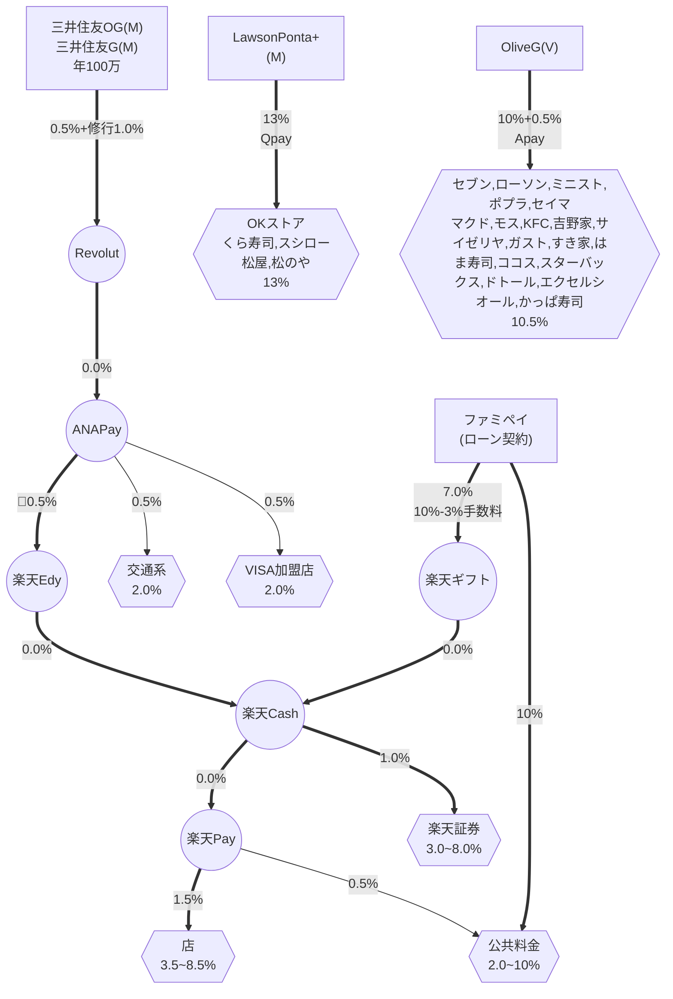

# Finance | 2026年最新：高還元決済ルート決定版

Last Updated: 2026-04-09

## 超要約
本レポートは、2026年最新の[キャッシュレス決済](/article.html?md=glossary/system-glossary.md#:~:text=%E3%82%AD%E3%83%A3%E3%83%83%E3%82%B7%E3%83%A5%E3%83%AC%E3%82%B9%E6%B1%BA%E6%B8%88)戦略を、三井住友カードの「[100万円修行](/article.html?md=glossary/system-glossary.md#:~:text=100%E4%B8%87%E5%86%86%E4%BF%AE%E8%A1%8C)」を主軸に解説したものです。かつての主力ルート（JAL Pay/au PAY）の封鎖を考慮し、現在は [Revolut](/article.html?md=glossary/system-glossary.md#:~:text=Revolut) や ANA Pay を経由して楽天キャッシュを調達し、街のお店での還元率を最大化（3.5%〜）する最新の[アルゴリズム](/article.html?md=glossary/system-glossary.md#:~:text=%E3%82%A2%E3%83%AB%E3%82%B4%E3%83%AA%E3%82%BA%E3%83%A0)を図解します。

---

[ポイ活](/article.html?md=glossary/system-glossary.md#:~:text=%E3%83%9D%E3%82%A4%E6%B4%BB)や[キャッシュレス決済](/article.html?md=glossary/system-glossary.md#:~:text=%E3%82%AD%E3%83%A3%E3%83%83%E3%82%B7%E3%83%A5%E3%83%AC%E3%82%B9%E6%B1%BA%E6%B8%88)のルートは日々進化し、時には「封鎖」と呼ばれるルートの閉鎖を乗り越えながら、よりお得な方法が模索されています。

今回は、[ポイ活](/article.html?md=glossary/system-glossary.md#:~:text=%E3%83%9D%E3%82%A4%E6%B4%BB)ガチ勢の間で話題の最新決済ルート図を読み解き、**日常の買い物を劇的にお得にする最強の決済ルート**を徹底解説します！

---

## 更新注記（2026年4月追記）

この記事の初版では `JAL Pay` や `au PAY` を経由するルートを主力として扱っていましたが、2026年3月1日利用分から三井住友カードの[100万円修行](/article.html?md=glossary/system-glossary.md#:~:text=100%E4%B8%87%E5%86%86%E4%BF%AE%E8%A1%8C)対象外となりました。

そのため、この記事は「高還元決済の考え方」を中心に残しつつ、修行ルートとしては `Revolut → ANA Pay` などへの読み替えが必要です。

- **[三井住友カード100万円修行の最新版はこちら](article.html?md=finance/smbc-million-challenge-revolut-route.md)**

---

## 🗺️ 決済ルート図 (2026年版)

---

## 💳 1. 楽天経済圏を攻略！「楽天キャッシュ」錬金術ルート

日常の買い物や[楽天証券](/article.html?md=glossary/system-glossary.md#:~:text=%E6%A5%BD%E5%A4%A9%E8%A8%BC%E5%88%B8)での投信積立に欠かせない「楽天キャッシュ」をお得に調達する2つの強力なルートです。

### 現行の主力候補: 「三井住友ゴールド（Mastercard）→ Revolut → ANA Pay」
年間100万円の利用でボーナスポイントが付与される「三井住友カード ゴールド（NL）」などを起点とする、[ポイ活](/article.html?md=glossary/system-glossary.md#:~:text=%E3%83%9D%E3%82%A4%E6%B4%BB)の王道ルートです。

1. **三井住友G（Mastercard）** [基本0.5% + [100万円修行](/article.html?md=glossary/system-glossary.md#:~:text=基本0.5% + [100万円修行)達成1.0% = **1.5%**]
2. **[Revolut](/article.html?md=glossary/system-glossary.md#:~:text=Revolut)** にチャージ [**修行対象候補**]
3. **ANA Pay** にチャージ [**0.5%**]
4. Android端末等で **楽天Edy** にチャージ（※Apple Payルートなど制限に注意）
5. 楽天Edyから **楽天キャッシュ** にチャージ
6. **[楽天ペイ](/article.html?md=glossary/system-glossary.md#:~:text=%E6%A5%BD%E5%A4%A9%E3%83%9A%E3%82%A4)** で決済 [**1.5%**] 

**✨ 合計還元率：3.5%**（三井住友 1.5% + ANA Pay 0.5% + 楽天ペイ 1.5%）
街のお店での買い物はもちろん、楽天証券の投信積立や公共料金の支払いにも接続できる余地があります。

ただし、`JAL Pay → ANA Pay` の旧ルートは2026年3月1日利用分以降、[100万円修行](/article.html?md=glossary/system-glossary.md#:~:text=100%E4%B8%87%E5%86%86%E4%BF%AE%E8%A1%8C)の主力としては使えません。現在は [Revolut](/article.html?md=glossary/system-glossary.md#:~:text=Revolut) 経由を軸にしつつ、ANA Pay 側の30日上限やブランド手数料に注意して運用するのが前提です。

出口側の目安は以下です。

- [楽天ペイ](/article.html?md=glossary/system-glossary.md#:~:text=%E6%A5%BD%E5%A4%A9%E3%83%9A%E3%82%A4)加盟店: **3.5%**
- [楽天証券](/article.html?md=glossary/system-glossary.md#:~:text=%E6%A5%BD%E5%A4%A9%E8%A8%BC%E5%88%B8)の楽天キャッシュ積立: **3.0%**
- [楽天ペイ](/article.html?md=glossary/system-glossary.md#:~:text=%E6%A5%BD%E5%A4%A9%E3%83%9A%E3%82%A4)請求書払い: **2.0%**

---

## 2. 驚異の還元率！「ファミペイ（ローン契約）ルート」
ファミペイのローン契約特典やキャンペーンの還元を活用する、少し上級者向けの爆益ルートです。

1. **ファミペイ（ローン契約特典等）** [10%還元 - 手数料等3% = 実質 **7.0%**]
2. ファミペイで **楽天ギフトカード** を購入
3. 楽天ギフトカードから **楽天キャッシュ** にチャージ
4. **[楽天ペイ](/article.html?md=glossary/system-glossary.md#:~:text=%E6%A5%BD%E5%A4%A9%E3%83%9A%E3%82%A4)** で決済 [**1.5%**]

**✨ 合計還元率：最大 8.5%**
手数料を差し引いても驚異的な還元率を叩き出します。さらに、ファミペイから直接公共料金を請求書払いで支払うことで**10%還元**を狙うことも可能です！

---

## 🚃 3. 交通系IC＆街のVISA加盟店を網羅！

SuicaやPASMOなどの交通系電子マネーや、街のVISA加盟店で幅広く使える領域です。こちらも三井住友ゴールド（Mastercard）が起点になりやすいですが、旧来ルートはそのままでは使えません。

1. **現行候補:** 三井住友G（Mastercard） → [Revolut](/article.html?md=glossary/system-glossary.md#:~:text=Revolut) → ANA Pay
2. **最終利用先:** 交通系IC（Suica/PASMO等） または VISA加盟店 で決済

**✨ 現行ルートの合計還元率：2.0%**（三井住友 1.5% + ANA Pay 0.5%）
[楽天ペイ](/article.html?md=glossary/system-glossary.md#:~:text=%E6%A5%BD%E5%A4%A9%E3%83%9A%E3%82%A4)が使えない店舗や、日々の電車移動でも使いやすい領域です。

---

## 🍽️ 4. 特定店舗で爆発！「特化型クレカ」の直結ルート

面倒なチャージ・経由は一切不要！対象店舗ならクレジットカードのスマホ決済だけで驚異的な還元率を誇るカードです。

### Olive フレキシブルペイ ゴールド（Visa）
* **還元率：10.5%〜**
* **対象店舗：** セブン-イレブン、ローソン、マクドナルド、サイゼリヤ、ガスト、すき家、スターバックス、ドトール 等の主要チェーン
* **決済方法：** スマホのVisaのタッチ決済（Apple Pay / Google Pay）
* **解説：** 言わずと知れた三井住友系列の最強カード。「[フレキシブルペイ](/article.html?md=glossary/system-glossary.md#:~:text=%E3%83%95%E3%83%AC%E3%82%AD%E3%82%B7%E3%83%96%E3%83%AB%E3%83%9A%E3%82%A4)」機能を備え、対象のコンビニやファミレス、カフェによく行く人は、このカードでスマホのタッチ決済をするだけで、ザクザクとVポイントが貯まります。

---

## 📝 まとめ

現在の[キャッシュレス決済](/article.html?md=glossary/system-glossary.md#:~:text=%E3%82%AD%E3%83%A3%E3%83%83%E3%82%B7%E3%83%A5%E3%83%AC%E3%82%B9%E6%B1%BA%E6%B8%88)は、「どこで・何を使って支払うか」によって還元率を管理するのが[ポイ活](/article.html?md=glossary/system-glossary.md#:~:text=%E3%83%9D%E3%82%A4%E6%B4%BB)の醍醐味です。

* **メイン決済:** 楽天キャッシュルート（[楽天ペイ](/article.html?md=glossary/system-glossary.md#:~:text=%E6%A5%BD%E5%A4%A9%E3%83%9A%E3%82%A4)）で **3.5%〜8.5%**
* **サブ決済:** 交通系・VISA加盟店で **2.0%**
* **特定店舗:** Olive（**10.5%**）等で直撃！

**⚠️ 注意点**
[ポイ活](/article.html?md=glossary/system-glossary.md#:~:text=%E3%83%9D%E3%82%A4%E6%B4%BB)のルートは常に最新の情報をチェックし、臨機応変に切り替えていくことが重要です。特に三井住友カードの[100万円修行](/article.html?md=glossary/system-glossary.md#:~:text=100%E4%B8%87%E5%86%86%E4%BF%AE%E8%A1%8C)を絡める場合は、古いルートをそのまま使わず、入口だけでなく出口側の合計還元率も最新条件で再計算してください。

## 変更履歴 (Changelog)
- **2026-04-09**: 全体的な標準化アップデート。「Synthetic Edition」デザイン規格に基づき、メタデータの再定義、およびタイトルと日付の同期を実施。
- **2026-04-06**: 用語の自動抽出とクロスリンク（Glossary）の適用、ならびに日付メタデータの統一アップデート、超要約・コンテンツ整理を実施。
