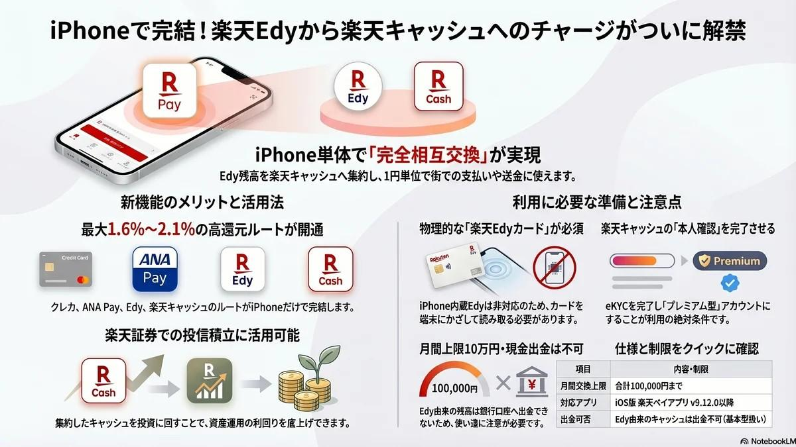

Standard Edition: v2026.04.14

# iPhone 楽天Edy→楽天キャッシュ 変換解禁ガイド

<figure class="mb-10 max-w-4xl mx-auto cyber-glow">
  
</figure>

2026年2月16日の[楽天ペイ](https://fununi222.github.io/website/article.html?md=glossary/system-glossary.md#:~:text="楽天ペイ")アプリ更新により、iPhone単体で[楽天Edy](https://fununi222.github.io/website/article.html?md=glossary/system-glossary.md#:~:text="楽天Edy")から[楽天キャッシュ](https://fununi222.github.io/website/article.html?md=glossary/system-glossary.md#:~:text="楽天キャッシュ")へのチャージが正式解禁されました。これにより、これまでAndroid端末が必須だった「高還元チャージルート」の出口がiPhone 1台で完結。楽天証券での投信積立など、[ポイ活](https://fununi222.github.io/website/article.html?md=glossary/system-glossary.md#:~:text="ポイ活")投資戦略において極めて重要なアップデートとなっています。

Last Updated: 2026-04-14

---

## 1. iPhone単体で「最高還元ルート」が完結する衝撃

今回のアップデート最大の功績は、ポイ活ユーザーの間で愛用されてきた「高還元チャージルート」の最終工程がiPhoneだけで完結したことです。これまでiPhoneユーザーは、どれだけ入り口で還元率を高めても、最後の「楽天キャッシュへの変換」のためにAndroid端末を別途用意する必要がありました。

今後は、以下のプロセスがiPhone 1台で完結します。

1. **高還元クレジットカード** からチャージ
2. **[ANA Pay](https://fununi222.github.io/website/article.html?md=glossary/system-glossary.md#:~:text="ANA Pay")** を経由
3. **楽天Edy** へチャージ
4. **楽天キャッシュ** へチャージ（← **新機能**）

このルートを構築することで、チャージ段階で **1.6％〜2.1％程度** の還元を狙うことが可能になります。楽天証券での投信積立にこの資金を充当すれば、運用開始前に実質2%以上の利益を確定させているのと同等の効果が得られます。

> [!TIP]
> 獲得した楽天キャッシュを投資に回すことで、複利の効果を最大化し、長期的な資産形成の効率を劇的に引き上げることができます。

## 2. 引き出しに眠る「端数Edy」の集約と救済

旧来の[楽天カード](https://fununi222.github.io/website/article.html?md=glossary/system-glossary.md#:~:text="楽天カード")やキャンペーン等で配布された「物理カード内の端数残高」を、iPhoneの[NFC](https://fununi222.github.io/website/article.html?md=glossary/system-glossary.md#:~:text="NFC")読み取り機能を使って楽天キャッシュへ一本化できます。

- **1円単位の集約**: 複数のカードに散らばった残高をまとめ、街での支払いや投資に無駄なく活用可能です。
- **デジタルな整理整頓**: 物理カードという制約から資金を解放し、現役のデジタル資産へと昇華させることができます。

## 3. 利用における技術的制約と「eKYC」の壁

Android（おサイフケータイ）版と異なり、iPhoneは本体内に楽天Edyを組み込むことができません。そのため、**「物理カードをスマホにかざす」** という物理的な動作が常に必要となります。

### 必須条件
- **対応OS**: iOS 15.0以上 / iPhone 7以降。
- **アプリ**: 楽天ペイアプリ v9.12.0以上。
- **物理アイテム**: Edy機能付き楽天カード等の「物理カード」。
- **本人確認**: 楽天キャッシュの本人確認（[eKYC](https://fununi222.github.io/website/article.html?md=glossary/system-glossary.md#:~:text="eKYC")）を完了させ、**[プレミアム型](https://fununi222.github.io/website/article.html?md=glossary/system-glossary.md#:~:text="プレミアム型")** へ移行していること。

> [!WARNING]
> 操作時はiPhone背面上部のカメラ付近にあるNFCリーダーにカードを密着させる必要があります。ケースの厚みによっては読み取りエラーが発生するため注意が必要です。

## 4. 厳守すべき「落とし穴」と制約事項

利便性に目を奪われて、資金の流動性を失わないよう以下の制約に注意してください。

- **月間上限**: Edyからキャッシュへの交換は月間10万円まで。
- **現金化不可**: このルートで生成されたキャッシュは「基本型」扱いとなるため、銀行口座への出金は不可能です。「決済・投資専用」と割り切る必要があります。
- **ポイント制限**: 期間限定ポイントをEdyへチャージし、さらにキャッシュへ流すことはできません。原資は通常ポイントまたはクレカ（現金）に限られます。

## 結論：iPhoneが楽天経済圏の「司令塔」へ

2026年2月16日のアップデートにより、iPhoneユーザーを縛り付けていた端末の壁は崩れました。iPhoneは、日々の決済から高還元な資産運用までを統括する「最強の司令塔」へと進化したと言えます。

まずはアプリを最新版にアップデートし、引き出しの奥で眠っているEdyカードを発掘するところから始めてみてください。

## 変更履歴 (Changelog)
- 2026-04-14: 新規作成。2026年2月の楽天ペイアップデートに伴う iPhone 楽天Edyチャージ機能の実装を反映。
