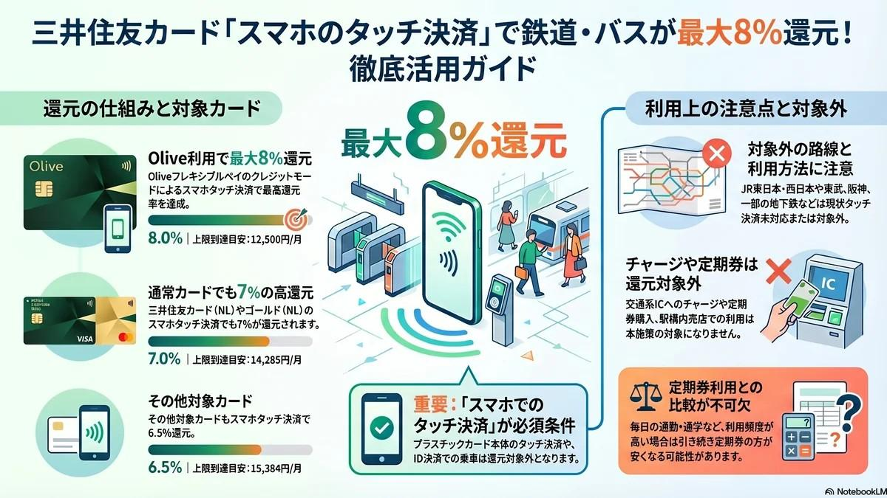

# 【関東圏】三井住友カード「スマホタッチ決済で最大8%還元」の活用法と注意点

<figure class="mb-10 max-w-4xl mx-auto cyber-glow">
  
</figure>

Standard Edition: v2026.04.13

日々の電車やバスの移動で、モバイルSuicaやPASMOを利用している方は多いと思います。現在、**全国の交通インフラ**において、新たな選択肢として「スマートフォンのタッチ決済」の導入が急速に進んでいます。

[三井住友カード](https://fununi222.github.io/website/article.html?md=glossary/system-glossary.md#:~:text="三井住友カード")が実施している「スマホのタッチ決済乗車で最大8%還元」は、対象路線の移動費に対して効率的に[Vポイント](https://fununi222.github.io/website/article.html?md=glossary/system-glossary.md#:~:text="Vポイント")を貯めるための非常に実用的な施策です。

本稿では、この全国的な施策を**「関東圏での具体的な活用」に絞って**、JR東日本併用時などの運用上の注意点とともに解説します。

---

## 1. 最大8%還元の適用条件（基本ルール）

この還元を受けるには、対象のカードをスマートフォンのタッチ決済（Apple Pay / Google Pay）で利用することが必須条件となります。

- **[Olive](https://fununi222.github.io/website/article.html?md=glossary/system-glossary.md#:~:text="Olive")フレキシブルペイ（クレジットモード）**: 8%還元
- **[三井住友カード](https://fununi222.github.io/website/article.html?md=glossary/system-glossary.md#:~:text="三井住友カード")（NL、ゴールドNLなど）**: 7%還元

> [!IMPORTANT]
> **重要な留意点**
> 物理カードを直接改札にタッチした場合は通常還元の扱いとなり、キャンペーンの対象外となります。また、還元上限はカード1枚につき毎月1,000ポイントまで（8%還元の場合は月間12,500円の利用が上限の目安）です。

## 2. 関東圏の対象路線と具体的な活用例

2026年3月末より、関東の私鉄・地下鉄でクレジットカードのタッチ決済対応が大きく拡大しました。主な対象路線は以下の通りです。

- **地下鉄**: 東京メトロ、都営地下鉄、横浜市営地下鉄
- **私鉄**: 京急電鉄、東急電鉄、小田急電鉄、京王電鉄、相模鉄道、みなとみらい線、江ノ島電鉄、つくばエクスプレス

たとえば、休日に京急線で逗子周辺から都心へ出かけたり、みなとみらい線を利用してKアリーナ横浜でのライブへ向かったりする際も、事前のチャージなしで改札を通過でき、ポイント還元の対象となります。

## 3. JR東日本・東武鉄道利用時の注意点

実際の移動で利用する際、いくつか気をつけるべき仕様があります。

#### JR東日本（在来線）は未対応
現在、JR東日本の在来線はタッチ決済での乗車に対応していません。JRと私鉄を乗り継ぐ際は、私鉄区間のみスマホ決済を利用するなどの使い分けが必要です。

#### 東武鉄道は「還元対象外」
東武鉄道は改札でのタッチ決済には対応していますが、今回の「最大8%還元」の対象路線からは除外されています（通常のカード還元のみ）。

#### 翌朝の決済処理と Olive のモード固定
クレジットカードのタッチ決済による運賃計算は、多くの場合、翌朝に一括して処理されます。乗車してから翌朝の決済が完了するまでの間に、[Olive](https://fununi222.github.io/website/article.html?md=glossary/system-glossary.md#:~:text="Olive")の支払いモード（クレジットモード等）を変更してしまうと、エラーが発生したり還元対象外になったりするリスクがあるため、乗車日はモードを固定しておくのが無難です。

---

## 結論：自分の生活圏に合わせた使い分けを

改札を通過する際の処理スピードにおいては、依然としてSuicaが優位です。すべての移動手段を無理にタッチ決済へ切り替えるのではなく、自分の生活圏や休日の移動ルートと照らし合わせ、対象となる区間で部分的に取り入れるのが、堅実な[ポイ活](https://fununi222.github.io/website/article.html?md=glossary/system-glossary.md#:~:text="ポイ活")の活用方法と言えます。

---

#### 参考文献・関連リンク
本記事内の還元率、対象カード、および対象路線の情報は、以下の公式発表および特設サイトの記載（2026年4月時点）に基づいています。最新の対応状況やキャンペーンの詳細は、各公式サイトをご確認ください。

* **三井住友カード株式会社**
  * [スマホのタッチ決済乗車で最大8％還元！](https://www.smbc-card.com/mem/for_transit/point_up.jsp)
    ※対象カード、ポイント還元率、還元上限の条件、およびキャンペーン対象となる事業者（東武鉄道など対象外の記載含む）の詳細
  * [クレカでタッチ決済乗車が使える事業者一覧](https://www.smbc-card.com/camp/visa_transit/kamei_list.jsp)
    ※全国の対応状況および導入予定の事業者リスト

* **各交通事業者の公式案内（関東エリアの相互利用に関する詳細）**
  * [クレジットカード等のタッチ決済による乗車サービス（東京都交通局）](https://www.kotsu.metro.tokyo.jp/subway/fare/contactless.html)
    ※2026年3月25日にスタートした、関東圏の鉄道事業者11社局（京急電鉄、東急電鉄、小田急電鉄、横浜高速鉄道など）における相互利用の仕組みや、改札の通過方法に関する公式情報

## 変更履歴 (Changelog)
- **2026-04-14**: 参考文献・関連リンクの正式URLを追記。
- **2026-04-13**: 新規作成。関東圏の交通系決済アップデートに伴う還元ルートの解説を追加。
