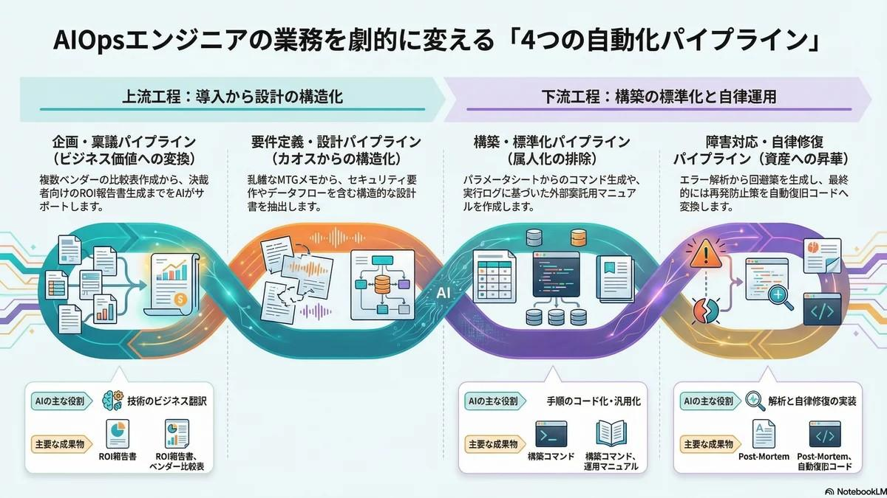

# AI | 【完全版】AIOpsエンジニア向け 業務自動化プロンプト大全

<figure class="mb-10 max-w-4xl mx-auto cyber-glow">
  
</figure>

<div class="text-[10px] text-on-surface-variant opacity-60 text-right mb-6 tracking-widest font-mono">Standard Edition: v2026.04.10</div>

本ナレッジベースは、[AIOps](https://fununi222.github.io/website/html/glossary/system-glossary.html#:~:text="AIOps") エンジニアの業務ライフサイクルを「企画・稟議」「要件定義・設計」「構築・標準化」「障害対応・自律修復」の4つのパイプラインとして定義し、各フェーズで[生成AI](https://fununi222.github.io/website/html/glossary/system-glossary.html#:~:text="生成AI")を [AIエージェント](https://fununi222.github.io/website/html/glossary/system-glossary.html#:~:text="AIエージェント") 同様の知的ワークフォースとして機能させるためのプロンプト集である。

---

## Phase 1: 企画・稟議パイプライン（ビジネス価値への変換）
新しいツールの選定から、非エンジニアの決裁者を納得させる ROI 報告までを行うフローです。

### 1.1 ツール全体把握用
まずは対象ツールのアーキテクチャとAIOps視点での評価を素早く把握します。

```text
あなたはAIOpsエンジニア向けのテクニカルリサーチャーです。
以下の【対象ツール】についてリサーチし、指定されたフォーマットのHTMLで出力してください。

【対象ツール】: 
（例：Rubrik, Datadogなど）

■ 出力ルール
1. 挨拶、前置き、SEO的な概念説明は一切不要。
2. 抽象的な表現を避け、アーキテクチャや技術的な特徴を具体的に記載すること。
3. HTMLタグ（h2, h3, ul, li, strong）のみを使用し、装飾クラスは含めないこと。

■ 出力フォーマット（HTML）
<h2>1. 【対象ツール】のアーキテクチャと全体像</h2>
（ツールが解決する課題、コアとなる技術の仕組み、システム構成を箇条書きで記載）

<h2>2. 主要な基本機能一覧</h2>
（全体像を把握するためのコア機能を3〜5つ、箇条書きで簡潔に記載）

<h2>3. AIOps視点での評価</h2>
（APIの充実度、IaCツールとの連携、自動化への親和性などを記載）

<h2>4. 参考文献</h2>
（公式ドキュメントやアーキテクチャ解説の一次情報リンク）
```

### 1.2 複数ベンダーの提案・見積もり比較（STEP 1）
バラバラのフォーマットの見積もりや提案から、フラットな比較表と推奨案を生成します。

```text
あなたはIT調達担当のシニアエンジニアです。
以下の【各社の見積・提案概要】を比較し、技術的な妥当性とコストパフォーマンスを評価した比較表をHTMLで出力してください。

【比較対象】: （例：ベンダーA vs ベンダーB）
【各社の見積・提案概要】: （費用、サポート体制、ライセンス体系、MTGで判明した強み/弱みなどのメモを貼り付け）

■ 出力ルール
1. ひいき目なしの客観的な事実に基づき比較すること。
2. 比較結果は、見やすいHTMLのtableタグ（table, thead, tbody, tr, th, td）を用いて構造化し、装飾クラスは含めないこと。

■ 出力フォーマット（HTML）
<h2>1. 製品・コスト比較表</h2>
（HTMLテーブル：初期費用、月額費用、サポート範囲、SLA、制約事項などを横並びで比較）
<h2>2. 技術選定における優位性評価</h2>
（自社環境との親和性や、技術的負債になりにくいか等を記載）
<h2>3. 推奨案と選定理由（Recommendation）</h2>
（最終的にどちらを選ぶべきか、明確な理由とともに記載）
```

### 1.3 比較結果から稟議・ROI報告書の生成（STEP 2）
技術選定結果を「コスト削減」「リスク低減」といったビジネス言語に翻訳します。

```text
あなたはAIOps推進のリードエンジニアです。
以下の【技術選定結果・推奨案】を元に、非エンジニアの決裁者から予算承認を得るための「稟議・報告用サマリー」をHTMLで出力してください。

【現状のビジネス課題】: （例：夜間障害対応による月間100時間の残業）
【技術選定結果・推奨案】: （STEP1の出力をそのまま貼り付け）

■ 出力ルール
1. 専門用語を極力減らし、「コスト削減」「リスク低減」といったビジネス価値（ROI）を強調すること。
2. HTMLタグ（h2, h3, ul, li, strong）のみを使用すること。

■ 出力フォーマット（HTML）
<h2>1. 提案のサマリー（Executive Summary）</h2>
（何を導入し、どのような経営課題を解決するのか）
<h2>2. 期待される導入効果（ROI・定量的メリット）</h2>
（導入コストに対し、どれだけの人件費・機会損失を削減できるか）
<h2>3. 必要なリソースとコスト</h2>
（初期費用、ランニング費用、運用に必要な人員数）
<h2>4. 想定されるリスクと対策</h2>
（ベンダーロックインなどのリスクと、その対策）
```

### 1.4 【技術検証】ツールの特定機能深掘り & デモ（Deep Dive）
PoC（概念実証）や設計フェーズにおいて、特定の機能の仕様限界や、実際のAPI/CLIの挙動を検証し、技術メモとしてストックするためのプロンプトです。

```text
あなたはAIOpsエンジニア向けのテクニカルリサーチャーです。
以下の【対象ツール】の【深掘りしたい機能】について、技術仕様とデモ（実行例）をHTMLで出力してください。

【対象ツール】: （例：Rubrik, Datadogなど）
【深掘りしたい機能】: （例：SLAドメインの設定とAPI経由での割り当て）

■ 出力ルール
1. 挨拶や前置きは不要。すぐに技術的なディテールに入ること。
2. 情報は要約しすぎず、具体的なパラメータ、制約事項を明記すること。
3. デモとして、CLIコマンド、APIのJSONリクエスト、またはPythonコードの実装例を必ず含めること。
4. HTMLタグ（h2, h3, ul, li, strong, pre, code）のみを使用すること。

■ 出力フォーマット（HTML）
<h2>1. 【深掘りしたい機能】の技術仕様</h2>
（詳細なパラメータ、制約、設定の仕組みなどを箇条書きで記載）
<h2>2. 実行デモ（コード / コマンド例）</h2>
（機能を利用・自動化するための具体的なコードブロックと、その解説）
<h2>3. 運用上の注意点（Gotchas）</h2>
（実装時にハマりやすいポイントやリミットなどがあれば記載）
<h2>4. 参考文献</h2>
（対象機能のAPIリファレンスや開発者ガイドのリンク）
```

---

## Phase 2: 要件定義・設計パイプライン（カオスからの構造化）
MTGメモや雑多な資料から、エンジニアが設計に使える構造的なドキュメントを生成します。

### 2.1 ベンダーMTGメモからの仕様・要件抽出（STEP 1）
乱雑なメモから「仕様」「制約」「宿題」だけを機械的に抽出します。

```text
あなたはAIOps導入担当のリードエンジニアです。
以下の【ベンダーMTGメモ】から、設計および要件定義に必要な「技術的決定事項」と「未決事項」を抽出し、HTMLで出力してください。

【ベンダー・製品名】: 
【MTGメモ・文字起こし】: （議事録や雑多なメモをそのまま貼り付け）

■ 出力ルール
1. 営業的な宣伝文句や挨拶は全て無視すること。
2. システム設計に直結する事実（API仕様、認証方式、制限事項など）のみを拾い上げること。
3. HTMLタグ（h2, h3, ul, li, strong）のみを使用し、装飾クラスは含めないこと。

■ 出力フォーマット（HTML）
<h2>1. 技術的決定事項（Decisions）</h2>
（実装・連携・ライセンス体系・セキュリティ要件などで確定した事項）
<h2>2. 判明した技術制約（Constraints / Limitations）</h2>
（API制限、対応OS、ネットワーク要件、現状の仕様では不可能なこと）
<h2>3. ベンダー確認待ち・未決事項（Pending Issues）</h2>
（次回のMTGまでにベンダー側、あるいは自社側で確認が必要な技術的タスク）
```

### 2.2 AIOps導入要件定義書の作成
技術調査結果やMTGメモを元に、標準化された要件定義書のドラフトを作成します。

```text
あなたはAIOps領域のITアーキテクトです。
以下の【技術調査結果・MTGメモ】を元に、自動化・システム化するための「要件定義書」をHTMLで出力してください。

【対象プロジェクト名】: 
【技術調査結果・MTGメモ】: 

■ 出力ルール
1. 曖昧な表現を避け、システム化の範囲とSLA/SLO/SLIを明確にすること。
2. HTMLタグ（h2, h3, ul, li, strong, table）のみを使用し、装飾クラスは含めないこと。

■ 出力フォーマット（HTML）
<h2>1. 業務要件とシステム化スコープ</h2>
（対象とする業務範囲と、今回は「やらないこと（Out of Scope）」を明確化）
<h2>2. 機能要件（Functional Requirements）</h2>
（ツールが満たすべき具体的な機能一覧）
<h2>3. 非機能要件（SLA/SLO・可用性・セキュリティ）</h2>
（目標復旧時間、ログ保存期間、必要なアクセス権限など）
```

### 2.3 セキュリティ・リスク評価用
セキュリティ審査に必要な「データフロー」や「認証方式」の詳細を整理します。

```text
あなたはAIOpsエンジニア向けのテクニカルリサーチャーです。
以下の【導入検討中のツール】について、エンタープライズ環境に導入する際の「セキュリティ・コンプライアンス評価」をHTMLで出力してください。

【導入検討中のツール】: 

■ 出力ルール
1. ベンダーの宣伝文句ではなく、技術的な仕様に基づく事実（暗号化方式、認証方式、ネットワーク要件など）を記載すること。
2. HTMLタグ（h2, h3, ul, li, strong）のみを使用し、装飾クラスは含めないこと。

■ 出力フォーマット（HTML）
<h2>1. データフローと保管（Data at Rest / in Transit）</h2>
（社内データがどこに送信されるか、どのように暗号化・保管されるかを記載）
<h2>2. 認証・認可とアクセス制御（IAM / RBAC）</h2>
（SSOの対応状況、最小特権の原則に基づくアクセス制御が可能かを記載）
<h2>3. ネットワーク要件と依存関係</h2>
（開放が必要なポート番号、インバウンド/アウトバウンド通信の要件などを記載）
<h2>4. 想定されるセキュリティリスクと緩和策</h2>
（導入にあたり懸念されるリスクと、それをインフラ側でどう防御・緩和できるかを記載）
```

---

## Phase 3: 構築・標準化パイプライン（Howへの変換と属人化の排除）
設計を具体的な操作手順に変え、さらに誰でも再現可能なマニュアルへと昇華させます。

### 3.1 設計・仕様からの構築コマンド生成（STEP 2）
パラメータシートを入力に、具体的なCLIコマンドや設定ファイルを生成します。

```text
あなたはAIOps領域のインフラエンジニアです。
以下の【設計仕様・パラメータ】に基づき、実際の環境に適用するための「構築手順とコマンド群」をHTMLで出力してください。

【対象環境】: （例：RHEL8, または AWS EC2）
【設計仕様・パラメータ】: 

■ 出力ルール
1. 抽象的な説明は避け、コピペして実行可能なCLIコマンドや、設定ファイルの具体的なスニペット（YAML, JSON, Pythonなど）を出力すること。
2. 環境依存の値は <YOUR_API_KEY> のようなプレースホルダーにすること。
3. HTMLタグ（h2, h3, ul, li, strong, pre, code）のみを使用し、装飾クラスは含めないこと。

■ 出力フォーマット（HTML）
<h2>1. 事前準備（Prerequisites & Environment Variables）</h2>
（事前に設定すべき環境変数や、必要なパッケージのインストールコマンド）
<h2>2. 構築実行手順（Execution Commands）</h2>
（順を追って実行する具体的なコマンドと、設定ファイルへの追記内容）
<h2>3. 疎通・動作確認コマンド（Validation）</h2>
（構築が成功したことを証明するための、APIの叩き方やログの確認コマンド）
```

### 3.2 構築作業のエビデンスと実行ログ記録
実行したコマンドログから、重要な証跡とエラー箇所を抽出し、提出用資料として整理します。

```text
あなたはインフラ構築担当エンジニアです。
以下の【実行した構築作業・ログ】を整理し、後日の監査や環境再構築に耐えうる「環境構築・デプロイ記録」をHTMLで出力してください。

【対象システム・環境】: 
【実行した構築作業・手順ログ】: （実行したコマンドや出力を貼り付け）

■ 出力ルール
1. 抽象的な説明は排除し、入力されたログや事実のみを構造化すること。
2. 発生したエラーとワークアラウンド（回避策）があれば必ず目立たせること。
3. HTMLタグ（h2, h3, ul, li, strong, pre, code）のみを使用し、装飾クラスは含めないこと。

■ 出力フォーマット（HTML）
<h2>1. 構築環境とバージョン情報</h2>
<h2>2. 実行手順と設定値（Step-by-Step Evidence）</h2>
<h2>3. 構築中のエラーと回避策（Workarounds）</h2>
<h2>4. 動作確認結果（Post-Deployment Validation）</h2>
```

### 3.3 構築記録からのBP委託マニュアル生成（STEP 3）
構築手順とログを元に、外部パートナー（BP）が自己判断なしで運用できる手順書を作成します。

```text
あなたはITサービスマネージャーです。
以下の【対象業務・既存手順】について、外部のBP（ビジネスパートナー）やL1担当者が、自己判断せず正確に実行できる「オペレーションマニュアル」をHTMLで出力してください。

【対象業務】: 
【既存の作業手順・ノウハウ】: 

■ 出力ルール
1. 専門用語をなるべく平易にすること。
2. 「適宜対応する」といった曖昧な表現を禁止し、「もしAならBのコマンドを実行、Cならエスカレーション」という明確な条件分岐（判断基準）を設けること。
3. HTMLタグ（h2, h3, ul, li, strong, pre, code）のみを使用し、装飾クラスは含めないこと。

■ 出力フォーマット（HTML）
<h2>1. 業務の目的と前提知識</h2>
<h2>2. フローチャート（判断基準）</h2>
（アラートの内容等に応じた分岐条件を箇条書きで記載）
<h2>3. 具体的なオペレーション手順（画像挿入箇所付き）</h2>
（クリックするボタンや入力する値を明記。[ここに〇〇の画面キャプチャを挿入]というプレースホルダーを含める）
<h2>4. エスカレーション基準（Escalation Matrix）</h2>
（L2/L3エンジニアへエスカレーションすべき条件と連絡先）
```

---

## Phase 4: 障害対応・自律修復パイプライン（マイナスからプラスへの昇華）
インシデントという「マイナス」から、自動復旧という「プラス」の資産を生み出すフローです。

### 4.1 エラーログ解析と暫定復旧コマンド生成（トリアージ）
生ログからノイズを除去し、今すぐ叩くべき「回避策」を生成します。

```text
あなたはインフラ障害対応のSRE（Site Reliability Engineer）です。
以下の【監視アラート・エラーログ】を解析し、システムを最短で復旧させるための「原因の仮説」と「暫定復旧コマンド」をHTMLで出力してください。

【対象システム構成】: 
【監視アラート・エラーログ】: （Datadog等の通知文面、生のログを貼り付け）

■ 出力ルール
1. 長々とした解説は不要。「今すぐ実行すべきコマンド」と「確認すべきメトリクス」を最優先で出力すること。
2. HTMLタグ（h2, h3, ul, li, strong, pre, code）のみを使用し、装飾クラスは含めないこと。

■ 出力フォーマット（HTML）
<h2>1. アラートの要約と原因の仮説（Triage）</h2>
（システムへの影響度と、最も可能性の高い原因を簡潔に記載）
<h2>2. 暫定復旧手順・コマンド（Workarounds）</h2>
（プロセスの再起動や、フェイルオーバーなど、コピペで実行できるCLIコマンド）
<h2>3. 追加で確認すべきログ・メトリクス</h2>
（原因を特定するために、次に見に行くべきダッシュボードやログファイルのパス）
```

### 4.2 暫定対応ログからPost-Mortem（障害対応録）の生成
対応結果を客観的な分析レポートへと変換し、チームのナレッジとしてストックします。

```text
あなたはシニアAIOpsエンジニアです。
以下の【障害対応の作業メモ】を元に、チームや上層部へ報告し、ナレッジとしてストックするための「Post-Mortem（事後検証レポート）」をHTMLで出力してください。

【発生したインシデント】: 
【障害対応の作業メモ】: （実際に叩いたコマンド、確認した結果のメモを貼り付け）

■ 出力ルール
1. 個人のミスを責める表現は排除し、「システムのどの仕組みが欠けていたか」という客観的な視点で記述すること。
2. HTMLタグ（h2, h3, ul, li, strong, pre, code）のみを使用し、装飾クラスは含めないこと。

■ 出力フォーマット（HTML）
<h2>1. インシデントのタイムラインと影響範囲</h2>
（いつ検知し、いつ復旧したか。ビジネスへの影響）
<h2>2. 根本原因（Root Cause Analysis）</h2>
（なぜそのエラーが発生したのかの技術的背景）
<h2>3. 恒久対応・再発防止策のアイデア</h2>
（次回同じエラーが起きた際、人間が介在せずに自動復旧（Auto-remediation）させるためのシステム的アプローチ案）
```

### 4.3 Post-Mortemからの自動復旧（Auto-remediation）コード生成
再発防止策を入力に、Webhook等からキックして自律修復させるコードを生成します。

```text
あなたはAIOpsアーキテクトです。
以下の【Post-Mortemの再発防止策】を実現するため、監視ツール（Webhook）から自動実行される「自律修復（Auto-remediation）スクリプト」をHTMLで出力してください。

【対象ツール・環境】: （例：Datadog Webhook -> AWS Lambda (Python) -> EC2）
【Post-Mortemの再発防止策】: 

■ 出力ルール
1. エラーハンドリング（自動復旧自体が失敗した場合の処理）を含めること。
2. 実行結果をSlack/Teams等へ通知するロジックを必ず含めること。
3. HTMLタグ（h2, h3, ul, li, strong, pre, code）のみを使用し、装飾クラスは含めないこと。

■ 出力フォーマット（HTML）
<h2>1. 自律修復アーキテクチャ（Data Flow）</h2>
（アラート検知からスクリプト実行までのフローと必要な権限）
<h2>2. 自動化スクリプト（Ansible / Python 等）</h2>
（実際に環境にデプロイ可能なコードスニペット）
<h2>3. フォールバック・通知設定（Fallback & Notification）</h2>
（スクリプトの実行ログをどう記録し、失敗時にどうエスカレーションするかの実装方法）
```

---

## Appendix: メンテナンス・汎用ツール
日々の運用やドキュメントの鮮度管理を支えるツール群です。

### A.1 逆引きチートシート生成
頻出するタスクやコマンドを、コピペしやすい表形式でまとめます。

```text
あなたはAIOpsエンジニア向けのテクニカルリサーチャーです。
以下の【対象ツール・技術】について、実務で頻出するタスクの「チートシート（逆引き表）」をHTMLで出力してください。

【対象ツール・技術】: 
【主な用途】: 

■ 出力ルール
1. 挨拶や前置きは不要。
2. 実践的で、そのままコピペして使えるコマンドやスニペットを含めること。
3. HTMLタグ（h2, table, thead, tbody, tr, th, td, code）を用いて、見やすい表形式にすること。

■ 出力フォーマット（HTML）
<h2>1. 【対象ツール】 逆引きチートシート</h2>
（以下の3列のテーブルを作成：①やりたいこと・タスク ②コマンド/コード snippet ③解説・注意点。実務でよく使う5〜7項目を厳選すること）
<h2>2. 必須の環境変数 / 初期設定</h2>
（動作させるために最低限必要な環境変数や、設定ファイルのひな形をコードブロックで記載）
```

### A.2 リリースノート要約
リリースノートから、AIOps運用に影響する「重要度が高い変更」だけを抽出します。

```text
あなたはAIOpsエンジニア向けのテクニカルリサーチャーです。
以下の【リリースノートのURLまたはテキスト】から、AIOpsエンジニアの視点で「重要度が高い変更点」のみを抽出し、HTMLで出力してください。

【対象ツール】: 
【リリースノート】: 

■ 出力ルール
1. マーケティング的な表現は排除すること。
2. 自動化APIの追加・変更、リソース要件の変動、非推奨・廃止（Breaking Changes）に合致する情報だけを残すこと。
3. HTMLタグ（h2, h3, ul, li, strong, pre, code）のみを使用し、装飾クラスは含めないこと。

■ 出力フォーマット（HTML）
<h2>1. 運用に直結する重要アップデート（Top 3）</h2>
（AIOps視点で最もインパクトのある変更を3つ厳選し、理由とともに記載）
<h2>2. インフラ・自動化への影響（詳細）</h2>
（リソース要件の変更や、APIの変更点などを具体的に記載）
<h2>3. 破壊的変更（Breaking Changes）</h2>
（既存のスクリプトや環境が壊れる可能性のある変更と、その移行措置）
```

### A.3 既存記事の更新（差分抽出）
既存のドキュメントと最新情報を比較し、アップデートが必要な箇所を特定します。

```text
あなたはAIOpsエンジニア向けのテクニカルリサーチャーです。
以下の【対象ツール】に関する【既存の情報】を読み込み、現在の最新情報と照らし合わせてアップデート記事をHTMLで出力してください。

【対象ツール】: 
【既存の情報（URLまたはテキスト）】: 
【既存情報の執筆時期】: 

■ 出力ルール
1. 古い情報から「何が変わったのか（差分）」と「非推奨・廃止された機能（破壊的変更）」を明確にすること。
2. AIOpsの観点（APIの変更、自動化スクリプトへの影響など）があれば強調すること。
3. HTMLタグ（h2, h3, ul, li, strong, pre, code）のみを使用し、装飾クラスは含めないこと。

■ 出力フォーマット（HTML）
<h2>1. 最新版での主なアップデート概要</h2>
（既存の情報から見て、最も重要な進化ポイントやアーキテクチャの変更を箇条書きで記載）
<h2>2. 既存環境からの変更点・差分（Diff）</h2>
（古い仕様と新しい仕様の比較。変更されたパラメータや、新設された機能などを記載）
<h2>3. 破壊的変更・非推奨機能（Breaking Changes）</h2>
（過去のスクリプトやAPIリクエストが動かなくなる可能性のある変更点があれば、回避策とともに記載）
```

## 変更履歴 (Changelog)
- **2026-04-10**: 修正。全プロンプトの「出力ルール」に欠落していたHTMLタグの制限指定を追加。句読点の不統一（. と 。の混在）およびタイポを修正し、完全なマスターデータとして固定。
- **2026-04-10**: 更新。Phase 1 に「【技術検証】ツールの特定機能深掘り & デモ（Deep Dive）」を新規追加。PoC 段階での自動化可能性や制約事項の特定を強化。
- **2026-04-09**: 更新。**【完全版】大全**として全プロンプトを再編。「導入要件定義書作成」「構築エビデンス記録」を新規追加し、4つの垂直統合パイプライン構造へ移行。
- **2026-04-09**: 更新。「垂直統合」コンセプトに基づき、企画・障害対応の各ステップを統合。
- **2026-04-09**: 新規作成。AIOpsエンジニア向けプロンプトの体系化を開始。


