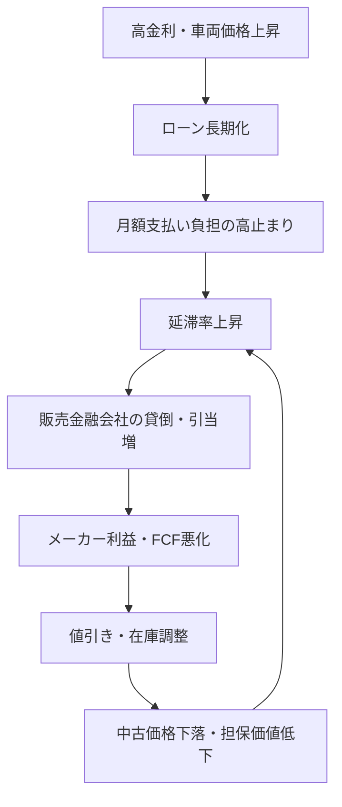

# 自動車業界の利益崩壊を投資シグナルとして読む｜EV減損・中国勢・ローン延滞

## 結論：自動車は「景気の先行センサー」として見る

自動車業界は、単なる個別セクターではありません。高額耐久財、消費者ローン、素材価格、為替、雇用、地政学、補助金政策が同時に反映されるため、経済の先行きを映す**炭鉱のカナリア**として機能します。

2025年から2026年にかけて目立つ異変は、販売台数や売上高が堅調でも、利益・フリーキャッシュフロー・バランスシートが先に傷み始めていることです。トヨタは2026年3月期に連結売上高50.684兆円を計上した一方、営業利益は前年の4.795兆円から3.766兆円へ低下しました。[Toyota Pressroom](https://pressroom.toyota.com/tmc-announces-april-through-march-2026-financial-results/)

この構図は、自動車株だけでなく、S&P500、日経平均、オルカン、つみたてNISAなどのインデックス投資家にも関係します。なぜなら、自動車ローン延滞や長期ローン化は、米国消費者の可処分所得と信用サイクルの劣化を示す可能性があるからです。

> 本稿は投資判断のための情報整理であり、特定銘柄の売買を推奨するものではありません。最終判断は一次情報、決算資料、リスク許容度に基づいて行ってください。

## 1. 現在の異常事態：売上は強いのに利益が崩れる

### 売上最高圏でも、利益の質が悪化している

自動車メーカーの売上が大きく見える理由は、販売単価の上昇、円安、インフレによる名目売上の押し上げが重なっているためです。しかし、投資家が見るべきは売上高ではなく、以下の3点です。

* **営業利益率**：価格転嫁できているか。
* **減損・特別損失**：過去投資の失敗が表面化していないか。
* **フリーキャッシュフロー**：高金利環境でも現金を残せているか。

2026年は、この3点が同時に悪化しやすい局面です。とくにEV投資の見直し、米国関税、労務費・素材費の上昇、販売金融の負担が利益を圧迫しています。

### 主要メーカーで起きていること

| 企業・地域 | 投資家が見るべきポイント | シグナル | --- | --- | --- | トヨタ | 売上高50兆円超でも営業利益は減少 | 全方位戦略は相対優位だが、マクロ圧力は免れない | ホンダ | EV戦略見直しに伴う巨額損失を公表 | EV投資の回収可能性が問われる | 日産 | 2025年度に5330億円規模の純損失 | リストラ・減損・固定費構造の重さが焦点 | ステランティス | 2025年下期に約222億ユーロのチャージ | EV需要見誤りと北米事業の立て直しが焦点 | 米国メーカー | EV投資、金利、販売金融、在庫調整 | 利益率と信用リスクが同時に揺れやすい |

ホンダは2026年3月、電動化戦略の再評価に伴い、連結で8200億円〜1.12兆円の営業費用、持分法投資損失1100億円〜1500億円を見込むと発表しました。[Honda Global](https://global.honda/en/newsroom/news/2026/c260312eng.html)

日産は2025年度決算で5330億円の純損失を発表し、再建策とコスト削減が投資テーマになっています。[MarkLines](https://www.marklines.com/en/news/344521)

ステランティスは2025年下期に約222億ユーロのチャージを計上し、EVを含む事業リセットを進めています。[Stellantis](https://www.stellantis.com/en/news/press-releases/2026/february/stellantis-resets-its-business-to-meet-customer-preferences-and-to-support-profitable-growth)

## 2. 利益を破壊する4つの構造問題

### ① EV投資の見誤りと減損リスク

2020年代前半、世界の自動車メーカーはテスラを追う形でEV投資を急拡大しました。しかし、2025年以降に明確になったのは、EV需要が直線的に伸び続けるわけではないという現実です。

EV市場では、初期採用者には刺さっても、一般消費者には以下の制約が残ります。

* 充電インフラへの不安
* 寒冷地や長距離移動での航続距離不安
* 中古価格・残価への不安
* 補助金や規制変更への依存
* 高金利下での月額支払い負担

投資家にとって重要なのは、「EVが良いか悪いか」ではありません。問題は、**過去に積み上げたEV関連投資の帳簿価値が、将来キャッシュフローで回収できるか**です。

回収不能と判断されれば、減損処理によって利益が一気に消えます。これはキャッシュアウトを伴わない場合もありますが、経営判断の失敗を会計上で認めるイベントであり、株価バリュエーションの前提を変えます。

### ② ブランド価値の崩壊：自動車のコモディティ化

内燃機関時代の高級車は、エンジン音、走行フィール、ブランドヒストリー、ディーラー体験によって高い利益率を維持してきました。

しかしEV化は、車の価値基準を変えます。

* 加速性能はモーターで比較的簡単に高められる。
* 安全装備や運転支援機能はソフトウェアとセンサーで標準化しやすい。
* 内装・大型ディスプレイ・コネクテッド機能は家電的に比較される。
* 消費者はブランドよりも、価格、スペック、ローン条件、納期を重視しやすくなる。

この変化は、PCやスマートフォン市場で起きたコモディティ化に近いものです。ブランドプレミアムが縮むと、PERや利益率の前提も下がります。

### ③ 中国メーカーの台頭：BYD・Xiaomiが価格基準を壊す

中国メーカーは、バッテリー、ソフトウェア、製造コスト、国内サプライチェーンの厚みを背景に、価格競争力を急速に高めています。

投資家が注視すべきは、中国国内だけではありません。欧州、東南アジア、オーストラリア、中南米など、関税・政治的障壁が相対的に低い市場で、既存メーカーのシェアと利益率を削る可能性があります。

重要なのは、販売台数の絶対値ではなく、**限界利益を奪う価格破壊者が市場に入ってきたこと**です。既存メーカーは値引き、インセンティブ、在庫調整で対抗せざるを得ず、利益率が先に傷みます。

### ④ 債務の壁：米国自動車ローンの劣化

米国では新車価格と金利の上昇により、購入者が長期ローンへ流れています。Edmundsデータを引用した報道では、2026年第2四半期に新車購入者の24%が84ヶ月以上のローンを選び、平均月額支払いは777ドル、平均借入額は4万4156ドルに達しました。[Road & Track](https://www.roadandtrack.com/news/a71837925/24-percent-of-new-vehicle-buyers-chose-loans-84-months-or-longer-q2-2026/)

また、Cox Automotiveは2026年3月時点で、ネガティブエクイティを抱える借り手の比率が59.2%に上昇し、過去最高を更新したとしています。[Cox Automotive](https://www.coxautoinc.com/insights/march-2026-cai/)

延滞率も注意が必要です。Trading EconomicsがFitch Auto ABS Indicesを基に示すデータでは、米国サブプライム借り手の60日以上延滞率は2026年5月に5.49%でした。[Trading Economics](https://tradingeconomics.com/united-states/car-loan-delinquency)

この数字が再び上昇に転じる場合、以下の連鎖が起きます。

## 3. 投資判断に使うチェックリスト

### インデックス投資家：マクロの定点観測

インデックス投資家は、自動車メーカー個別の勝ち負けよりも、米国消費者の信用サイクルを見るべきです。

| 指標 | 悪化した場合の意味 | 見る場所 | --- | --- | --- | サブプライム自動車ローン60日以上延滞率 | 低所得・中間層の資金繰り悪化 | Fitch、Trading Economics、Fed系レポート | 84ヶ月以上ローン比率 | 所得に対して車が高すぎる | Edmunds、Experian、Cox Automotive | ネガティブエクイティ比率 | 中古価格下落時の信用リスク増幅 | Cox Automotive | 新車在庫日数・インセンティブ | 需要鈍化と値引き圧力 | Cox Automotive、各社販売資料 | メーカー金融子会社の貸倒引当 | 信用コストの先行悪化 | 10-K、決算短信、有価証券報告書 |

これらが同時に悪化する局面では、自動車セクターだけでなく、消費関連株、金融株、ハイイールド債、広範な株価指数に波及するリスクがあります。

### 個別株投資家：安値拾いの前に見る5項目

「自動車株が下がったから割安」と判断するのは危険です。PBRやPERが低く見えても、利益の前提そのものが壊れている可能性があります。

| チェックポイント | 賢い選択の条件 | 注意したいパターンのリスク | --- | --- | --- | EV投資の処理状況 | 減損を出し切り、将来投資の規模を現実化 | 回収不能なEV投資を帳簿に抱える | 中国市場依存度 | 中国外で利益を稼げる | 中国勢との価格競争で利益率低下 | パワートレイン戦略 | HEV、PHEV、ICE、EVを需要に応じて配分 | EV一本足で需要変化に弱い | 販売金融の健全性 | 延滞・貸倒引当が管理可能 | 高金利と中古価格下落で信用損失が拡大 | 株主還元余力 | FCFで配当・自社株買いを支える | 見かけの配当利回りだけ高い罠 |

### トヨタ再評価の本質

トヨタの全方位戦略は、EV一本化への批判を浴びる局面もありました。しかし、需要・インフラ・規制・地政学が不確実な市場では、ハイブリッドを含む複線的なパワートレイン戦略がリスク分散として機能します。

ただし、これは「トヨタなら無条件で安全」という意味ではありません。関税、北米利益、労務費、円高転換、中国競争、販売金融の悪化は、トヨタにも影響します。再評価すべきは銘柄名ではなく、**需要の変化に合わせて資本配分を切り替えられる経営構造**です。

## 4. サテライト戦略：破壊する側に回る選択肢

リスク許容度が高い投資家は、既存メーカーではなく、市場を破壊する側の企業にサテライト枠を割く選択肢もあります。

候補になり得るテーマは以下です。

* 中国EVメーカー
* バッテリー・素材・部品サプライヤー
* 車載ソフトウェア・半導体
* 充電インフラ
* 中古車・オークション・整備プラットフォーム

ただし、中国企業には会計透明性、地政学、ADR・香港市場の流動性、規制、為替、制裁リスクがあります。サテライト投資に留め、コア資産とは明確に分けるべきです。

## 5. 長期投資の教訓：ブームの逆側を見る

今回の自動車業界の変調から得られる最大の教訓は、次の一文に集約できます。

> 世間が一方通行のブームに沸いている時ほど、その逆側のリスクに耐えられる経営と銘柄を選ぶ。

EVブームは、脱炭素、テスラ株、政策補助金、ESGマネーが重なって加速しました。しかし、投資テーマが正しくても、投資価格、投資規模、需要タイミングを誤れば株主価値は毀損します。

これはAIブームにも通じます。AIが重要な技術であることと、AI関連投資がすべて高リターンになることは別問題です。

長期投資家が持つべき視点は、流行テーマに乗ることではなく、以下を冷静に検証することです。

* その投資は、将来キャッシュフローで回収できるか。
* 競争優位はブランドではなく構造で守られているか。
* 借入・金利・信用サイクルに耐えられるか。
* 経営陣はブームと逆方向の選択を取れるか。
* 減損や特別損失を出しても資本政策を維持できるか。

## まとめ：自動車業界は「売上」ではなく「信用」と「資本配分」で見る

2026年の自動車業界で見るべき核心は、販売台数や売上高ではありません。

重要なのは、EV投資の減損、中国勢による価格破壊、ブランド価値のコモディティ化、米国自動車ローンの延滞という4つの圧力が、同時に利益を削っていることです。

投資家は、自動車業界を個別株の対象としてだけでなく、景気後退リスクを読むためのマクロセンサーとして観察すべきです。

## 変更履歴
- **2026-08-17**: 読み手に寄り添うプロ品質へのリライト（煽り・誇張表現の適正化、概要・構成の洗練）。

* 2026-07-08: 初版公開。自動車業界の利益悪化、EV減損、米国自動車ローン、投資チェックリストを整理。
