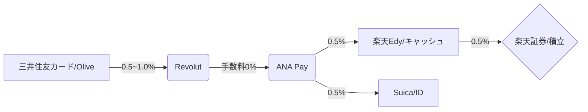

# 【2026決定版】最大還元率を叩き出すキャッシュレス決済ルート完全攻略

「どのカードからチャージするのが一番お得なの？」
「Revolutの改悪続きで、もう高還元ルートは終わった……」

そう思っていませんか？ 2026年現在、決済ルートは複雑化していますが、**「正しい組み合わせ」**を知っていれば、依然として2.0%〜3.0%以上の還元率を維持することは可能です。

本記事では、ポイ活のプロが実践する、**三井住友カードを起点とした「2026年最新・最強決済ルート」**をフロー図と共に徹底解説します。

---

## 1. 2026年の最強ルート俯瞰図（Mermaid Flow）

現在の決済パズルの正解は以下の通りです。

### このルートの核となる「ポイント三重取り」
1.  **三井住友カード決済ポイント**: 100万円修行を含めたベースポイント（0.5%〜1.5%相当）。
2.  **ANA Payチャージ/利用ポイント**: ANAマイルとしての還元（0.5%）。
3.  **楽天キャッシュ/Edy利用ポイント**: 楽天ポイントとしての還元（0.5%）。

合計で**常時2.0%前後**、キャンペーン併用でさらに上積みが狙えます。

---

## 2. ブランド別・チャージ手数料の罠を回避せよ

ここが最大の難所です。カードブランドの選択を誤ると、手数料で利益が吹き飛びます。

| 起点カード | 対象ブランド | Revolutチャージ手数料 | 判定 |
| :--- | :--- | :--- | :--- |
| **三井住友カード** | **Mastercard** | **0%** | **◎ 最強** |
| **三井住友カード** | Visa | 1.7% | ❌ 回避推奨 |
| **Olive** | **Visa (デビットモード)** | **0%** | **◯ 推奨** |

### 💡 鉄則：Mastercardブランドをメインに据える
三井住友カード（NL）等を作成する際は、必ず**Mastercard**を選んでください。VisaブランドではRevolutチャージに手数料がかかりますが、Mastercardなら無料です。Visaしか持っていない場合は、Oliveの「デビットモード」への切り替えが必須となります。

---

## 3. OS別：出口戦略の最適解

チャージした残高をどこで使うか。お使いのスマートフォンによって「最後の1ピース」が異なります。

### iPhoneユーザー：Apple Payの壁を突破
2026年のアップデートにより、iPhoneでも楽天Edyから楽天キャッシュへの変換が可能になりました。

*   **ルート**: Revolut ➡️ ANA Pay ➡️ 楽天Edy ➡️ 楽天キャッシュ ➡️ 楽天証券
*   **メリット**: スマホ1台で、高還元の「投信積立」まで完結。

### Androidユーザー：おサイフケータイの利便性
*   **ルート**: Revolut ➡️ ANA Pay ➡️ 楽天キャッシュ（モバイルSuica等も自在）
*   **メリット**: 物理カード不要。FeliCaによるタッチ決済の反応速度が爆速。

---

## 4. なぜ「ANA Pay」を噛ませるのか？（PREP法）

**【Point】**
決済ルートのハブとして「ANA Pay」を導入することは、現代ポイ活の必須条件です。

**【Reason】**
Revolutから直接Suicaや楽天キャッシュにチャージすると、ポイントが付与されない、あるいは手数料がかかるケースが増えているためです。

**【Example】**
ANA Payを経由させることで、Revolutの「Visa/Mastercard加盟店」としての決済枠を維持しつつ、さらに0.5%のANAマイルを上乗せできます。

**【Point】**
「手間は増えても、還元率は裏切らない」。この0.5%の積み重ねが、年間数十万円の決済額では大きな差となります。

---

## 5. まとめ：今日から始める「最強ルート」移行リスト

1.  **三井住友カード Mastercard** を用意する（またはOliveデビットモード）。
2.  **ANA Pay** をインストールし、Revolutをチャージ元に設定する。
3.  少額（1,000円〜）でチャージの疎通確認を行う。
4.  日常の決済（ID/Suica）や積立を、このルートに集約する。

ポイ活は「知っているか、知らないか」だけの差です。2026年の最新ルールを味方につけて、賢く資産を最大化しましょう。

## 変更履歴 (Changelog)
- **2026-04-24**: 「SEOトップ1%戦略」に基づき、記事を全面的にリライト。2026年最新の手数料体系とOS別ルートを反映。

