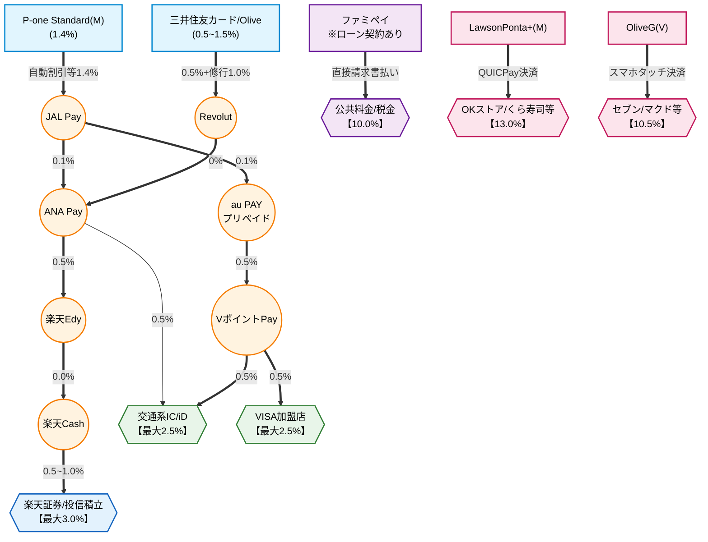

# 2026年最新ポイ活ルート完全図解：JAL Pay改悪を乗り越える「分離戦略」と実践マニュアル

## なぜ今、ポイ活ルートの「再構築」が必要なのか？

キャッシュレス決済のポイント還元ルールは日々変化しています。
特に、三井住友カード等から「JAL Pay」へのチャージがポイント付与対象外となった改悪は、多くのポイ活ユーザーにとってシステム再構築を迫られる大きな出来事でした。

さらに、楽天キャッシュの入手ルート（Edy経由や楽天ギフトカードなど）にも制限や上限がかかりやすくなっています。

これらの変化により、これまでの「とりあえず楽天ペイで払う」という思考停止の運用は通用しなくなりました。
レジ前で「どのアプリで払うのが一番お得か？」と迷う認知負荷（ストレス）も限界に達しているのが現状です。

今求められているのは、**改悪に強く、かつ日常の判断ストレスをゼロにする新しいポイ活システム**です。

## 新たな最適解「日常決済と投資の完全分離」戦略

現状のポイ活環境における最大の防御策であり最適解は、**「日常決済」と「投資」のルートを完全に分離すること**です。

具体的には、以下のルールを徹底します。

* **楽天キャッシュは「投信積立（最大3.0%）」の原資としてのみ運用する**
* **日常の街のお店での決済や請求書払いから「楽天ペイ」を切り離す**

貴重な楽天キャッシュは、街の買い物で消費せず、資産形成（楽天証券での積立）に全振りします。
これにより、ポイント価値を最大化しつつ、日常の支払いルートを極めてシンプルに再構築することが可能になります。

## 新・ポイ活マスターマップ（全体図解）

日常決済と投資を分離し、RevolutとP-oneカードを新たな起点として組み込んだ最新の全体図です。

このマップの要となる、2つの強力なチャージルートを解説します。

### ルートA：三井住友カード/Olive × Revolutルートの強み

JAL Pay改悪の穴を完璧に埋めるのが「Revolut」です。

* **還元率:** 0.5%（基本）＋ 1.0%（100万修行ボーナス）＝ **最大1.5%**
* **特徴:** Revolutを経由することで、手数料0%のままANA Payへ資金を流せます。年間100万円利用（100万修行）の進捗に合わせて稼働させるメインエンジンです。

### ルートB：P-one Standard × JAL Payルートの強み

100万修行に縛られたくない場合の最強のサブエンジンです。

* **還元率:** 請求時自動1%オフ ＋ 各種還元 ＝ **合計1.4%ベース**
* **特徴:** JAL Payへのチャージ専用カードとしてP-one Standard（Mastercard）を採用。ポイント移行の手間がなく、必要な時に必要な分だけチャージしても常に高還元を維持できる身軽さが最大の強みです。

---

## 場面別・ポイ活最適化マニュアル：レジ前でもう迷わない即効アクション

複雑な全体図も、用途と場面ごとに分解すれば非常にシンプルです。
「店舗特化」「街のお店」「自宅での作業（固定費・投資）」の3つの場面における、絶対的な行動指針をまとめました。

### 場面①「特定の店舗」では最強カードを即出しせよ（10.5%〜13%）

対象店舗に入った場合は、チャージルートのことは一切忘れてください。専用カードでの直接決済が圧倒的な最高還元となります。

| 対象店舗 | 最適な決済手段 | 還元率 |
| --- | --- | --- |
| **OKストア、くら寿司、スシロー、松屋、松のや** | Lawson Ponta+(M)の**QUICPay**決済 | **13.0%** |
| **セブンイレブン、ローソン、マクドナルド、サイゼリヤ、すき家 等** | OliveG(V)の**スマホVISAタッチ**決済 | **10.5%** |

### 場面②「街のお店（一般）」のメイン決済ルート（最大2.5%）

スーパーやドラッグストアなど、上記以外のすべてのお店での基本動作です。楽天ペイを使わないため、選択肢は極めてシンプルになります。

1. **第一優先:** VポイントPayを使った**スマホVISAタッチ または Suica**（最大2.5%）
* *経路:* P-one(M) ⇒ JAL Pay ⇒ au PAY ⇒ VポイントPay

2. **第二優先（残高不足・上限時）:** ANA Payを使った**iD または Suica**（最大2.0%）
* *経路:* 三井住友/Olive ⇒ Revolut ⇒ ANA Pay

レジ前では「VISAで」「Suicaで」「iDで」のいずれかを宣言するだけです。

### 場面③「自宅での作業」は機械的に処理せよ

レジ前での決済とは異なり、自宅で落ち着いて処理できる「固定費」と「投資」は、手間をかけてでも還元率の最大値を確実に取りにいきます。

#### 公共料金・税金の請求書払い

* **最適な決済手段:** ファミペイ（直接払い）
* **還元率:** **10.0%**（※ファミペイローン契約の恩恵をフル活用）
* **注意点:** 楽天ペイの請求書払いは還元率が劣るため使用しません。ローン契約による高還元枠を全額ここに投下します。

#### 楽天証券での投信積立（キャッシュ防衛戦）

* **作業ルート:** 三井住友/P-one ⇒（Revolut/JAL Pay等）⇒ ANA Pay ⇒ 楽天Edy ⇒ **楽天キャッシュ**
* **還元率:** **最大3.0%**
* **運用方法:** このルートでかき集めた楽天キャッシュは、一切の無駄遣いをせず、毎月の投信積立設定へ全額投入します。

## まとめ：システムを構築したら、あとは自動でポイントを生み出すだけ

JAL Payルートの改悪は、ポイ活環境を見直す絶好の機会でした。

「楽天キャッシュは投資専用」「レジ前では特定カードかVISAタッチ/交通系のみ」という明確な分離ルールを敷くことで、日々の判断ストレスは劇的に軽減されます。

一度このシステムとルーティンを構築してしまえば、あとは機械的に決済を行うだけで、生活のあらゆる支出から最大値のポイントが自動的に生み出されていくはずです。

## 変更履歴
- **2026-05-09**: 新規作成。JAL Pay改悪に対応した日常決済と投資の「分離戦略」を図解付きで解説。
