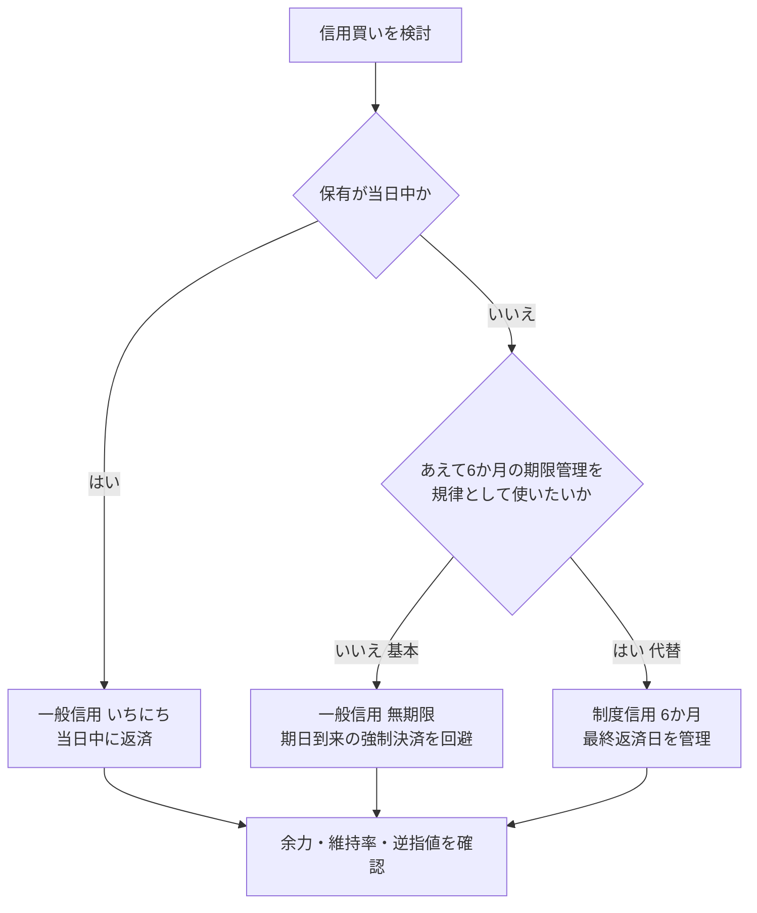

# 楽天証券の信用取引入門：一般信用（無期限）を基本にする考え方

> **重要な注意**: この記事は制度と操作前の確認事項を整理する情報提供です。特定銘柄・取引手法の売買を勧めるものではありません。信用取引では、預けた保証金を超える損失、追加保証金（追証）、不足金が発生する可能性があります。実際の取引条件は、必ず楽天証券の契約締結前交付書面と注文画面で確認してください。

「制度信用の6か月期限が気になる。一般信用の無期限で買えばよいのか」「ゼロコースなら本当にコストはかからないのか」と迷う人は少なくありません。

信用取引は、単にレバレッジをかける手段ではなく、**返済期限・金利・保証金維持率を自分で管理する取引**です。この記事では、楽天証券で国内株の信用買いを始める前に理解しておきたい選択肢と、手動注文前の確認手順を整理します。

> **筆者の個人運用における基本方針**
>
> 楽天証券のゼロコースを使う信用買いは、**一般信用（無期限）・買建を基本**にします。目的は、6か月の返済期日到来による意図しない決済や、建て直しの手間を避けることです。
>
> **制度信用（6か月）**は、「最長6か月で必ず保有を見直す」という期限を、あえて自分の規律として使いたい場合の代替にします。これは筆者の運用ルールであり、万人に共通する最適解ではありません。

## この記事で分かること

- ゼロコースで0円になる費用と、保有中に残る費用
- この個人運用で一般信用（無期限）を基本にする理由
- 追証・強制決済を避けるために見るべき数字
- 終値シグナルを手動注文の検討材料として使う場合の安全な流れ

---

## 1. 信用買いの基本方針と選び方

楽天証券の国内株信用取引では、注文時に信用区分を選びます。買建に関係する主な区分は、制度信用、一般信用（無期限）、一般信用（いちにち）です。一般信用（14日）は売建専用なので、信用買いには使いません。

この個人運用では、日計り以外はまず一般信用（無期限）を選べるか確認します。無期限を選んでも安全という意味ではありません。株価下落による追証や、証券会社・取引所の規制による制約は受けます。

### 信用区分の早見表

| 区分 | 買建 | 返済期限 | 初心者向けの理解 |
|---|---:|---|---|
| 制度信用 | 可 | 6か月 | 取引所のルールに基づく標準的な信用取引。最終返済日までに返済が必要です。 |
| 一般信用（無期限） | 可否を注文画面で確認 | 原則無期限 | 6か月の返済期日を避けて保有したい場合の選択肢です。 |
| 一般信用（14日） | 不可 | 14日 | 売建専用。つなぎ売りなどが主な用途です。 |
| 一般信用（いちにち） | 可 | 当日中 | デイトレード用。持ち越しはできません。 |

楽天証券では、注文画面に信用区分が表示され、対象外なら「－」表示になります。銘柄と売買区分によって取扱いが異なるため、一般信用（無期限）を使いたいときも発注前に確認が必要です。 [楽天証券：信用区分の表示](https://www.rakuten-sec.co.jp/ITS/qaJpOrd0014.html)

---

## 2. ゼロコースと金利コストの現実

楽天証券のゼロコースでは、国内株式の現物・信用取引の**売買委託手数料は0円**です。ただし、ゼロコースを利用するには原則としてSOR（Rクロスを含む）の利用同意が必要です。 [楽天証券：信用取引の手数料](https://www.rakuten-sec.co.jp/web/domestic/margin/commission.html)

売買手数料が0円でも、信用買いを持ち越すなら次の費用を分けて考えます。

| 費用 | いつ発生するか | 信用買いでの見方 |
|---|---|---|
| 売買委託手数料 | 新規・返済の約定時 | ゼロコースなら0円。ただし利用条件を確認します。 |
| 買方金利 | 建玉の保有期間 | 借入金に対する日割りの費用です。保有日数が長いほど増えます。 |
| 信用管理費 | 一定期間を超えた保有 | 金利とは別の事務費用です。発生条件・金額を公式表で確認します。 |
| 名義書換料等 | 権利日をまたぐ保有など | 配当・権利確定日をまたぐ場合は費用や処理を確認します。 |

### 金利は通常金利で見積もる

2026年8月22日時点で、楽天証券の通常買方金利は制度信用・一般信用（無期限）とも年2.80%です。大口条件を満たす場合の優遇金利は制度信用が年2.28%、一般信用（無期限）が年2.10%とされています。 [楽天証券：金利・優遇条件](https://www.rakuten-sec.co.jp/web/domestic/margin/commission.html)

優遇金利には大口の取引額・建玉残高に関する条件があります。多くの個人投資家は、資金計画を通常金利で置く方が安全です。金利は改定され得るため、発注時点の公式画面を優先してください。

---

## 3. なぜ一般信用（無期限）を基本にするのか

買建に限定すると、通常買方金利は作成時点で両方とも年2.80%です。そのため、この個人運用では金利差よりも、**6か月の期日を管理したいか、期日到来での決済を避けたいか**を優先します。

| 比較項目 | 制度信用（6か月）買 | 一般信用（無期限）買 |
|---|---|---|
| 返済期限 | 6か月目の応当日の前営業日が最終返済日 | 原則無期限 |
| 通常買方金利 | 年2.80%（作成時点） | 年2.80%（作成時点） |
| 優遇買方金利 | 年2.28%（作成時点） | 年2.10%（作成時点） |
| 買建の取扱 | 制度信用銘柄で可能 | 楽天の注文画面で取扱可否を確認 |
| この個人運用での位置づけ | 期限を規律として使いたい場合の代替 | **基本選択**：期日到来での決済を避け、損切り・利確は取引ルールで判断する |

一般信用（無期限）なら、制度信用の最終返済日に起因する強制決済を避けられます。日次シグナルに従って手仕舞い判断を行う個人運用では、期日ではなく損切り・利確ルールで決済を決められることが利点です。 [楽天証券：制度信用](https://www.rakuten-sec.co.jp/web/domestic/margin/system_margin/) [楽天証券：一般信用（無期限）](https://www.rakuten-sec.co.jp/web/domestic/margin/long_term/)

ただし「無期限」は「何も起きない」という意味ではありません。追証、口座の余力不足、取引所規制、株式分割・合併などのコーポレートアクションでは、返済が必要になる場合があります。損切りの判断を先送りする理由にしないことが重要です。

### この個人運用での使い分け

- **基本**: 一般信用（無期限）を選べる銘柄なら、一般信用（無期限）・買建を選びます。期限切れによる決済を避けられます。
- **代替**: 「最大6か月で必ず見直す」ことを運用規律にしたいときだけ、制度信用・買建を選びます。
- **共通の注意**: 通常金利は同じなので、信用買いの保有期間が長くなるほど金利負担は増えます。無期限は損失の許容期間を無期限にする仕組みではありません。

---

## 4. 追証と強制決済を避けるための基本

信用取引では、最低30万円かつ新規建代金に対して原則30%以上の委託保証金が必要です。30%で考えると、制度上は最大約3.3倍まで建てられます。しかし「建てられる上限」と「安全に建ててよい金額」は別です。 [楽天証券：信用取引の基本ルール](https://www.rakuten-sec.co.jp/web/domestic/margin/rule/ground_rules.html)

楽天証券の基本ルールでは、終値後の値洗いで委託保証金維持率が20%を下回ると追証が発生します。個別銘柄の増担保規制などでは、これより厳しい条件になる可能性があります。追証の解消期限や必要額は、必ずその時点の楽天証券画面で確認してください。

### 初心者が先に決めるべきこと

1. **最大レバレッジではなく、最大損失額を決める**: 何%下落したら、いくら損失になるかを先に計算します。
2. **維持率に余裕を持つ**: 追証ラインの近くまで使わず、株価下落や代用有価証券の値下がりに耐えられる余力を残します。
3. **逆指値の限界を理解する**: 逆指値は重要な管理手段ですが、急変や値幅制限で指定価格どおりの約定を保証するものではありません。
4. **返済期日を記録する**: 制度信用なら最終返済日を、一般信用なら保有日数と累積金利を定期的に確認します。

---

## 5. 終値シグナルを使う場合の手動確認フロー

日足終値後に銘柄候補を確認するツールを使う場合でも、シグナルは注文ではありません。翌営業日の寄りを想定した検討材料として扱い、発注と約定確認はブローカー画面で行います。

1. **日次レポートを読む**: データ基準日、候補理由、保有状態、損切り目安を確認します。
2. **楽天の注文画面で照合する**: 銘柄コード、株数、信用区分、価格条件、新規建余力、維持率、信用規制を確認します。
3. **自分で注文する**: 成行・指値・執行条件は、値動きのリスクを理解したうえで自分で選択します。
4. **翌営業日に約定を確認する**: 約定価格と株数は、注文時の想定と異なることがあります。約定確認前に保有台帳を更新しません。
5. **保有中も確認する**: 逆指値、維持率、決算日、権利日、制度信用の返済期日を継続して確認します。

この流れでは、シグナル生成ソフトは楽天証券へ注文を送信しません。発注前の最終判断と注文内容の責任は、常に利用者自身にあります。

---

## 6. 発注前チェックリスト

- [ ] 銘柄コード・銘柄名・株数に誤りがない。
- [ ] 「信用新規買」と「信用返済売」を取り違えていない。
- [ ] 制度信用 / 一般信用（無期限）の選択が保有計画と一致している。
- [ ] 発注後も維持率に十分な余裕がある。
- [ ] 逆指値の価格・数量・有効期限を確認した。
- [ ] 決算予定、権利付き最終日、信用規制を確認した。
- [ ] ゼロコースの利用条件を満たしていることを確認した。
- [ ] 信用取引の損失が保証金を超える可能性を理解している。

---

## まとめ

楽天証券で信用買いを始めるときは、売買手数料の0円だけで判断せず、買方金利、返済期限、維持率、追証リスクを一つのセットとして確認することが大切です。

- この個人運用では、一般信用（無期限）・買建を基本にします。期日到来による強制決済を避けられるためです。
- 制度信用は、6か月の返済期限を自分の運用規律として使いたい場合の代替です。
- 一般信用（無期限）でも、保有コストや追証リスクはなくなりません。
- ゼロコースでも、信用買いの金利などは別途かかります。
- シグナルツールは判断材料にとどめ、注文・約定・維持率は楽天証券の画面で手動確認します。

取引前には、制度や費用の変更がないかを楽天証券の[信用取引ページ](https://www.rakuten-sec.co.jp/web/domestic/margin/)で確認してください。

---

## 変更履歴 (Changelog)

- **2026-08-22 (v1.1)**: 個人運用の基本方針を「一般信用（無期限）・買建」と明示し、制度信用を期限管理の代替として整理。
- **2026-08-22 (v1.0)**: 楽天証券で信用取引を始める初心者向けに、ゼロコース、制度信用と一般信用（無期限）の比較、保証金・追証、手動確認フローを新規公開。
