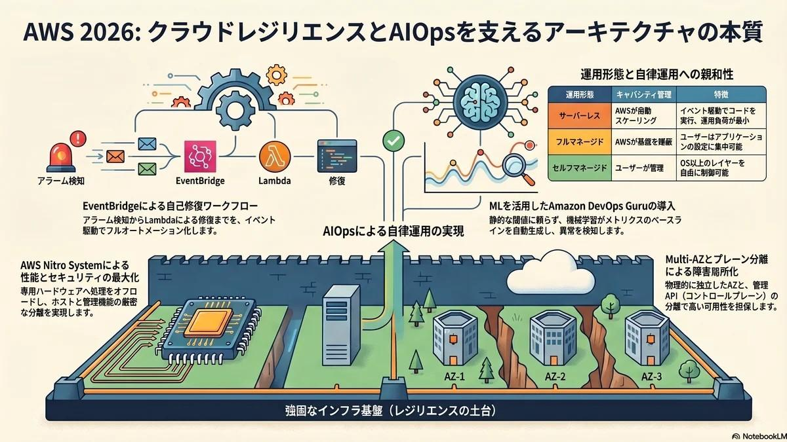

# Infra | AWS：クラウドレジリエンスと AIOps を支える基盤設計 2026

<figure class="mb-10 max-w-4xl mx-auto cyber-glow">
  
</figure>

Standard Edition: v2026.04.10

[AWS](https://fununi222.github.io/websi../../article.html?md=glossary/system-glossary.md#:~:text="AWS%20RDS")は、単なる仮想サーバーの提供を超え、[AWS Nitro System](https://fununi222.github.io/websi../../article.html?md=glossary/system-glossary.md#:~:text="AWS%20Nitro%20System")による基盤の抽象化と、[Amazon EventBridge](https://fununi222.github.io/websi../../article.html?md=glossary/system-glossary.md#:~:text="Amazon%20EventBridge")を中心としたイベント駆動型エコシステムにより、高い耐障害性と自律運用（[AIOps](https://fununi222.github.io/websi../../article.html?md=glossary/system-glossary.md#:~:text="AIOps")）を実現するプラットフォームである。本稿では、そのアーキテクチャの本質と運用自動化への親和性を紐解く。

---

## 1. AWSのアーキテクチャと全体像

- **グローバルインフラストラクチャ:** リージョンとアベイラビリティーゾーン（[Multi-AZ](https://fununi222.github.io/websi../../article.html?md=glossary/system-glossary.md#:~:text="Multi-AZ")）による物理的・論理的な障害ドメインの分離で構成され、データセンターレベルの障害局所化と高可用性を担保。
- **[AWS Nitro System](https://fununi222.github.io/websi../../article.html?md=glossary/system-glossary.md#:~:text="AWS%20Nitro%20System"):** 独自の仮想化基盤。ネットワーク、ストレージ、管理機能などのハイパーバイザタスクを専用ハードウェア（Nitro Card）にオフロードし、ベアメタルに近いパフォーマンスとホスト基盤の厳密なセキュリティ分離を実現。
- **コントロールプレーンとデータプレーンの分離:** リソースをプロビジョニングする[API](https://fununi222.github.io/websi../../article.html?md=glossary/system-glossary.md#:~:text="API")エンドポイント等のコントロールプレーンと、実際のパケットルーティングやストレージI/Oを行うデータプレーンが厳密に分離されており、管理系APIの障害が稼働中のワークロードに影響を与えない設計。
- **責任共有モデルに基づく運用:** サービスは「フルマネージド（基盤管理をAWSが隠蔽）」「サーバーレス（キャパシティ管理と実行環境を動的にスケーリング）」「セルフマネージド（EC2等のインフラのみ提供）」の形態で提供される。

## 2. 主要な基本機能一覧

- **コンピューティング ([Amazon EC2](https://fununi222.github.io/websi../../article.html?md=glossary/system-glossary.md#:~:text="Amazon%20EC2") / [AWS Lambda](https://fununi222.github.io/websi../../article.html?md=glossary/system-glossary.md#:~:text="AWS%20Lambda")):** 仮想サーバーのプロビジョニング、およびインフラ管理不要でイベント駆動でコードを実行するコンテナ/関数ベースのサーバーレスコンピューティング環境。
- **ネットワーキング ([Amazon VPC](https://fununi222.github.io/websi../../article.html?md=glossary/system-glossary.md#:~:text="Amazon%20VPC")):** 論理的に分離された仮想ネットワーク空間の構築、サブネット分割、ルートテーブル設定、およびセキュリティグループ（[パケットフィルター](https://fununi222.github.io/websi../../article.html?md=glossary/system-glossary.md#:~:text="パケットフィルター")）によるフィルタリング。
- **オブザーバビリティ ([Amazon CloudWatch](https://fununi222.github.io/websi../../article.html?md=glossary/system-glossary.md#:~:text="Amazon%20CloudWatch")):** インフラおよびアプリケーションのメトリクス収集、ログの集約、異常検知に基づくアラーム発報。AWS X-Rayと統合された分散トレースにより[MTTR](https://fununi222.github.io/websi../../article.html?md=glossary/system-glossary.md#:~:text="MTTR")を短縮する。
- **イベント駆動ルーティング ([Amazon EventBridge](https://fununi222.github.io/websi../../article.html?md=glossary/system-glossary.md#:~:text="Amazon%20EventBridge")):** AWSサービスの状態変化やカスタムアプリケーションのイベントをサブスクライブし、ターゲット（Lambda、Step Functions等）へルーティングするサーバーレス[Event Orchestration](https://fununi222.github.io/websi../../article.html?md=glossary/system-glossary.md#:~:text="Event%20Orchestration")。

## 3. AIOps視点での評価

- **APIの完全性とSDKの充実度:** ほぼ全てのリソース操作およびメトリクス取得がRESTful API化されており、[Boto3](https://fununi222.github.io/websi../../article.html?md=glossary/system-glossary.md#:~:text="Boto3")（Python）等を通じて、[AIOps](https://fununi222.github.io/websi../../article.html?md=glossary/system-glossary.md#:~:text="AIOps")パイプラインからのデータ抽出や修復スクリプトの実行を容易にフルオートメーション可能。
- **IaCエコシステムとの強固な統合:** [Terraform](https://fununi222.github.io/websi../../article.html?md=glossary/system-glossary.md#:~:text="Terraform")や[AWS CDK](https://fununi222.github.io/websi../../article.html?md=glossary/system-glossary.md#:~:text="AWS%20CDK")（プログラミング言語によるインフラ定義）を公式にサポート。監視設定やアラーム定義自体をコード化（[Docs-as-Code](https://fununi222.github.io/websi../../article.html?md=glossary/system-glossary.md#:~:text="Docs-as-Code")）し、CI/CDパイプラインへの組み込みが可能。
- **イベント駆動型自動化（Auto-remediation）への親和性:** EventBridgeとAWS Lambdaを組み合わせることで、「CloudWatchアラーム発報 → EventBridgeで検知 → Lambdaで一次調査・自己修復スクリプトを実行」というリアクティブな運用自動化ワークフロー（[Runbook Automation](https://fununi222.github.io/websi../../article.html?md=glossary/system-glossary.md#:~:text="Runbook%20Automation")）を構築可能。
- **ネイティブAIOps機能の提供:** [Amazon DevOps Guru](https://fununi222.github.io/websi../../article.html?md=glossary/system-glossary.md#:~:text="Amazon%20DevOps%20Guru")等により、機械学習を用いてメトリクスのベースラインを自動生成し、通常とは異なる異常な動作（メモリリーク、レイテンシスパイク等）を静的な閾値設定なしで自動検知・アラート化する。

## 4. 参考文献

- **AWS 公式ドキュメント:** https://docs.aws.amazon.com/
- **[AWS Well-Architected Framework](https://fununi222.github.io/websi../../article.html?md=glossary/system-glossary.md#:~:text="AWS%20Well-Architected%20Framework"):** https://aws.amazon.com/jp/architecture/well-architected/
- **AWS Nitro System のアーキテクチャ:** https://aws.amazon.com/jp/ec2/nitro/
- **Amazon DevOps Guru（MLを活用した運用支援）:** https://aws.amazon.com/jp/devops-guru/

## 変更履歴 (Changelog)
- **2026-04-10**: AWSの基礎アーキテクチャとAIOps適応に関する技術深掘り記事を新規作成。

