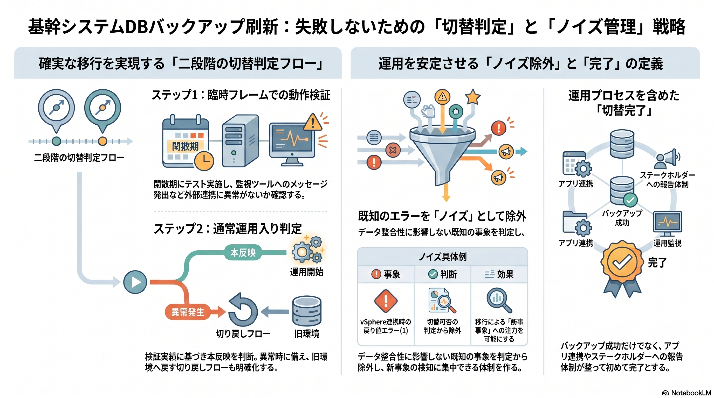

Research Log: v2026.04.16

<figure class="mb-10 max-w-4xl mx-auto cyber-glow">
  
</figure>

# DB Backup Modernization | 基幹システムのバックアップ刷新と『ノイズ除外』の判断基準

販売管理等のミッションクリティカルなデータベース基盤を旧環境から新バックアップ基盤へ移行する際、単なる「設定完了」をゴールにすると、運用開始直後の警告多発により移行の成否判断が揺らぐリスクがあります。本稿では、既知の製品制約を「ノイズ」として定義し、真の切替成功を判定するためのゲート設計について整理します。

Last Updated: 2026-04-16

---

## 1. 二段階の切替判定フロー

確実な移行を実現するため、技術的な「正常終了」と運用的な「実績確認」を分けた二段階のゲートを設置します。

### ステップ1：臨時フレームでの動作検証（検証機・本番機）
- 日曜日のAM等の閑散期に臨時フレームを投入。
  - 新バックアップ基盤による初回バックアップの終了状態を確認。
- 統合監視ツールとの連携（メッセージ発出）に異常がないかをチェック。

### ステップ2：通常運用入り判定
- 事前検証での実績に基づき、通常スケジュールへの本反映可否を最終判断。
- 異常時は即座に旧環境側のアーカイブモードを戻す等の切り戻しフローを明確化しておく。

## 2. 『ノイズ除外』：既知エラーの扱い

移行時に最も警戒すべきは、**「以前から存在していた無害なエラー」を移行起因の障害と誤認すること**です。

### [post-thaw-script](https://fununi222.github.io/website/html/glossary/system-glossary.html#:~:text="post-thaw-script") エラーの分類
- **事象**: [vSphere](https://fununi222.github.io/website/html/glossary/system-glossary.html#:~:text="vSphere")連携時にスクリプト実行結果がエラー（1）を返すが、データ自体は整合性が保たれているケース。
- **判断**: 旧環境利用時からの既知事象である場合、今回の切替可否の一次判定からは除外。
- **効果**: 監視のノイズを低減し、移行によって「新たに発生した事象」にフォーカスできる体制を構築。

## 3. 連絡系統の確立

バックアップ製品のコンソール上での「Success」だけでは不十分です。
- アプリケーション側の臨時フレーム停止を検知できるか。
- 統合監視ツールのメッセージに基づき、Teams等で即時にステークホルダーへ報告できるか。
- 手順書に基づく「説明責任」を果たせる状態を「切替完了」と定義します。

---

## 結論：運用まで含めた「完成」の定義
[IaC](https://fununi222.github.io/website/html/glossary/system-glossary.html#:~:text="IaC")による構築自動化が進む現代においても、エンタープライズ領域の移行では「人間がどう判断し、どう連絡するか」という運用プロセスの設計が最終的な品質を左右します。

## 変更履歴 (Changelog)
- 2026-04-16: 新規作成。基幹DBのバックアップ刷新判定フローとノイズ管理戦略を統合。

