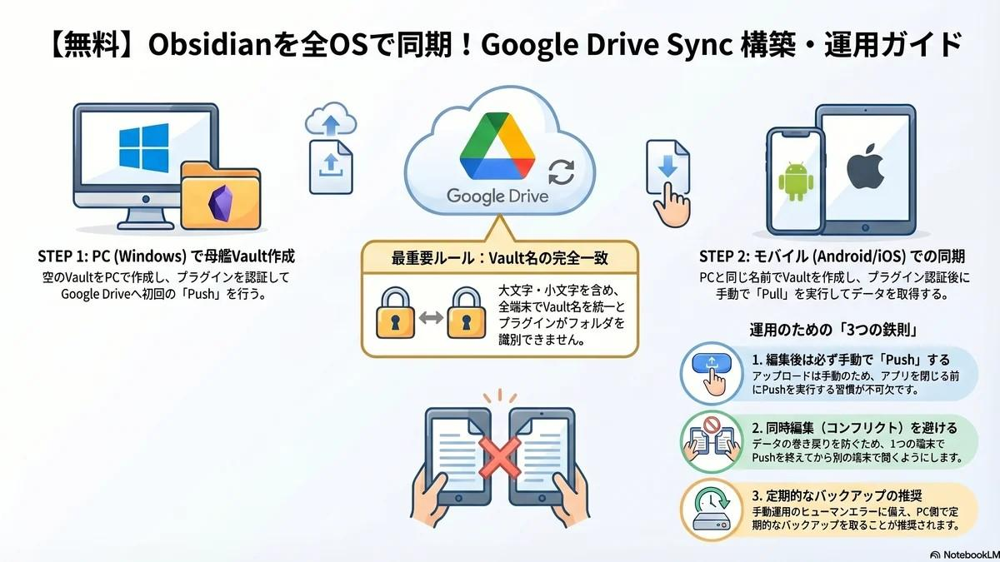

# Obsidian | Google Drive Sync によるマルチプラットフォーム無料同期術 2026

<figure class="mb-10 max-w-4xl mx-auto cyber-glow">
  
</figure>

[Obsidian](https://fununi222.github.io/websi../../article.html?md=glossary/system-glossary.md#:~:text="Obsidian") は優れたローカルファーストの知識管理ツールですが、モバイル端末との同期には通常 `Obsidian Sync`（有料サブスクリプション）が必要です。本記事では、コミュニティプラグイン **[Google Drive Sync](https://fununi222.github.io/websi../../article.html?md=glossary/system-glossary.md#:~:text="Google Drive Sync")** を活用し、Windows PC、Android、iOS の 3OS 間で [Vault](https://fununi222.github.io/websi../../article.html?md=glossary/system-glossary.md#:~:text="Vault (保管庫)") を無料で完全同期する手法を解説します。

Last Updated: 2026-04-13

---

## 💡 同期システムのデザインと「最重要ルール」

設定に入る前に、今回構築する同期エンジンの仕様を理解しておく必要があります。

- **Pull (ダウンロード) は自動**: アプリ起動時、自動的に Google Drive から最新のファイル群を取得します。
- **Push (アップロード) は手動**: 編集したメモをクラウドに反映させるには、**明示的な手動 Push** が必要です。

> [!CAUTION]
> **最重要：Vault名の完全統一**
> PC、Android、iOS のすべてで、**全く同じVault名（大文字・小文字も完全に一致）**にする必要があります。プラグインは「Vault名」をキーにして Google Drive 上のフォルダを識別するため、ここがズレると同期が成立しません。

---

## 🛠️ Step 1：Windows PC でのベース設定（親Vaultの作成）

まずは母艦となる Windows PC から設定を行います。既存のメモがある場合でも、まずは「空の保管庫」から構築することで競合トラブルを回避できます。

### 1. 新規 Vault の作成
1. Obsidian を起動し、「Create new vault（新しい保管庫を作成）」を選択。
2. Vault名を入力（例：`MyNotes`）。**※この名前を全端末で共通利用します。**
3. 保存場所を指定して「Create」をクリック。

### 2. プラグインのインストール
1. `Settings` > `Community plugins` を開き、「Turn on community plugins」を有効化。
2. `Browse` をクリックし、検索バーに `Google Drive Sync` と入力。
3. プラグインをインストールし、`Enable` をクリック。

### 3. Google アカウント認証と初回 Push
1. プラグイン設定の「プラグインオプション」から `Google Drive Sync` を開く。
2. **「Get Refresh token」** をクリック。ブラウザで Google アカウント認証を行い、表示された文字列を `Refresh token` 欄に貼り付けます。
3. コマンドパレット（`Ctrl + P`）を開き、`Google Drive Sync: Push to Google Drive` を実行。

これにより、Google Drive のマイドライブ直下に Vault 名と同名のフォルダが自動生成されます。

---

## 📱 Step 2：Android 端末での同期設定

1. Google Play ストアから Obsidian をインストール。
2. 「Create new vault」をタップ。PC と**完全に同じ名前**（例：`MyNotes`）で作成。
3. PC と同様に `Google Drive Sync` プラグインをインストール・有効化。
4. 設定画面で `Refresh token` を取得・貼り付け（PC と同じアカウントを使用）。
5. コマンドパレットから `Google Drive Sync: Pull from Google Drive` を実行。
   - ※初回は手動 Pull でデータを引き込む必要があります。

---

## 🍏 Step 3：iOS (iPhone / iPad) での同期設定

iOS のファイルシステムの制約上、iCloud 経由ではなく「ローカル保存」を選択するのがポイントです。

1. App Store から Obsidian をインストール。
2. 「Create new vault」をタップ。PC/Android と同一の名前を入力。
3. **重要：** 「Store in iCloud」のチェックを **オフ（ローカル保存）** にして作成。
4. プラグインのセットアップ手順は Android と同様です。認証後、`Pull from Google Drive` を実行してください。

これで、全 OS 間での同期ルートが開通しました。

---

## 📌 運用上の鉄則とベストプラクティス

この同期環境を安全に運用するための 3 つのルールです。

### 1. 編集後は必ず「Push」する習慣
PC でもスマホでも、作業を終えてアプリを閉じる前に必ずコマンドパレットから **Push** を実行してください。これを忘れると、他端末で開いた際に古いデータが残ったままになります。

### 2. 同時編集の厳禁（競合回避）
PC でファイルを開いたままスマホで同じファイルを編集すると「コンフリクト（競合）」が発生します。基本的には「最後に Push されたもの」が優先されますが、データ巻き戻りのリスクを避けるため、「1 端末での作業完了 → Push → 別の端末で開く」というシーケンスを徹底してください。

### 3. 定期的なバックアップ
無料プラグインによる手動同期である以上、操作ミスによるデータ消失リスクはゼロではありません。PC 側で `Vault` フォルダをまるごと別ドライブにバックアップするか、PC 環境であれば Git 等を併用した自動バックアップを推奨します。

---

## まとめ

[Google Drive Sync](https://fununi222.github.io/websi../../article.html?md=glossary/system-glossary.md#:~:text="Google Drive Sync") を活用することで、高価なサブスクリプションを介さずに強力なクロスプラットフォーム同期を実現できます。「手動 Push」というワンアクションをルーチン化できれば、Obsidian は真の意味でどこでも使える最強の「知のネットワーク」となるでしょう。

