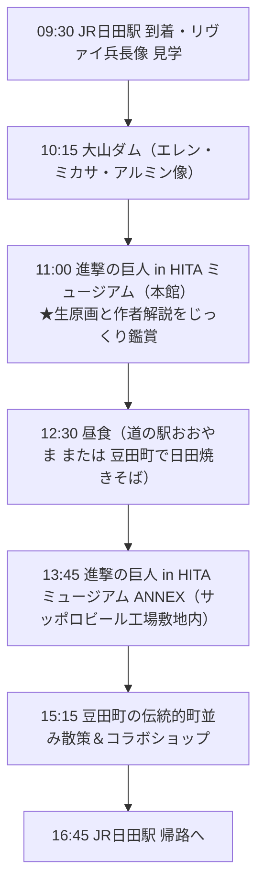

---
title: "日田「進撃の巨人」聖地巡礼1日モデルコース｜作者解説ミュージアムと銅像スポットを巡る旅"
date: "2026-08-28"
category: "other"
description: "大分県日田市に点在する『進撃の巨人』聖地を1日で効率よく巡るモデルコース。作者・諫山創氏の直筆解説が読めるミュージアムをハイライトに、大山ダム、日田駅前、ANNEXの回り方と時間配分を解説します。"
themes: ["other:research", "other:workflow"]
updated: "2026-08-28"
---

# 日田「進撃の巨人」聖地巡礼1日モデルコース｜作者解説ミュージアムと銅像スポットを巡る旅

原作者・諫山創氏の故郷である大分県日田市には、作品の世界観をリアルに体感できるスポットが点在しています。中でも最大の魅力は、道の駅 水辺の郷おおやま内にある「進撃の巨人 in HITA ミュージアム」で、**諫山氏自身が選定した生原画と、本人の直筆解説コメント**を読める点にあります。

この記事では、作者の言葉をじっくり味わうミュージアム鑑賞をメインに据えつつ、大山ダムや日田駅前の銅像、ANNEX、豆田町の散策を1日で無理なく巡るためのモデルコースと時間配分を整理します。

## 概要（Summary）

- **ハイライト**: 「進撃の巨人 in HITA ミュージアム（本館）」では、諫山創氏が選定した生原画26ページとともに、作者本人の解説キャプションを作品の真横で鑑賞できます。
- **4大主要スポット**: 「日田駅前（リヴァイ像）」「大山ダム（エレン・ミカサ・アルミン像）」「ミュージアム本館（水辺の郷おおやま）」「ミュージアム ANNEX（サッポロビール工場敷地内）」。
- **推奨所要時間**: 1日（約6〜7時間）。大山エリア（ダム・本館）と日田市街地（駅・豆田町・ANNEX）でエリアを分けると移動の無駄を省けます。
- **移動手段**: 車・レンタカーが最も柔軟に回れますが、日田駅発の路線バス・タクシーを活用した公共交通ルートでも主要スポットを巡回可能です。

> 最終確認: 2026-08-28。展示内容・開館時間・バスダイヤは変更される場合があるため、出発前に[進撃の日田 公式サイト](https://shingeki-hita.com/)で最新情報をご確認ください。

---

## 1. 日田×進撃の巨人で巡りたい4大スポット

日田市内の聖地は、大きく「大山（おおやま）エリア」と「日田駅・市街地エリア」の2つに分かれています。

| スポット名 | エリア | 主な見どころ | 目安滞在時間 |
| :--- | :--- | :--- | :--- |
| **進撃の巨人 in HITA ミュージアム（本館）** | 大山 | 諫山創氏セレクト生原画26点、作者本人による解説キャプション、大型オブジェ | 45〜60分 |
| **大山ダム（銅像スポット）** | 大山 | エレン・ミカサ・アルミンの少年期像、ダム壁面を「ウォール・マリア」に見立てた演出 | 20〜30分 |
| **進撃の巨人 in HITA ミュージアム ANNEX** | 市街地近郊 | 全34巻の複製原画展示、諫山氏の幼少期〜連載初期エピソード、限定展示 | 45〜60分 |
| **JR日田駅前広場・駅構内** | 日田駅 | リヴァイ兵長像、駅前案内所、駅舎内の進撃の巨人展示 | 15〜30分 |

---

## 2. 最大の見どころ：「ミュージアム本館」で作者の直接解説を読む

日田の進撃スポットの中で、作品ファンにとって最も体験価値が高いのが「進撃の巨人 in HITA ミュージアム（道の駅 水辺の郷おおやま内）」です。

単に作品のパネルやグッズが並んでいるだけでなく、**「諫山創氏本人がどの意図でそのコマを描いたのか」「執筆時にどんな試行錯誤や感情があったのか」**が、原画のすぐ横にキャプションとして日本語・英語・韓国語・繁体字中国語で掲示されています。

> **著者の鑑賞メモ**:
> 原画の筆致や修正跡を見られるだけでも貴重ですが、作者本人の率直な解説文を読むことで、「このシーンの感情表現はこうして生まれたのか」という裏側の文脈が立ち上がってきます。流し見するのではなく、キャプションを一文ずつ丁寧に読む時間を確保することが、この旅の満足度を大きく高めてくれます。

---

## 3. おすすめ1日モデルコース

日田駅を拠点として、午前中に大山エリア（ダム・本館ミュージアム）を巡り、午後に市街地・ANNEX・豆田町を回る王道ルートです。

### スケジュール詳細

#### 【09:30】JR日田駅 到着・駅前広場
- 駅前広場に設置された**リヴァイ兵長像**を鑑賞。
- 日田駅観光案内所で「進撃の日田マップ」を入手し、2館共通入場券の販売状況等を確認します。

#### 【10:15】大山ダム（壁を見上げる3人）
- 日田駅から車で約20分。ダムの巨大な堤体を「ウォール・マリア」に見立て、超大型巨人の襲来を仰ぎ見るエレン、ミカサ、アルミンの少年期像が設置されています。
- 公式ARアプリを使うと、ダムの上に超大型巨人が出現する臨場感あふれる演出も楽しめます。

#### 【11:00】進撃の巨人 in HITA ミュージアム（本館）
- 大山ダムから車で約5分、「道の駅 水辺の郷おおやま」に隣接。
- 諫山氏が選定した生原画と解説コメントを1コマずつじっくり鑑賞します。物販コーナーには日田限定のオリジナルグッズも揃っています。

#### 【12:30】ランチ（日田ご当地グルメ）
- 道の駅内のレストラン、または市街地・豆田町へ移動して名物の**日田焼きそば**（パリッとした麺と香ばしいソースが特徴）を味わいます。

#### 【13:45】進撃の巨人 in HITA ミュージアム ANNEX
- サッポロビール九州日田工場の敷地内にある第2のミュージアム。
- 1巻から最終34巻までの複製原画が壁一面に並び、物語の軌跡を一気に追体験できます。

#### 【15:15】豆田町のレトロな町並み散策
- 江戸時代の風情が残る国選定重要伝統的建造物群保存地区「豆田町」を散策。
- 羊羹や下駄の老舗、カフェ、進撃コラボ商品の取り扱い店舗を巡ります。

---

## 4. 移動手段別のポイント

### 車・レンタカーを利用する場合（推奨）
- **メリット**: スポット間の移動がスムーズで、ダムや道の駅での滞在時間を自由に調整可能。
- **駐車料金**: 大山ダム、水辺の郷おおやま、サッポロビール工場、市街地市営駐車場など、各拠点に駐車場が整備されています。

### 公共交通（バス・タクシー）を利用する場合
- 日田バスターミナルから日田バス「杖立線」に乗り、「水辺の郷おおやま前」で下車（約30分）。
- **注意点**: バスの運行本数が限られるため、日田駅到着時に必ず復路（帰り）のバス時刻表を確保し、逆算してミュージアムの滞在時間を決めてください。
- **大山ダムへの移動**: バス停（水辺の郷おおやま前）から大山ダム下流広場までは約2.5kmの上り勾配（徒歩約35〜40分）があるため、日田駅または道の駅からタクシーを併用するのが現実的です。

---

## 5. 旅をより楽しむためのコツ

1. **ミュージアム共通券を活用する**:
   本館とANNEXの両方を訪れる場合、共通券（通常2日間有効）を購入するとお得に入場できます。
2. **原作を読み返しておくと感動が倍増**:
   特に本館の生原画展は、該当する場面の展開を知っているほど、作者のコメントに込められた意図や当時の苦悩が深く刺さります。
3. **公式ARアプリを事前ダウンロード**:
   「進撃の日田」専用アプリを事前にスマートフォンにインストールしておくと、大山ダムや日田駅前でのAR演出をスムーズに体験できます。

---

## 巡礼前チェックリスト

- [ ] [進撃の日田 公式サイト](https://shingeki-hita.com/)で休館日（第3水曜等）・営業時間を調べた
- [ ] 公共交通利用の場合、日田バスの往復時刻表を確認した
- [ ] 本館ミュージアムの作者解説を読む時間を「最低45分〜1時間」確保した
- [ ] 原作の好きな巻・名場面を振り返っておいた
- [ ] スマホの充電とARアプリの準備を完了した

---

## まとめ

日田の『進撃の巨人』スポット巡りは、単なるアニメの聖地訪問にとどまらず、**「作者・諫山創氏が生まれ育った土地の空気を感じながら、本人の生の声（解説）に触れる」**という特別な体験ができます。

特にミュージアム本館の生原画と作者コメントは、時間をかけてじっくり読む価値があります。ぜひ日田の美しい自然や歴史ある町並みとともに、心に残る巡礼旅を楽しんでみてください。

---

## 変更履歴 (Changelog)

- **2026-08-28**: 日田「進撃の巨人」聖地巡礼1日モデルコース（作者解説ミュージアム、大山ダム、ANNEX、日田駅）を新規公開。