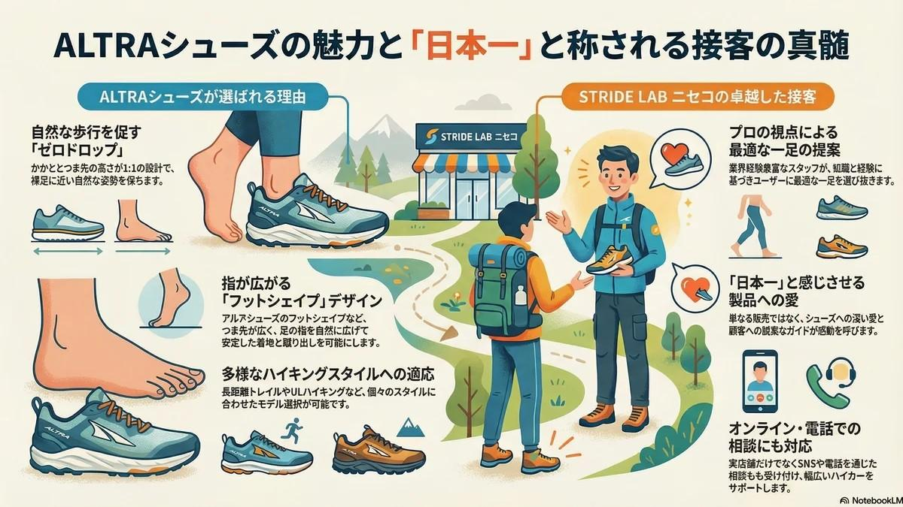

# Other | 顧客満足度分析レポート：アウトドア小売における「日本一の接客」と高付加価値カウンセリング戦略

<figure class="mb-10 max-w-4xl mx-auto cyber-glow">
  
</figure>

本レポートでは、北海道・ニセコの「STRIDE LAB」における「日本一の接客」の構造を、CX（顧客体験）戦略とブランド防衛の観点から分析する。単なる販売から、個別の身体特性に基づいた「高付加価値カウンセリング」への昇華が、いかにしてCustomer Success（顧客の活動の成功）と強固なブランドロイヤリティを生み出すかを詳解。デジタル時代の店舗が目指すべき、コミュニティ・ハブとしての次世代リテールモデルを提示する。

Last Updated: 2026-04-09

---

## 1. イントロダクション：専門特化型小売における接客の戦略的重要性

現代のアウトドア市場において、製品の機能性やスペックのみで持続的な差別化を図ることは極めて困難です。ECの普及により、消費者は世界中のギアに指先一つでアクセス可能となりました。このような「情報の過多」と「購買のコモディティ化」が進む中で、実店舗が提供すべき真の価値は、単なる販売代行ではなく、顧客の課題を解決し「Customer Success（顧客の活動の成功）」を保証することにあります。

本レポートでは、北海道・ニセコを拠点とする「ストライドラボ（STRIDE LAB）」の事例を分析します。ここでは、従来の小売の枠組みを超えた「高度なカウンセリング」が展開されており、それがどのようにブランド・エクイティ（ブランド資産）の向上と、LTV（顧客生涯価値）の最大化に寄与しているかを論理的に抽出します。単なる商品説明と、顧客の身体特性や活動スタイルに基づいたカウンセリングの決定的な違いを明確にすることは、次世代の店舗戦略を練る上で不可欠です。

以下、ストライドラボ・ニセコのマコト店長による具体的な事例を通じ、プロフェッショナルの視点から見た接客の戦略的価値を詳述します。

## 2. マコトちゃん（ストライドラボ・ニセコ）に見る「日本一の接客」の定義：専門知による主観的評価の検証

ストライドラボ・ニセコを切り盛りする「マコトちゃん（マコト店長）」の接客は、元メーカー勤務者として7年間のキャリアを持つJK氏によって「日本一」と評されています。この「日本一」という言葉は、JK氏自身のバックグラウンドに基づいた主観的な賛辞ではありますが、製造・流通・接客の全てを熟知した専門家の視点による「妥当性の極めて高い評価」として捉えるべきです。

マコトちゃんの接客スキルをCX（顧客体験）戦略の観点から分類すると、以下の3つのコア・コンポーネントに集約されます。

- **深い製品知識とブランド・アドボカシー**: [ALTRA](https://fununi222.github.io/website/html/glossary/system-glossary.html#:~:text="ALTRA")（アルトラ）をはじめとする取り扱い製品への深い造詣に加え、自らが熱狂的なファンであるという「ブランド愛」が、顧客に圧倒的な説得力と安心感を与えます。これは単なるマニュアル知識ではなく、製品思想を血肉化した「代弁者」としての強みです。
- **真摯な姿勢（Genuineness）と信頼構築**: 売上という短期的なKPI（重要業績評価指標）を追うのではなく、顧客の足の状態や活動背景に誠実向き合う姿勢を徹底しています。この「偽りのない関心」が、顧客との心理的契約を強固にし、店舗に対する深い信頼へと変換されます。
- **パーソナライズされた課題解決能力**: 「どの靴が売れているか」ではなく、「その顧客のハイキングスタイルにおいて、どの靴がパフォーマンスを最大化し、トラブルを最小化するか」を起点に提案を行います。個別のニーズに対する最適化プロセスこそが、高付加価値カウンセリングの本質です。

これらの要素が組み合わさることで、単なる購買体験が「専門家によるコンサルティング体験」へと昇華されています。

## 3. 顧客の活動スタイルに寄り添った「カウンセリング手法」の構造分析

ストライドラボのカウンセリングにおいて特筆すべきは、ALTRAのような「ゼロドロップ（踵とつま先の高低差がない）」や「フットシェイプ（足指の広がりを妨げない）」といった特殊な思想を持つ製品のポテンシャルを、顧客の身体特性に合わせて「起動」させている点です。特に移行期における怪我のリスクを低減させるための技術的アドバイスは、リスクマネジメントの観点からも極めて重要です。

一般的な小売店とストライドラボのカウンセリングの差異を、以下の比較表にまとめます。

<table class="w-full text-xs border-collapse">
    <thead>
        <tr class="bg-surface-container-high">
            <th class="p-3 border border-white/10 text-left">分析項目</th>
            <th class="p-3 border border-white/10 text-left">一般的な小売店の接客</th>
            <th class="p-3 border border-white/10 text-left">ストライドラボのカウンセリング</th>
        </tr>
    </thead>
    <tbody>
        <tr>
            <td class="p-3 border border-white/10"><strong>接客の主眼点</strong></td>
            <td class="p-3 border border-white/10">サイズ適合と在庫提示（Product-Out）</td>
            <td class="p-3 border border-white/10">課題解決と活動の成功（Solution-In）</td>
        </tr>
        <tr>
            <td class="p-3 border border-white/10"><strong>技術的関与</strong></td>
            <td class="p-3 border border-white/10">スペックの読み上げ</td>
            <td class="p-3 border border-white/10">歩き方の分析、ゼロドロップへの適応指導</td>
        </tr>
        <tr>
            <td class="p-3 border border-white/10"><strong>リスク管理</strong></td>
            <td class="p-3 border border-white/10">不良品対応などの受動的対応</td>
            <td class="p-3 border border-white/10">怪我防止のための予防的アドバイス</td>
        </tr>
        <tr>
            <td class="p-3 border border-white/10"><strong>タッチポイント</strong></td>
            <td class="p-3 border border-white/10">店頭での対面販売のみ</td>
            <td class="p-3 border border-white/10">Instagram、電話相談、オンライン等のマルチチャネル</td>
        </tr>
        <tr>
            <td class="p-3 border border-white/10"><strong>体験の定義</strong></td>
            <td class="p-3 border border-white/10">「モノ」の所有</td>
            <td class="p-3 border border-white/10">「正しい使用法」と「自信」の獲得</td>
        </tr>
    </tbody>
</table>

表1: 一般的なアウトドア小売とストライドラボにおける顧客対応モデルの比較

### インパクトの評価：購買体験から「成功体験」への変容

この高度なカウンセリングは、顧客の「購買体験」を劇的に変容させます。顧客はシューズという「道具」を買うだけでなく、その道具を使って自身のハイキングやランニングを成功させるための「ソリューション」を享受します。このプロセスにより、返品率の低下やリピート率の向上といった定量的メリットに加え、競合他社が模倣困難な「店舗へのロイヤリティ」が醸成されるのです。

## 4. 元メーカー勤務者の視点：ラストワンマイルにおける「ブランド防衛」の市場価値

本事例の評価者であるJK氏は、山岳ギアメーカーでの7年間の勤務経験を有しています。メーカー側の視点に立てば、店頭接客は製品が消費者に届く「ラストワンマイル」であり、ブランド価値を決定づける最重要のタッチポイントです。

- **ブランド思想の「アクティベート（活性化）」**: メーカーが数億の投資を行い、研究開発（R&D）によって生み出した「Balanced Cushioning」や「FootShape」といった機能も、店頭で「今これが流行っています」としか説明されなければ、その価値は死文化します。マコトちゃんのように、設計思想を理解し、情熱を持って伝える存在は、メーカーのR&D投資を店頭で「価値」へと変換する重要な役割を担っています。
- **ブランド防衛（Brand Defense）としての接客**: ALTRAのような特異な機能を持つ製品は、誤ったサイズ選びや不適切な使用法（急激な走行距離の増加など）により、顧客が不快感や怪我を負うリスクを孕んでいます。もし不適切な販売が行われれば、それは「ブランドへの悪評」として蓄積されます。マコトちゃんのカウンセリングは、適切な使用法を教示することでブランド価値の毀損を防ぐ「ブランド防衛」としての機能を果たしています。

このように、卓越した接客は「店舗への信頼」を「ブランド全体への継続的な支持」へと転換させる強力なエンジンとなります。

## 5. 結論：ブランドロイヤリティを構築する次世代の接客モデル

ストライドラボ・ニセコの事例は、デジタル時代における実店舗の生存戦略を明示しています。それは、単なるリテール（小売）の場を脱却し、地域やコミュニティの「コンサルティング・ハブ」へと進化することです。

本レポートの結論として、次世代の接客モデル構築に向けた3つの提言を行います。

1.  **専門知と誠実さの統合による「信頼資本」の蓄積**: 製品知識の「深さ」と、顧客の利益を最優先する「誠実さ」の両立こそが、信頼の基盤です。これはマニュアル化困難な暗黙知であり、スタッフのブランドへの愛着からしか生まれません。
2.  **Customer Successをゴールに置くカウンセリング**: 「売る」ことを目的化せず、顧客の活動（ハイキングやランニング）が成功することをゴールに設定します。この姿勢が、顧客にとっての「店舗の存在意義」を不可欠なものにします。
3.  **シームレスなコミュニティ形成**: 店頭での体験を軸に、Instagramでの情報発信や電話相談といった購入前後のタッチポイントを最適化（Optimization）し、物理的な店舗の壁を超えた強固なコミュニティを形成します。

ホスピタリティと高度な専門技術を融合させたマコトちゃんの接客スタイルこそが、ブランドの市場価値を最大化し、揺るぎない顧客満足度を生み出す唯一の道であると確信します。

## 変更履歴 (Changelog)
- **2026-04-09**: 顧客満足度分析レポートとして内容を大幅に更新。戦略的接客モデルの構造分析とブランド防衛の観点を追加。
- **2026-04-06**: 新規作成。

