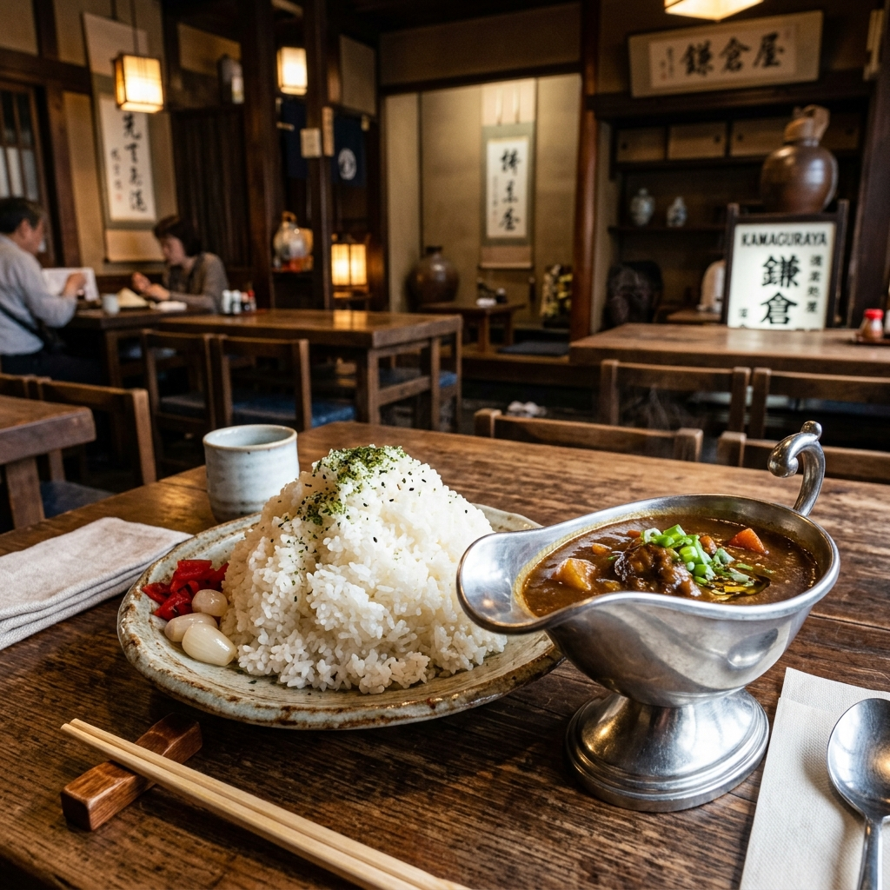

Research Log: v2026.04.15

<figure class="mb-10 max-w-4xl mx-auto cyber-glow">
  
</figure>

# 鎌倉のコスパ飯 3選 | 行列必至の老舗カレーから本格麻婆豆腐まで

鎌倉での食事は「高い・混む」というイメージがありますが、しっかりリサーチすれば1,000円台で驚くほどのクオリティに出会えます。今回は、地元民が「並んででも食べたい」と太鼓判を押すコスパ最強の3店を厳選しました。

Last Updated: 2026-04-15

---

## 1. キャラウェイ
小町通りの一本隣にある、鎌倉を代表する老舗カレー店。特筆すべきはその「ライス」の量。普通盛りで小山のようなライス（500g超）が出てきますが、じっくり煮込まれた濃厚な欧風カレーとの相性は抜群。このボリュームと味でこの価格はまさに伝説レベルです。
- **名物**: ビーフカレー、チーズカレー
- **Map**: [Google Mapsで見る](https://www.google.com/maps/search/?api=1&query=キャラウェイ+鎌倉)

## 2. かかん 鎌倉本店
「鎌倉で麻婆豆腐といえばここ」と言われる人気店。スパイスが効きつつもコクのある味わいは唯一無二。ランチセットはボリュームもあり、小町通りの喧騒から少し離れた落ち着いた空間で楽しめます。
- **特徴**: 本格派麻婆豆腐、おしゃれな内装
- **Map**: [Google Mapsで見る](https://www.google.com/maps/search/?api=1&query=かかん+鎌倉本店)

## 3. 鎌倉海鮮 碧海
若宮大路に面した、隠れた海鮮の名店。観光地価格に流されず、天然本マグロをはじめとする新鮮なネタをリーズナブルな丼で提供しています。
- **特徴**: 天然本マグロ、駅近高コスパ
- **Map**: [Google Mapsで見る](https://www.google.com/maps/search/?api=1&query=鎌倉海鮮+碧海)

---

## 散策のヒント
鎌倉のコスパ飯を攻略するには、ランチのピークタイムを少しずらすか、事前予約が可能な店舗を選ぶのが賢明です。今回紹介したお店はどれも人気が高いため、時間に余裕を持って訪れてみてください。

> **💡 さらに広い視点で戦略を組むなら**
> なぜこれらの店が「安いのに美味い」のか？行列を回避する立ち回りや周辺の逗子エリアとの比較など、よりマクロな視点でのランチ攻略戦略については、[記事①：鎌倉・逗子のランチ革命（全体ハブ）](https://fununi222.github.io/website/article.html?md=other/kamakura-zushi-lunch-hub.md) をぜひお読みください。

## 変更履歴 (Changelog)
- 2026-04-15: 新規作成。鎌倉エリアのコスバリサーチログを統合。
