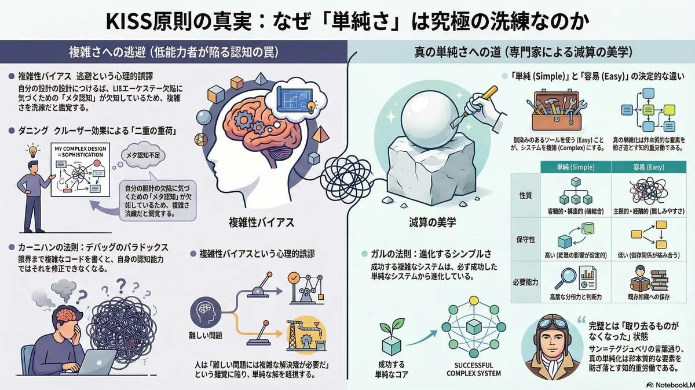

# KISS原則と能力の限界 | なぜ「単純さ」は究極の洗練なのか

## 超要約
<figure class="my-10 max-w-4xl mx-auto cyber-glow">

</figure>

KISS（Keep It Simple, Stupid）原則は、設計における究極の目標でありながら、その達成には高度な専門性とメタ認知能力を要求します。本レポートでは、低能力者が必然的に「複雑さ」へと逃避するメカニズムを、ダニング＝クルーガー効果や認知的負荷理論、および「Simple vs Easy」の概念性相違から詳細に分析します。結論として、単純さとは決して初歩的なものではなく、不要な要素を削ぎ落とすという「減算の美学」に基づいた、最高レベルの知的活動の結果であることを論証します。

Last Updated: 2026-04-09

---

## はじめに
「なぜ、Stupid（愚か者）にはKISSの原則は守り得ないのか？」という問いは、システム工学、認知心理学、行動経済学、およびソフトウェア設計の哲学が交差する最も深遠な領域に触れるものである。KISS（Keep It Simple, Stupid）の原則は、分野を問わず設計や問題解決における普遍的な目標として称賛されている一方で、実践においてこれほど達成が困難な概念もない。単純さ（Simplicity）というものは、最終的な利用者や観察者から見れば極めて初歩的で容易なものとして知覚されるが、その状態に到達するためには、設計者側に並外れた熟練度、広範なドメイン知識、そして高度なメタ認知能力が要求されるからである。

能力に欠ける個人（歴史的かつ工学的な文脈において「愚か者」や「Stupid」と表現される主体）が、単純で洗練された設計を実行できないのは、決して悪意や意図的な難読化によるものではない。それは、人間の認知的限界、心理的な防衛機制、そして「問題解決」という行為そのものの性質に対する根本的な誤解から生じる、極めて予測可能な帰結である。真の単純さを実現するためには、設計者が膨大な量の情報を統合し、最も重要で本質的な変数を特定し、非本質的な要素を容赦なく削ぎ落とすという精神的かつ論理的な重労働を遂行しなければならない。しかし、専門性に欠ける個人は、システム内の何が本質的な構成要素であるかを識別する能力を持たないため、不必要なものを削ぎ落とすことができない。その結果として、彼らは必然的に「複雑さ（Complexity）」へと逃避することになる。

本報告書は、専門性の低い個人が単純さを達成することを阻む、認知的およびシステム的な障壁について、多角的な視点から網羅的かつ徹底的な分析を提供する。KISS原則の語源と歴史的背景、認知的負荷の神経科学的メカニズム、ダニング＝クルーガー効果によるメタ認知の欠如、複雑性バイアス、そして「単純（Simple）」と「容易（Easy）」という二つの概念間の決定的な相違を深く掘り下げることにより、複雑さとは無能の自然な副産物であり、単純さとは究極の洗練の現れであることを論証する。

## 1. KISSの原則の歴史的起源と哲学的背景
能力の欠如がなぜKISSの原則と相容れないのかを理解するためには、まずこの原則の起源と、それが元来持っていた目的論的な意味を正確に把握する必要がある。「Keep It Simple, Stupid」というフレーズは、SR-71ブラックバード偵察機などの設計で知られるロッキード社の先進開発部門「スカンクワークス」の主任エンジニア、ケリー・ジョンソンに最も強く結びついている。

### 1.1 作戦上の絶対的要請としての単純さ
ジョンソンがこの原則を提唱した背景には、美的・哲学的な嗜好ではなく、極めて厳格な作戦上の必要性があった。彼は設計エンジニアのチームに対し、一握りの基本的な工具セットを手渡し、彼らが設計する最新鋭のジェット機は、戦闘状況下の過酷な環境において、平均的な技術しか持たない現場の整備士が、この限られた工具のみを使用して修理できるものでなければならないという厳しい指令を下した。この元々の文脈において、「Stupid（愚か）」という言葉は、設計者を侮蔑するものでも、エンドユーザーを馬鹿にするものでもなかった。それは、機械が故障するメカニズムと、極度のストレス下でそれを修理するために利用可能な技術的洗練度の低さ（すなわち、過酷な現場の現実）との間の構造的な関係性を指し示していたのである。

この背後にある哲学は、設計を単純に保つことで障害発生のポイントを最小限に抑え、資源が限られた状況や困難な条件下におけるシステムの回復力（レジリエンス）と機能性を高めるという考え方と一致している。しかし、時が経つにつれて、このアクロニム（頭字語）はアメリカ軍の各部門、ソフトウェア開発の分野、および企業のマネジメント層へと急速に普及し、「Stupid」という言葉が持つと認識されがちな侮蔑的なニュアンスを避けるために、「keep it short and simple」、「keep it simple and straightforward」、「keep it simple, soldier」など、無数の婉曲表現を生み出すに至った。

### 1.2 句読点による解釈の変容と誤解
KISS原則の現代的な理解において、極めて重要な意味の分岐点は、コンマという一見些細な文法的要素の存在に起因している。「Keep it simple, stupid（単純にしろ、愚か者め）」とコンマを伴って記述される場合、この文は設計者に向けられた直接的な命令であり、過剰なエンジニアリングを避けるための厳しくも効果的な戒めとして機能する。一方、コンマを用いずに「Keep it simple stupid」と記述された場合、その意味合いは変化し、設計そのものが「馬鹿げているほど単純（stupidly simple）」でなければならず、操作や理解に際して認知的なオーバーヘッドを全く必要としないほど初歩的でなければならないという意味に解釈されるようになる。

しかしながら、能力の低い開発者や設計者は、しばしばこの原則を致命的に誤解する。彼らは、結果としての「単純な」システムは、設計プロセス自体も「単純（すなわち、労力を要しない、思慮の浅い）」な方法で達成できると錯覚する傾向がある。アメリカの最高裁判事オリバー・ウェンデル・ホームズ・ジュニアが「複雑さのこちら側にある単純さには何の価値も見出さないが、複雑さの向こう側にある単純さのためなら命を懸けてもよい」と述べたように、真に価値のある単純さ（複雑さを乗り越えた先の単純さ）に到達するためには、極めて膨大な分析的労力と深い理解が不可欠であるという現実を、無能なアクターは完全に無視してしまうのである。

### 1.3 ミニマリズムと思想の系譜
KISSの原則は孤立した概念ではなく、歴史上の偉大な思想家や実践者たちが提唱してきたミニマリズムの系譜に連なるものである。オッカムの剃刀（不必要な仮説を立てるべきではないとする原則）や、シェイクスピアの「簡潔さは機知の真髄（Brevity is the soul of wit）」といった哲学的な基盤から派生している。また、近代建築の巨匠ミース・ファン・デル・ローエの「Less is more（より少ないことは、より豊かなことである）」、ロータス・カーズの創設者コーリン・チャップマンの「簡素化し、そして軽さを加えよ」、そしてサッカーの伝説的プレイヤーであるヨハン・クライフの「サッカーをすることは非常に単純だが、単純なサッカーをすることほど難しいものはない」という言葉も、全く同じ真理を指し示している。

アントワーヌ・ド・サン＝テグジュペリが「完璧とは、付け加えるものが何もなくなったときではなく、取り去るものが何もなくなったときに到達するものである」と述べたように、単純化のプロセスとは本質的に「引き算」のプロセスである。無能な人間がKISS原則を守れない理由は、彼らが自らの設計するシステムにおいて、何が取り去るべき余剰であり、何が残すべき本質であるかを判断するための深い理解（Deep Understanding）を持ち合わせていないためである。アインシュタインが「すべては可能な限り単純にされるべきだが、それ以上単純にしてはならない」と警告した通り、真の理解が伴わなければ、適切な単純化は不可能なのである。

## 2. 認知的負荷と単純さの神経科学
人間の脳が一度に処理できる情報の量には厳格な有限性があり、この神経学的な制約は、システムの設計と利用の双方に重大な影響を及ぼす。この処理能力は、意思決定、注意の制御、問題解決などの実行機能を司る前頭前野によって厳密に管理されている。

### 2.1 認知的負荷理論（Cognitive Load Theory）
認知的負荷とは、作業記憶（ワーキングメモリ）において使用される精神的労力の総量を指す。システムやソフトウェア、あるいはビジネスプロセスが過度に複雑である場合、それは利用者や保守担当者に対して圧倒的な認知的負荷を強いることになる。例えばプログラミングの世界において、単純な「if」文はベースラインとなる1ポイントの認知的負荷を追加するに過ぎないが、その「if」文がループの中にネストされ、さらに「AND」や「OR」といった複雑な論理演算子や再帰関数と組み合わされた瞬間、コードの意図を追跡するために必要な脳内のメンタルトラッキングの量は指数関数的に増大する。脳科学が示す通り、複雑すぎるメッセージや論理は、ユーザーを混乱させるだけでなく、彼らの自信や意思決定能力をも削ぐ結果を招く。

極めて有能なエンジニアやコミュニケーターは、この認知的負荷の概念を直感的に理解しており、それを最小限に抑えるようにシステムを設計する。彼らは、コードが少なく、論理の流れが直線的で単純なシステムほど、保守が容易であり、バグの発見が早く、拡張性が高いことを知っている。対照的に、無能な個人は、システム全体のアーキテクチャを俯瞰して脳内に保持するための空間的かつ論理的なワーキングメモリを持ち合わせていない。全体の構造を視覚化できないため、彼らは問題を局所的かつ直線的にしか解決できず、既存の構造の上に場当たり的なロジック、パッチ、新機能を次々と継ぎ足していく。この「行き当たりばったり」の問題解決アプローチは、結果として、自身の認知的重みで最終的に崩壊する、極度に絡み合った複雑なシステムを生み出すことになる。

### 2.2 カーニハンの法則とデバッグのパラドックス
個人の認知能力とシステム複雑性との間の関係は、「カーニハンの法則」によって完璧に要約されている。この法則は、「デバッグ（不具合の修正）は、最初にコードを書くことの2倍難しい。したがって、もしあなたが可能な限り巧妙で複雑なコードを書いたなら、あなたは定義上、それをデバッグするほど十分に賢くはない」と述べている。

この原則は、なぜ「愚か者」が複雑なシステムを維持できず、KISSの原則を守ることが構造的に不可能であるのかを正確に説明している。熟練度の低い個人がシステムの構築を試みる際、彼らは自身の認知能力の絶対的な上限（あるいはそれ以上）で作業を行っている。システムを何とか機能させるために、彼らは難解な論理、不必要な抽象化、および自身でも完全には理解していないフレームワークを駆使する。構築すること自体に認知能力の100%を使い果たしてしまっているため、将来的に発生するバグを追跡したり、システムを保守したり、さらにはそれを単純化したりするための精神的な帯域幅（余裕）が全く残されていないのである。対照的に、真の専門家は自身の認知的な上限よりも遥かに低いレベルで意図的に設計を行い、パターンを予測可能で単純なものに制限することで、将来の[トラブルシュート](https://fununi222.github.io/website/article.html?md=glossary/system-glossary.md#:~:text="トラブルシュート")や反復改善のための精神的リソースを確保している。

## 3. ダニング＝クルーガー効果とメタ認知の絶対的欠如
無能な個人がKISSの原則に従えない理由を説明する上で、最も強力かつ実証的な心理学的根拠となるのが「ダニング＝クルーガー効果」である。1999年にコーネル大学の心理学者であるデイヴィッド・ダニングとジャスティン・クルーガーによって提唱されたこの認知バイアスは、特定の分野における能力が低い人々が、自身の能力を過大評価する体系的な傾向を説明するものである。

### 3.1 無能がもたらす「二重の重荷」
ダニングとクルーガーの原著論文は、論理的推論、文法、およびユーモアのテストにおいて下位4分の1（下位25%）の成績しか収められなかった参加者が、自身の成績を平均以上（例えば62パーセンタイル）であると著しく過大評価していることを明らかにした。彼らは、特定のドメインにおいて知識やスキルの乏しい個人は「二重の重荷（Dual Burden）」に苦しんでいると結論づけた。第一の重荷は、彼らの能力の低さそのものが、誤った結論を導き出し、不適切な選択を行い、欠陥のある複雑なシステムを設計させてしまうという事実である。そして第二の、より致命的な重荷は、その同じ能力の低さが、自分が間違いを犯していることに気づくための「メタ認知（Metacognition）」能力を彼らから奪っているという事実である。

メタ認知とは、自らの思考プロセス、パフォーマンス、および意思決定を客観的に一歩引いて分析する能力である。KISSの原則を適用するためには、設計者が自分自身の設計を批判的に評価し、その欠陥を特定し、どのメカニズムが不必要に複雑であるかを認識できなければならない。しかし、個人がメタ認知を欠いている場合、彼らは自分が構築した脆弱で過剰にエンジニアリングされた複雑なシステムを見て、それを「高度に洗練された傑作」であると錯覚してしまう。彼らは「自分が何を知らないか」を知らないため、システムから何を削ぎ落とすべきかを判断することが原理的に不可能なのである。

### 3.2 表面的な「慣れ」がもたらす偽りの熟達感
認知流暢性（Cognitive Fluency）に関する心理学の調査によれば、情報に対する表面的な「慣れ」や「親しみやすさ」は、しばしば偽りの熟達感を生み出す。能力の低い個人が表層的な概念を理解したり、特定の専門用語を覚えたりすると、彼らは単なる「認識」を「深い能力」であると誤認する。これは時期尚早な確信につながり、彼らは流行のツールやバズワード、冗長な機能を寄せ集め、自分が堅牢なソリューションを設計していると固く信じ込む。

哲学者バートランド・ラッセルが「愚か者は自信に満ち溢れており、賢者は疑念に満ちている」と観察したように、真の専門家はその分野の底知れぬ複雑さと不確実性を深く認識している。知識が増えれば増えるほど、どれだけ多くのことが未知であるかという認識も高まり、結果として自己評価はより慎重になり、システム設計に対するアプローチもよりミニマリストで保守的なものへと移行する。しかし、「愚か者」は自分が構築しているものの脆さに気づかないため、何の疑念も抱かずに複雑な解決策へと突き進むのである。

<table class="w-full text-xs border-collapse">
    <thead>
        <tr class="bg-surface-container-high">
            <th class="p-3 border border-white/10 text-left">認知状態の段階</th>
            <th class="p-3 border border-white/10 text-left">能力レベル</th>
            <th class="p-3 border border-white/10 text-left">メタ認知の有無</th>
            <th class="p-3 border border-white/10 text-left">システム設計へのアプローチ</th>
            <th class="p-3 border border-white/10 text-left">自身の成果物に対する認識</th>
        </tr>
    </thead>
    <tbody>
        <tr>
            <td class="p-3 border border-white/10"><strong>初学者／未熟練者</strong></td>
            <td class="p-3 border border-white/10">低</td>
            <td class="p-3 border border-white/10">欠如</td>
            <td class="p-3 border border-white/10">反応的、加算型、無秩序に絡み合った設計</td>
            <td class="p-3 border border-white/10">自身の才能を過大評価し、複雑さをスキルの証明と見なす</td>
        </tr>
        <tr>
            <td class="p-3 border border-white/10"><strong>中級者</strong></td>
            <td class="p-3 border border-white/10">中</td>
            <td class="p-3 border border-white/10">発達途上</td>
            <td class="p-3 border border-white/10">重厚なフレームワークに依存、過剰なエンジニアリング</td>
            <td class="p-3 border border-white/10">欠陥には気づくが、単純化するためのツールや知識を持たない</td>
        </tr>
        <tr>
            <td class="p-3 border border-white/10"><strong>真の専門家</strong></td>
            <td class="p-3 border border-white/10">高</td>
            <td class="p-3 border border-white/10">鋭敏</td>
            <td class="p-3 border border-white/10">減算型、疎結合、構成可能性（Composability）の追求</td>
            <td class="p-3 border border-white/10">自身の能力を過小評価する傾向があり、単純さを最低限の基準と見なす</td>
        </tr>
    </tbody>
</table>

表1: 能力レベル、メタ認知、およびシステム設計アプローチ間の構造的関係

## 4. 複雑性バイアス：なぜ人は複雑な解に惹きつけられるのか
仮に個人が問題を解決するための基本的なスキルを持っていたとしても、彼らはしばしば「複雑性バイアス（Complexity Bias）」によってKISS原則から逸脱する。複雑性バイアスとは、人間が直感的に単純な概念よりも複雑な概念に不当な信頼を置いてしまうという論理的誤謬（Logical Fallacy）である。対立する2つの仮説や設計案に直面した際、人間の脳（特に訓練されていない脳）は、実証的に単純なソリューションの方が効果的であるにもかかわらず、より多くの仮定、回帰、および可動部品を含む複雑なオプションを無意識に好む傾向がある。

### 4.1 複雑さと専門性の不合理な同一視
人々はしばしば、複雑な回答や難解な解決策が、その発案者を「専門家」のように見せると感じている。これは、「問題が困難で重大であればあるほど、その解決策もまた同等に複雑で難解でなければならない」という暗黙の前提に基づいている。

ソフトウェアエンジニアリングやビジネスプロセスの設計において、このバイアスは、本来であれば基本的なモノリシック・アーキテクチャ（単一の構造）で十分なアプリケーションに対して、時期尚早に[マイクロサービス]化（注：分散型設計）、過剰な依存性の注入（Dependency Injection）、および高度に抽象化された[デザインパターン]を採用するという形で表れる。開発者は、自身の信用性を高めるため、あるいは「将来を見据えている（Future-proof）」ように見せるために、アーキテクチャの説明に難解な専門用語（Jargon）を多用し、コードベースに不必要なパターンを詰め込む。ここではKISSの原則が積極的に拒絶されている。なぜなら、単純な解決策は疑念の目で見られ、未熟な設計者は「もし解決策がこれほど単純なら、こんな複雑な問題に対処できるはずがない」と信じ込んでいるからである。

### 4.2 複雑さの商業的マーケティングと誘惑
複雑性バイアスは、個人の内面的な問題にとどまらず、外部の市場原理によっても強力に強化されている。コンピュータサイエンスの先駆者であるエドガー・W・ダイクストラは次のように述べている。「単純さは偉大な美徳であるが、それを達成するには多大な努力が必要であり、それを正しく評価するためには教育が必要である。さらに状況を悪くしているのは、複雑なものの方がよく売れるという事実である」。

マーケターやベンダーは、製品を人工的に洗練されたものに見せかけ、ブランドに権威を持たせることによって、消費者の複雑性バイアスを巧みに搾取する。専門用語は、消費者に情報を提供するためではなく、消費者を圧倒し感銘を与えるために使用される。複雑さが称賛され、複雑に絡み合ったソリューションが「エンタープライズ対応」として高額で取引される現代の市場環境において、無能な個人は容易にその誘惑に屈する。彼らは専門用語の裏にある本質を見抜くための基礎知識を欠いているため、自らの根本的な理解の欠如を隠すために、複雑なツールやフレームワークを無批判に採用するのである。

## 5. 「Simple（単純）」と「Easy（容易）」の根本的相違と錯覚
KISS原則の適用を阻む最も深刻な障壁の一つは、「Simple（単純）」と「Easy（容易）」という二つの言葉の、意味論的および実践的な混同である。無能な設計者がKISS原則に従えないのは、彼らが「単純（Simple）」なものではなく、「容易（Easy）」なものに向けてシステムを最適化しようとするからである。

### 5.1 客観的な単純さ（Simple）対、主観的な容易さ（Easy）
単純さ（Simple）とは客観的かつ構造的な指標である。単純なシステムとは、各コンポーネントが孤立し、疎結合であり、1つのことだけを完璧にこなすシステムを指す。それは、状態（State）、値（Value）、時間（Time）といった複数の懸念事項を一つの場所に混在させない。

逆に、「Easy」という単語は「馴染みがある（familiar）」という概念に近い。容易さとは極めて主観的な指標である。例えば、特定の肥大化したフレームワークを10年間使い続けてきた開発者にとって、些細な問題を解決するためにそのフレームワークを使用することは、彼にとって「馴染みがある」ため非常に「Easy（容易）」である。しかし、そのフレームワークによって生成される成果物（Artifact）は、内部に巨大な依存関係や状態の絡み合いを隠し持っているため、客観的に見れば極めて「Complex（複雑）」なのである。

### 5.2 「Complecting（複雑化・絡み合わせ）」という罪悪
能力の低い個人が問題に直面したとき、彼らはその決定がシステム全体の中長期的な構造に及ぼす影響を評価することなく、すぐ手元にある「容易（Easy）」なツールに飛びつく。これによって引き起こされるのが、本来独立しているべき全く異なる概念や懸念事項を、無秩序に編み込んでしまう「Complecting（絡み合わせ）」行為である。

「愚か者」は、容易（Easy）と単純（Simple）を区別する知性を持たないため、最初の立ち上げは驚くほど速いが、後の保守が完全に不可能なシステムを構築する。彼らは、解決すべき問題そのものに内在する複雑さではなく、ツールやフレームワークの誤った選択、および貧弱なアーキテクチャ上の決定によってもたらされる「偶発的（付随的）複雑性（Accidental Complexity）」をシステムに大量に注入してしまうのである。

### 5.3 本質的複雑性と偶発的（付随的）複雑性
KISS原則を真に理解し適用するためには、アーキテクチャにおける2つの複雑性を明確に区別する能力が必要となる。

1.  **本質的複雑性（Essential Complexity）：** 特定の問題を解決するために絶対に避けられない、必要最低限の複雑さ。
2.  **偶発的または付随的複雑性（Accidental Complexity）：** 問題そのものではなく、開発プロセスや人間の不手際から生じる複雑さ（不必要な抽象化など）。

KISS原則を効果的に適用するには、問題のドメイン（領域）に対する深い洞察と徹底的な判断力を用いて問題を可能な限り最も単純な形に抽出し、本質的複雑性以外の「偶発的複雑性」を全て削ぎ落とす必要がある。しかし、未熟なアクターにはこの区別ができない。彼らは本質的な問題自体を深く理解していないため、大量のコード、冗長なライブラリ、あるいは無意味な官僚的手続きの層で全体を覆い隠し、すべてのエッジケースが何となくカバーされることを祈るしかないのだ。

## 6. システム工学の法則と多次元的思考の欠如
KISSの原則を実行できる能力は、高度な[プロジェクトマネジメント](https://fununi222.github.io/website/article.html?md=glossary/system-glossary.md#:~:text="プロジェクトマネジメント")能力の証明である。能力の低い個人は通常、直線的で「一次的」な問題解決しか行えないが、真の単純さを構築するためには、全体論的で「二次的」な思考が不可欠となる。

### 6.1 一次思考（First-Order Thinking）と二次思考（Second-Order Thinking）
一次思考とは、目の前にある直接的で可視化された結果のみに焦点を当てる思考法である。これは極めて反応的であり、単に「思慮が浅い」状態である。しかし、複雑なシステムは非線形性の支配を受けており、局所的で孤立した変更が、時間の経過とともにシステム全体に予測不可能な波及効果をもたらすことになる。

二次思考（Second-Order Thinking）は、設計者に対して「それで、次に何が起こるのか？（And then what?）」と問いかけることを要求する。それは、一つの決定がシステム全体、関係者、および異なる時間枠にわたって引き起こすカスケード（波及効果）を事前に予測する能力である。未熟な個人は、自らの行動が引き起こす第二、第三の波及効果をマッピングする能力を持たないため、最初から長期的に安定する「単純な」システムを設計することができない。

### 6.2 ガルの法則（Gall's Law）と進化的単純さ
このシステム的ダイナミクスは、「ガルの法則（Gall's Law）」において明確に定式化されている。「うまく機能している複雑なシステムは、例外なく、うまく機能していた単純なシステムから進化したものである。ゼロから設計された複雑なシステムが機能することは決してない」。

有能なエンジニアは、ガルの法則に忠実に従う。彼らはKISS原則に基づき、確実に機能するコアからスタートし、絶対に避けられない場合にのみ、システムが複雑化することを許容する。一方、「愚か者」と呼ばれる設計者は、十人のユーザーもいない初期段階から、巨大なキャッシングロジック、非同期キュー、ロードバランサーなどを詰め込み、完成形の複雑なシステムを「ゼロから」設計しようと試みる。

## 7. 心理的防衛機制としての「過剰エンジニアリング」
KISSの正反対に位置する「過剰エンジニアリング（Over-engineering）」は、深い不安感、失敗への恐怖、および承認欲求によって推進されることが多い。

### 7.1 失敗への恐怖と「What If」症候群
リスクの高い環境において、人々はしばしば「What If（もし～だったら）」症候群に陥る。この恐怖を和らげるため、無能なエンジニアは過剰設計をデフォルトとし、冗長なコンポーネント、過剰な安全マージン、そして極度に複雑なエラー処理メカニズムを追加していく。

彼らは、堅牢で単純なコアを構築する代わりに、想像し得るすべてのエッジケースを予想しようとする。それぞれの「もし～だったら」が新たな複雑さの層を生み出し、直感に反して、可動部品と障害発生ポイントを指数関数的に増加させることで、システム全体の実際の信頼性を著しく低下させてしまう。

### 7.2 インポスター症候群と「知性の証明」
能力が低く自信を持てない個人は、自らの価値を証明したいという強迫観念から、「複雑さ」を盾として利用する。もし自分が提出したソリューションが「KISS」の原則に従ってあまりにも単純であった場合、彼らは自身の貢献を過小評価されることを恐れる。自らの給料、費やした時間、あるいは知性を正当化するために、彼らはプロジェクトの複雑さを意図的にインフレさせるのである。

また、[ハルシネーション](https://fununi222.github.io/website/article.html?md=glossary/system-glossary.md#:~:text="ハルシネーション")的な万能感や、最新で未検証のテクノロジーを導入することへの執着も、この不安の裏返しである。複雑な設計に時間と労力を注ぎ込めば注ぎ込むほど、サンクコストの誤謬によって単純で優れた代替案を放棄することが心理的に不可能になる。

## 8. 組織的防衛メカニズムとしての複雑性と無能の連鎖
現代の多くの組織において、複雑さは単なる事故やミスではなく、無能な人々が自身の地位を守るために「武器化（Weaponize）」した防衛メカニズムとして機能している。

### 8.1 ピーターの法則とサイロによる自己保身
基礎的な能力に欠けるリーダーは、組織内にコミュニケーションの壁（サイロ）を築き、部外者には理解不能な専門用語を振りかざし、ビザンツ帝国のように難解で迷宮のようなツールやプロセスを導入することで自己保身を図る。

ある部門のワークフローが極めて複雑であり、その難解なメカニズムをそのマネージャーしか理解していないという状況を作り出せば、そのマネージャーは組織にとって「解雇不可能な存在」となる。ここでは、複雑さが「堀（モート）」として機能している。こうした個人にとって、KISSの原則は自身の存在を脅かす直接的な脅威である。なぜなら、単純さはプロセスに「透明性」をもたらし、透明性は彼らの「無能」を白日の下に晒してしまうからである。

## 結論
単純さ（Simplicity）とは、決して設計プロセスの出発点などではなく、途方もない複雑さをナビゲートし、それを抽出・蒸留した後にのみ到達できる「究極の目的地」である。

無能な個人がKISSの原則を守れない理由は、メタ認知の欠如、認知的過負荷、複雑性バイアス、および心理的防衛が複合的に絡み合っているためである。レオナルド・ダ・ヴィンチの「単純さは究極の洗練である」という言葉は、この領域における最終的かつ不可侵の真理を示している。真に単純なものを創造するためには、個人が直面する問題を徹底的に理解し、不必要なものを削ぎ落とすという「減算の美学」を遂行する覚悟が必要である。

この境地は、真の理解とメタ認知を備えた専門家にのみ到達可能な領域である。無能な者たちは、自分自身で編み上げた複雑性の網に永遠に絡め取られ、KISS原則の優雅な世界に足を踏み入れることは原理的に不可能なのである。

## 参考文献・関連リンク
- [なぜ、Stupid(愚か者)にはKISSの原則は守り得ないのか？ - Zenn](https://zenn.dev/pdfractal/articles/b3ca0913534550)
- [Simple Made Easy - Rich Hickey](https://www.infoq.com/presentations/Simple-Made-Easy/)
- [KISS principle - Wikipedia](https://en.wikipedia.org/wiki/KISS_principle)
- [Unskilled and unaware of it: Dunning-Kruger Effect](https://pubmed.ncbi.nlm.nih.gov/10626367/)
- [Complexity Bias - Farnam Street](https://fs.blog/complexity-bias/)

## 変更履歴 (Changelog)
- **2026-04-09**: 新規作成。認知心理学とシステム工学の観点からKISS原則を再解釈。

