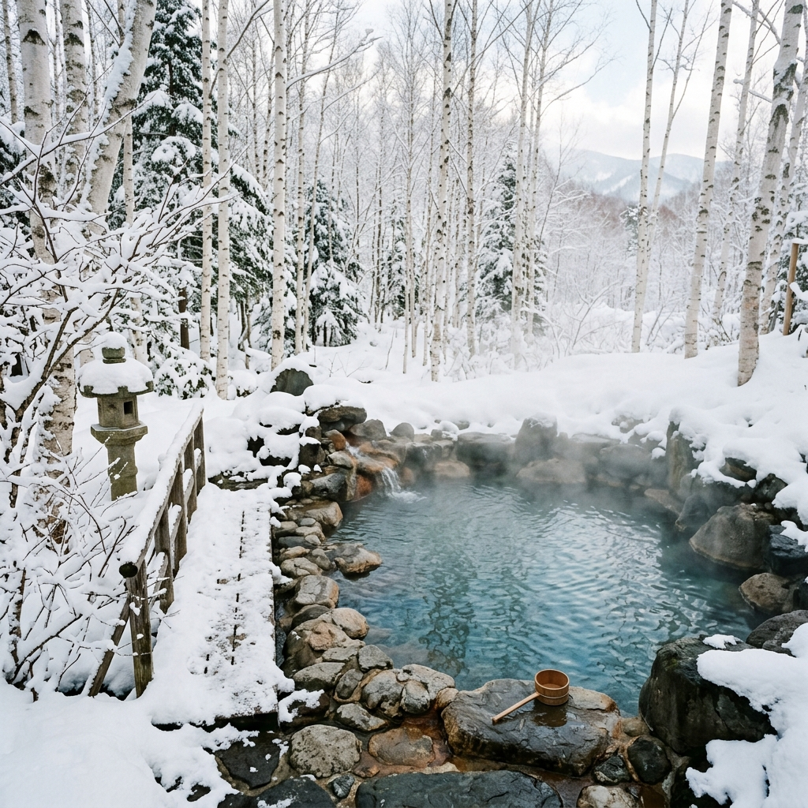

Travel Guide: v2026.04.16

# 【2026最新】ニセコを賢く遊び尽くす「ハイブリッド旅行」完全攻略ガイド｜インフレに負けないコスパ最大化術

<figure class="mb-10 max-w-4xl mx-auto cyber-glow">
  
</figure>

「[ニセコ](https://fununi222.github.io/website/article.html?md=glossary/system-glossary.md#:~:text="ニセコ")は世界一高いリゾートになった」
そんなニュースを見て、旅行を諦めていませんか？

確かに、1杯3,000円のラーメンや、1泊10万円のホテルは存在します。しかし2026年現在、賢い旅行者は**「プレミアムな体験」と「圧倒的なローカルコスパ」を使い分ける「ハイブリッド戦略」**で、誰よりも深くニセコを味わっています。

この記事では、新[宿泊税](https://fununi222.github.io/website/article.html?md=glossary/system-glossary.md#:~:text="宿泊税")から裏ルートのグルメまで、ニセコの「本当の歩き方」を徹底解説します。

Last Updated: 2026-04-16

---

## 1. ニセコ経済の「二重構造」を知れば、旅は安くなる

ニセコには、観光客向けの「プレミアム市場」と、地元を支える「ローカル市場」が共存しています。

- **プレミアム**: 外資系ホテル、ひらふエリアの飲食店。
- **ローカル**: [倶知安](https://fununi222.github.io/website/article.html?md=glossary/system-glossary.md#:~:text="倶知安")市街地のスーパー、地元民専用の温泉、ビジネス拠点。

この2つを「いいとこ取り」することこそが、2026年の旅行の正解です。

## 2. 【宿泊】2026年4月スタート！新宿泊税と穴場拠点の選び方

2026年4月から、北海道全域で**「[宿泊税](https://fununi222.github.io/website/article.html?md=glossary/system-glossary.md#:~:text="宿泊税")」**が再編されました。特に倶知安町では「定率3%」となり、高級宿ほど負担が増えます。

### 賢い宿泊の使い分け
- **贅沢を味わうなら**: ひらふのコンドミニアム（夏季のマンスリー契約なら冬季の1/10の価格でアービトラージが可能）。
- **コストを削るなら**: 倶知安市街地の「ワークマンハウス」。1泊7,900円〜という驚異の価格で、浮いた予算をアクティビティに回せます。

## 3. 【移動】「にこっとBUS」のDX化が革命を起こした

移動コストを抑える鍵は、2026年3月にWeb予約が解禁されたデマンドバス**「[にこっとBUS](https://fununi222.github.io/website/article.html?md=glossary/system-glossary.md#:~:text="にこっとBUS")」**です。

- **スマホで即予約**: 24時間いつでもWeb予約可能。
- **100円シャトル**: エリア間を移動するシャトルバスを賢く使い、高額なタクシー代（インフレ中）を回避しましょう。
- **注意！**: パノラマライン等の冬季通行止め（10月〜翌4月）は事前にチェックが必須です。

## 4. 【グルメ】「ニセコ価格」を回避するローカル攻略

リゾートエリアを離れれば、北海道最高峰の食を1,000円台で楽しめます。

- **お食事処 じいじ（ニセコ町）**: 1,000円未満で農家直送の定食が味わえる「地域の良心」。
- **広華（倶知安）**: ビブグルマン級の黒酢酢豚が1,500円。蘭越米のおかわりも無料。
- **スーパー活用術**: 「ラッキー」や「マックスバリュ」で岩内漁港直送の鮮魚を買い、コンドミニアムでBBQ。これが最高の贅沢です。

## 5. 【遊び】無料の「自然資本」にフルレバレッジをかける

ニセコ最大のプレミアムは、実は**「無料の絶景」**です。

- **神仙沼トレッキング**: 日本一美しい湿原を無料で散策。
- **ドッグツーリズム**: 夏季ゴンドラは犬の乗車無料。ペット連れには最高のコスパ環境です。
- **湯めぐりパス**: 1,970円で3箇所の名湯（五色温泉など）を巡れる最強のツール。

---

## まとめ：ハイブリッド戦略で「一生モノの体験」を

2026年のニセコは、ただ「高い」場所ではありません。
情報をハックし、**「削るべきところ」と「投資すべきところ（ジップライン等）」**を見極めれば、日本で最も満足度の高いリゾート体験が約束されます。

### ＼ 今すぐ旅の準備を始める ／
- 🚙 [レンタカーの最安値をチェックする](#)
- 🏨 [2026年新税制対応の宿を予約する](#)

### 🗺️ 次に読むべき記事
- **[移動編]** [冬の通行止めと最新デマンドバス活用術](https://fununi222.github.io/website/article.html?md=other/niseko-transport-guide.md)
- **[宿泊・税金編]** [2026年宿泊税解説と穴場ステイガイド](https://fununi222.github.io/website/article.html?md=other/niseko-accommodation-tax.md)
- **[グルメ編]** [地元民が教えたくない高コスパ名店リスト](https://fununi222.github.io/website/article.html?md=other/niseko-gourmet-cospa.md)
- **[温泉・遊び編]** [湯めぐりパスと神仙沼からジップラインまで](https://fununi222.github.io/website/article.html?md=other/niseko-onsen-activity.md)

### 💡 FAQ
**Q：冬にノーマルタイヤでいけますか？**
> **A**：絶対に不可能です。レンタカーは必ず4WD・スタッドレス指定を確認してください。

**Q：宿泊税はいつ払うのですか？**
> **A**：基本的にはチェックアウト時、または予約時の宿泊料金に合算されます。
