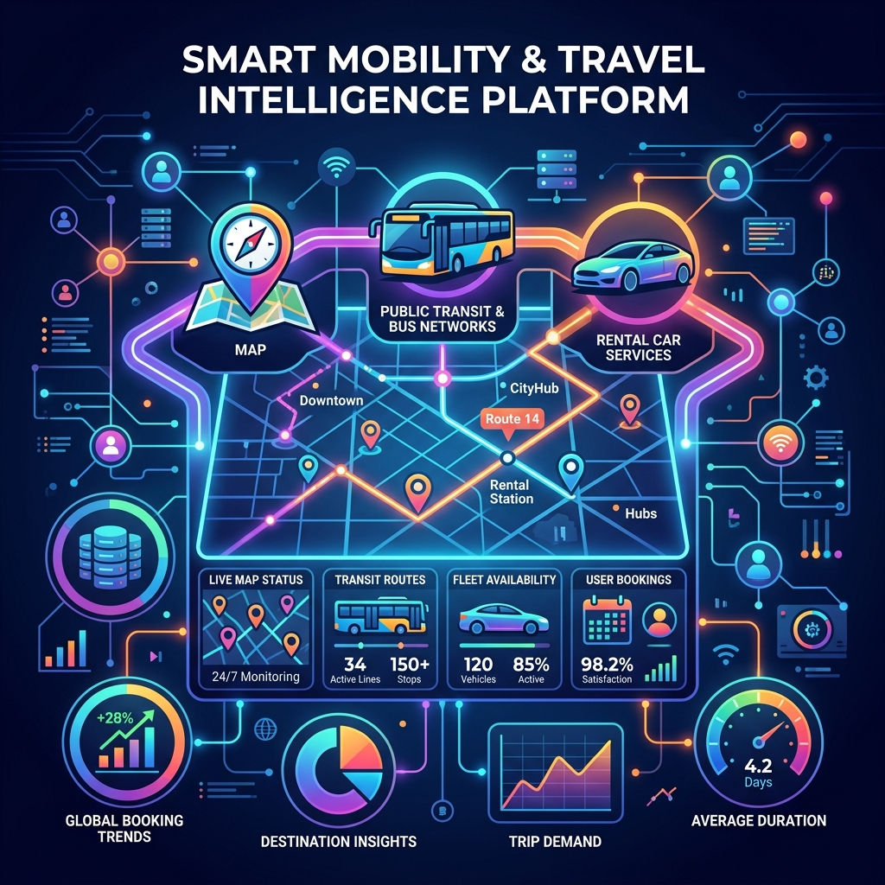

Travel Guide: v2026.04.16

# 冬のニセコは「足」で決まる！2026年最新の交通規制・レンタカー・バス活用術

<figure class="mb-10 max-w-4xl mx-auto cyber-glow">
  
</figure>

[ニセコ](https://fununi222.github.io/website/article.html?md=glossary/system-glossary.md#:~:text="ニセコ")観光の成否を分けるのは、実は「移動手段」です。
広大なエリアに点在する穴場グルメや秘湯にたどり着くには、リゾート中心部の高いタクシーに頼るだけでは不十分。2026年最新の交通インフラ事情をハックして、機動力を最大化しましょう。

Last Updated: 2026-04-16

---

## 1. 「冬季通行止め」の罠を回避せよ
ニセコ周辺の絶景ルート（パノラマライン等）は、冬の間は完全に閉鎖されます。これを知らずにルートを組むと、数時間のロスに繋がります。

- **道道66号（パノラマライン）**: 2025年10月24日〜2026年4月27日まで閉鎖
- **道道58号（エコーライン）**: 2025年10月14日〜2026年5月22日まで閉鎖
- **戦略**: 春先や初夏の旅行を計画する際は、これらの解除日を待つことで、一気に観光の選択肢が広がります。

## 2. 進化した「にこっとBUS」のスマホ予約が最強
ニセコ町内を自由に移動できるデマンドバス「[にこっとBUS](https://fununi222.github.io/website/article.html?md=glossary/system-glossary.md#:~:text="にこっとBUS")」が、2026年3月にWeb予約システムを全面導入しました。

- **メリット**: 電話不要、24時間予約可能、英語対応。
- **賢い使い方**: 夜のディナーで酒を楽しみたい時、タクシー代わりに予約。100円シャトルを組み合わせれば、交通費は数分の一に。

## 3. レンタカー市場の2026年相場
自由度を求めるならレンタカー一択です。

- **軽自動車**: 4,100円〜 / 日
- **コンパクトカー**: 4,900円〜 / 日
- **注意**: 冬のニセコは4WD・スタッドレスが絶対条件。ケチらず安全装備を確認しましょう。

### 【メリット・デメリット】
- **メリット**: 行列店に開店直後を狙って行ける、重いスキー道具も楽々。
- **デメリット**: 雪道運転のプレッシャー（不慣れな方はデマンドバス推奨）。

## FAQ
**Q：国際免許の外国人は多い？**
> **A**：非常に多いです。にこっとBUSの英語対応により、2026年はさらに混雑が予想されるため、早めの予約が必須です。

---

## まとめ：機動力を確保すれば「真のニセコ」に手が届く
機動力を確保すれば、リゾート価格の圏外にある「真のニセコ」に手が届きます。

- 🚙 [レンタカーの最新空き状況を確認する](#)

### 🗺️ ニセコハイブリッド旅行ガイド
- [【ハブ記事】 ニセコ「ハイブリッド旅行」完全攻略ガイド2026](https://fununi222.github.io/website/article.html?md=other/niseko-cospa-travel.md)
- [【宿泊・税金編】 2026年宿泊税を徹底解説！穴場拠点とラグジュアリー](https://fununi222.github.io/website/article.html?md=other/niseko-accommodation-tax.md)
- [【グルメ編】 「ニセコ価格」をハックする！地元スーパーと名店リスト](https://fununi222.github.io/website/article.html?md=other/niseko-gourmet-cospa.md)
- [【温泉・遊び編】 湯めぐりパス2026最新版と無料＆感動体験](https://fununi222.github.io/website/article.html?md=other/niseko-onsen-activity.md)
