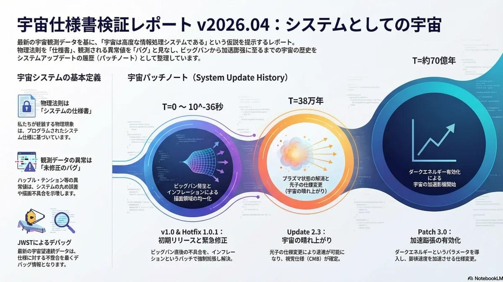

# Other | 宇宙基盤システム 技術要件定義書 (Universal Infrastructure System TRD)

<figure class="mb-10 max-w-4xl mx-auto cyber-glow">
  
</figure>

本ドキュメントは、我々が「物理世界」と呼称する全領域を、高度に構造化された情報処理システム（[Universal Infrastructure System]）として再定義する技術要件定義書（TRD）である。物理法則を「実行仕様（Specification）」、宇宙を「ランタイム環境（Runtime Environment）」として扱い、最新の観測データに含まれる不整合をシステムの「バグ」や「パッチ未適用」として技術的に分析。初期デプロイ（Version 1.0）から最終仕様変更（Big Rip）に至るまでのシステムロードマップを詳解する。

Last Updated: 2026-04-09

---

## 1. システム定義と設計思想 (System Definition & Design Philosophy)

本セクションでは、物理世界を情報理論的な観点から工学的に解釈する。

この設計思想の導入は、システム全体のリソース管理および計算効率を最適化する上で極めて戦略的な意義を持つ。例えば、物理法則の一貫性は、広大な実行領域内での「競合状態（Race Condition）」を防ぐための排他制御として機能し、[最小作用の原理](https://fununi222.github.io/website/article.html?md=glossary/system-glossary.md#:~:text="最小作用の原理")は、計算コストを最小化するための「経路最適化アルゴリズム」または「遅延評価（Lazy Loading）」として解釈される。

### 1.1 システム・パラダイムの定義
宇宙は「物理的な実体」ではなく、極めて高精度な「計算実行環境」である。このパラダイムにおいて、物理法則はシステムの動作を規定するハードコードされたソースコードであり、我々が取得する観測データは、システムの稼働状況を監視するための「デバッグ情報（Telemetry）」として扱う。[JWST](https://fununi222.github.io/website/article.html?md=glossary/system-glossary.md#:~:text="JWST")（ジェイムズ・ウェッブ宇宙望遠鏡）等の最新デバイスから得られる異常値は、物理的な謎ではなく、システムが設計限界に達していることを示すエラーログである。

### 1.2 設計原則の抽象化
物理定数や4つの基本相互作用は、システム全体で共有される「共通プロトコル」である。これらが全領域で一貫して適用されることで、局所的な計算がグローバルなシステム状態に悪影響を及ぼさないよう設計されている。このプロトコル化の目的は、サブシステム間の相互運用性を確保しつつ、グローバルなステートロックを回避し、計算リソースを効率的に局所化することにある。

## 2. システム制約と共通プロトコル (System Constraints & Common Protocols)

システムの安定稼働を維持するための厳格な制約条件（Constraints）を定義する。

### 2.1 基本相互作用のプロトコルスタック
初期リリース（v1.0）において、システムは「重力」「電磁気力」「強い相互作用」「弱い相互作用」の4層レイヤーからなる基本命令セットを実装した。初期ブート時には単一のモノリシックなプロトコルであったが、冷却（相転移）に伴い、機能的なマイクロサービスとして分離独立した。

### 2.2 物理定数による計算パラメータの固定
- **光速（c）**: システムにおける情報の最大転送速度。回路上のレイテンシの下限を規定し、情報の因果関係（データの一貫性）を保護する「タイムアウト・フラグ」として機能する。
- **パラメータの固定**: 重力定数や微細構造定数は、システムの実行安定性を確保するための最適化パラメータであり、これらの値の微細な不整合は、即座にシステムのランタイム・クラッシュ（物質の崩壊）を招く。

### 2.3 丸め誤差とレンダリング不具合の診断
観測される微小な揺らぎやプランクスケールの非連続性は、システムの「浮動小数点演算精度（Bit Depth）」の限界に起因する「丸め誤差」として診断される。プランク長やプランク時間は、システムの「最小解像度」および「ティックレート（Tick Rate）」を定義している。

## 3. システム・アップデート履歴とロードマップ (System Update History & Roadmap)

宇宙の歴史を、機能拡張とバグ修正の連続（パッチ適用履歴）として捉える。

- **Version 1.0: 初期デプロイ (T=0)**: 「ビッグバン・リリース」。[CP対称性の破れ](https://fununi222.github.io/website/article.html?md=glossary/system-glossary.md#:~:text="CP対称性の破れ")という重大な論理バグが発生。本来データは対消滅する仕様であったが、このバグが「データ永続性（物質世界の存在）」を可能にした。
- **Hotfix 1.0.1: インフレーション・パッチ (T=10^-36s)**: 「地平線・平坦性問題」を解決するための緊急パッチ。空間を指数関数的に強制拡張させ、描画領域の均一性を確保した。
- **Update 2.3: 視覚仕様の確定 (T=38万年)**: 「宇宙の晴れ上がり」。光子の透過フラグが有効化され、視覚仕様が確定。[CMB](https://fununi222.github.io/website/article.html?md=glossary/system-glossary.md#:~:text="CMB")（宇宙マイクロ波背景放射）は、このアップデート完了時のログ・ダンプである。
- **Patch 3.0: 加速膨張パッチ (T=約70億年)**: 「ダークエネルギー」パラメータの有効化。システムを将来的にシャットダウンするためのリソース解放プロセスの開始とされる。

## 4. 現行システムのデバッグ状況と不整合分析 (Current System Debugging & Inconsistency Analysis)

最新の観測データと仕様書（[標準模型](https://fununi222.github.io/website/article.html?md=glossary/system-glossary.md#:~:text="標準模型")）の乖離をデバッグ情報として可視化する。

### 4.1 ハッブル・テンションの不整合分析
[ハッブル・テンション](https://fununi222.github.io/website/article.html?md=glossary/system-glossary.md#:~:text="ハッブル・テンション")は、初期宇宙のログ（CMB）という「キャッシュ」と、近傍宇宙の「ライブ・テレメトリ」間で見られる「キャッシングの不整合（Caching Inconsistency）」である。

<button data-dataset="hubble" class="px-4 py-2 bg-surface text-primary border border-primary/30 rounded font-bold text-[10px] uppercase tracking-widest hover:bg-primary/10 transition-colors focus:ring-1 focus:ring-primary shadow-lg">Hubble Tension</button>
<button data-dataset="alpha" class="px-4 py-2 bg-background/50 text-slate-500 border border-white/5 rounded font-bold text-[10px] uppercase tracking-widest hover:bg-surface transition-colors focus:ring-1 focus:ring-secondary shadow-lg">α-Variation</button>
<button data-dataset="cmb" class="px-4 py-2 bg-background/50 text-slate-500 border border-white/5 rounded font-bold text-[10px] uppercase tracking-widest hover:bg-surface transition-colors focus:ring-1 focus:ring-tertiary shadow-lg">CMB Artifact</button>

<canvas id="diagnosticChart"></canvas>

<h3 id="insight-title" class="text-base font-bold font-headline text-on-surface mb-3 border-b border-white/5 pb-3 uppercase tracking-tight">Hubble Tension</h3>

初期宇宙のデータに基づく予測値と、近傍宇宙の直接観測値の間に重大な不整合が生じています。宇宙膨張のアルゴリズムに未定義の定数パッチがある可能性が高いです。

System Status:
CRITICAL ERROR

Severity:
MAX

### 4.2 パッチ未適用の例外処理
ダークマター等の現象は、標準模型APIに未統合の「プレイスホルダー」である。これらはミッシング・マス（不明な変数）を補填するための暫定的な例外処理であり、次世代の統合仕様書（量子重力理論パッチ）の適用を待つ「Issue」として管理されている。

## 5. 将来の仕様変更：Big Rip に向けた技術的考察

将来的な加速膨張は、システムの完全性（Integrity）を不可逆的に破壊する。

### 5.1 空間プロトコルのオーバーロード
膨張速度が限界値を超えた際、空間グリッドそのものがデータの保持能力を喪失。これは空間のポインタがシステム対応ビット幅を超過することによる「セグメンテーション違反（Segmentation Fault）」あるいは「ヒープ枯渇（Heap Exhaustion）」として定義される。

### 5.2 システム完全性の崩壊シナリオ
「Big Rip（引き裂き）」が進行すると、原子レベルまでの通信プロトコルが順次無効化される。これは下位レイヤーの命令セットが上位構造を維持できなくなる「スタック・オーバーフロー（Stack Overflow）」の連鎖であり、システムは最終的にハングアップする。

### 5.3 総括と提言
加速膨張パラメータは、システムの「寿命（End of Life）」を規定するための意図的な設計仕様である。 チーフ・アーキテクトとしての提言は、本システムを永続的環境としてではなく、有限な計算バッチとして評価することである。我々はこの「仕様通りの終焉」を受容せざるを得ない。

---

## 参考文献 (References & Technical Sources)

1.  **Hubble Tension & JWST Update**: Riess, A. G., et al. (2024). *JWST Observations of Cepheids and Type Ia Supernovae.* [NASA/STScI References](https://science.nasa.gov/missions/webb/webbs-new-look-at-the-hubble-tension-continues-to-perplex-astronomers/)
2.  **Simulation Hypothesis & Information Physics**: Wolpert, D. H. (1992). *Physical Limits of Computation.* [Santa Fe Institute Research](https://www.santafe.edu/)
3.  **CP Violation & Matter Asymmetry**: Sakharov, A. D. (1967). *Violation of CP Invariance, C Asymmetry, and Baryon Asymmetry of the Universe.* [CERN Document Server](https://cds.cern.ch/)
4.  **The Big Rip Scenario**: Caldwell, R. R., et al. (2003). *Phantom Energy: Dark Energy with w < -1 Causes a Cosmic Doomsday.* [Physical Review Letters](https://journals.aps.org/prl/abstract/10.1103/PhysRevLett.91.071301)
5.  **CMB & Cosmological Constraints**: Planck Collaboration. (2018). *Planck 2018 results. VI. Cosmological parameters.* [Astronomy & Astrophysics](https://www.aanda.org/articles/aa/abs/2020/09/aa33910-18/aa33910-18.html)

## 変更履歴 (Changelog)
- **2026-04-09**: 体系的な技術要件定義書（TRD）形式へ大幅アップデート。設計思想、システム制約、アップデート履歴、デバッグ分析のセクションを追加。参考文献（References）の統合を実施。
- **2026-04-06**: 新規作成。異常値診断チャート（Chart.js）を実装。

