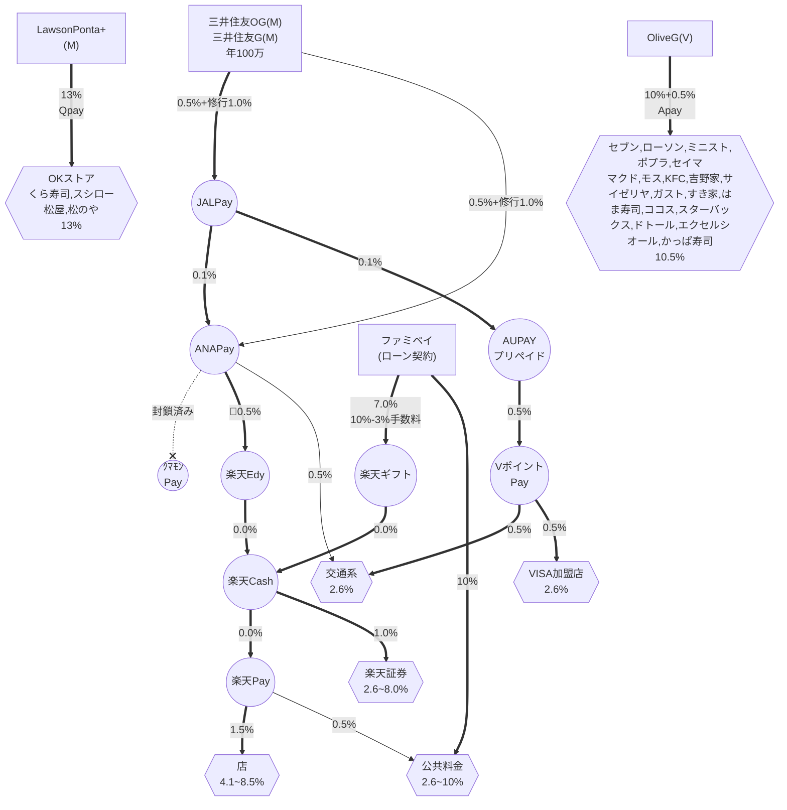

# 【最新版】ポイ活ガチ勢必見！三井住友・楽天・ファミペイを駆使した超高還元決済ルート完全攻略

ポイ活やキャッシュレス決済のルートは日々進化し、時には「封鎖」と呼ばれるルートの閉鎖を乗り越えながら、よりお得な方法が模索されています。

今回は、ポイ活ガチ勢の間で話題の最新決済ルート図を読み解き、**日常の買い物を劇的にお得にする最強の決済ルート**を徹底解説します！

---

## 🗺️ 決済ルート図 (2026年版)

---

## 💳 1. 楽天経済圏を攻略！「楽天キャッシュ」錬金術ルート

日常の買い物や楽天証券での投信積立に欠かせない「楽天キャッシュ」をお得に調達する2つの強力なルートです。

### 安定の高還元！「三井住友ゴールド（Mastercard）起点ルート」
年間100万円の利用でボーナスポイントが付与される「三井住友カード ゴールド（NL）」などを起点とする、ポイ活の王道ルートです。

1.  **三井住友G（Mastercard）** [基本0.5% + 100万修行達成1.0% = **1.5%**]
2.  **JAL Pay** にチャージ [**0.1%**]
3.  **ANA Pay** にチャージ [**0.5%**]
4.  Android端末等で **楽天Edy** にチャージ（※Apple Payルートなど制限に注意）
5.  楽天Edyから **楽天キャッシュ** にチャージ
6.  **楽天ペイ** で決済 [**1.5%**] 

**✨ 合計還元率：最大 3.6%以上**（※店舗のキャンペーン等で最大4.1%に達することも！）
街のお店での買い物はもちろん、楽天証券の投信積立（最大1.0%還元）や、公共料金の支払い（楽天ペイ請求書払いで0.5%）にも使える、非常に汎用性の高いルートです。
*(※かつて存在した「クマホンPay」ルートは残念ながら封鎖済みとなっています)*

### 驚異の還元率！「ファミペイ（ローン契約）ルート」
ファミペイのローン契約特典やキャンペーンの還元を活用する、少し上級者向けの爆益ルートです。

1.  **ファミペイ（ローン契約特典等）** [10%還元 - 手数料等3% = 実質 **7.0%**]
2.  ファミペイで **楽天ギフトカード** を購入
3.  楽天ギフトカードから **楽天キャッシュ** にチャージ
4.  **楽天ペイ** で決済 [**1.5%**]

**✨ 合計還元率：最大 8.5%**
手数料を差し引いても驚異的な還元率を叩き出します。さらに、ファミペイから直接公共料金を請求書払いで支払うことで**10%還元**を狙うことも可能です！

---

## 🚃 2. 交通系IC＆街のVISA加盟店を網羅！「2.6%還元ルート」

SuicaやPASMOなどの交通系電子マネーや、街のVISA加盟店で幅広く使えるルートです。こちらも三井住友ゴールド（Mastercard）が起点となります。

1.  **三井住友G（Mastercard）** [**1.5%**]
2.  **JAL Pay** にチャージ [**0.1%**]
3.  **au PAY プリペイドカード** にチャージ [**0.5%**]
4.  **VポイントPay** にチャージ [**0.5%**]
5.  **交通系IC**（Suica/PASMO等） または **VISA加盟店** で決済

**✨ 合計還元率：2.6%**
楽天ペイが使えない店舗や、日々の電車移動でも確実に2.6%の還元を受けられる、隙のないサブルートとして大活躍します。ANA Payから直接交通系ICへチャージするショートカット（合計2.5%）もシンプルで便利です。

---

## 🍽️ 3. 特定店舗で爆発！「特化型クレカ」の直結ルート

面倒なチャージ・経由は一切不要！対象店舗ならクレジットカードのスマホ決済だけで驚異的な還元率を誇る2大カードです。

### Lawson Ponta プラス（Mastercard）
* **還元率：13%**
* **対象店舗：** OKストア、くら寿司、スシロー、松屋、松のや 等
* **決済方法：** QUICPay（Apple Pay等）
* **解説：** ローソンだけでなく、特定のスーパーや飲食チェーンで爆発的な還元を発揮します。日常的によく利用する店舗が含まれているなら、持っておいて損はありません。

### Olive フレキシブルペイ ゴールド（Visa）
* **還元率：10.5%〜**（※Vポイントアッププログラム・家族ポイント等適用時）
* **対象店舗：** セブン-イレブン、ローソン、マクドナルド、サイゼリヤ、ガスト、すき家、スターバックス、ドトール 等の主要チェーン
* **決済方法：** スマホのVisaのタッチ決済（Apple Pay / Google Pay）
* **解説：** 言わずと知れた三井住友系列の最強カード。対象のコンビニやファミレス、カフェによく行く人は、このカードでスマホのタッチ決済をするだけで、ザクザクとVポイントが貯まります。

---

## 📝 まとめ：最適ルートを見極めてポイ活を極めよう！

現在のキャッシュレス決済は、「どこで・何を使って支払うか」によって還元率を管理するのがポイ活の醍醐味です。

* **メイン決済:** 楽天キャッシュルート（楽天ペイ）で **3.6%〜8.5%**
* **サブ決済:** VポイントPayルート（交通系・VISA）で **2.6%**
* **特定店舗:** Lawson Ponta プラス（**13%**）＆ Olive（**10.5%**）で直撃！

**⚠️ 注意点**
ポイ活のルートは常に最新の情報をチェックし、臨機応変に切り替えていくことが重要です。ぜひこの記事を参考に、ご自身の生活スタイルに合った最強の決済ルートを構築してみてください！
